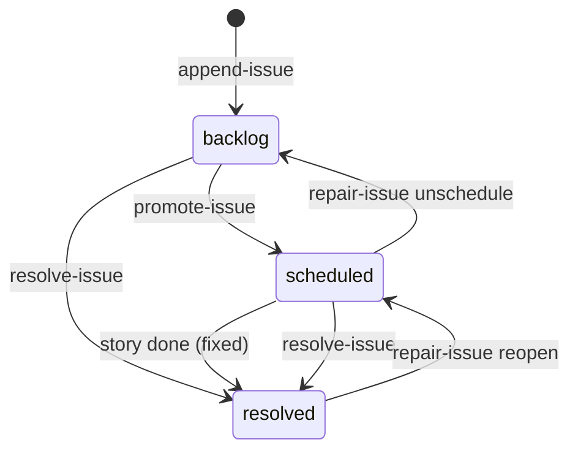

# l3io-pm Reference

Full reference for the PM orchestration module — four skills that cover the delivery lifecycle from planning through epic closure.

## Skills Overview

| Skill | Role |
|-------|------|
| `l3io-pm-plan` | Validates readiness, elaborates thin stories, estimates, builds the dependency graph, and writes a phased execution plan |
| `l3io-pm-execute` | Runs the plan — full, single epic, or single sprint. Includes the pre-execution architecture gate, the per-story dev loop, and sprint/epic closure |
| `l3io-pm-help` | Reads project state and recommends the exact next l3io-pm action. `progress` forwards to `/l3io-util-doctor stats` for the plan-aware progress tree |
| `l3io-pm-sync` | Bidirectional sync between l3io-pm state and GitHub Issues — `setup`, `push`, `pull`, `sync`, `status` |

`l3io-pm-execute` is **one skill in two modes**, not two skills. In normal mode it orchestrates epics; for each sprint it dispatches a *headless* subagent invocation of itself. There is no separate sprint-execute or epic-execute skill.

## Configuration

Skills resolve config at activation through BMad core's resolver:

```bash
uv run --python 3.11 {project-root}/_bmad/scripts/resolve_config.py --project-root {project-root}
```

The full contract is each skill's `references/config-resolution.md`. Module setup is not
routed through any of these four skills — `/l3io-pm-setup` is the module's setup entry point.
An absent `modules.l3io-pm` section just means you have no overrides, which is the normal
state.

### Config files

BMad merges four TOML layers, later winning. The first two are regenerated by the installer;
put your own settings in the last two.

| File | Scope | Contents |
|------|-------|----------|
| `{project-root}/_bmad/config.toml` | team, installer-owned | `output_folder`, `document_output_language`, `project_name` |
| `{project-root}/_bmad/config.user.toml` | personal, installer-owned | `user_name`, `communication_language` |
| `{project-root}/_bmad/custom/config.toml` | team, yours | `[modules.l3io-pm]` overrides — committed |
| `{project-root}/_bmad/custom/config.user.toml` | personal, yours | personal overrides — gitignored |

There is no `_bmad/config.yaml`. Skills up to 2.0.1 read one; BMad has not created that file
since the TOML migration, so the read always missed and every invocation fell into first-run
setup.

### Config variables

| Variable | Key | Default | Description |
|----------|-----|---------|-------------|
| `user_name` | `core.user_name` | BMad | Name used when the skill addresses the user |
| `communication_language` | `core.communication_language` | English | Language for all skill responses |
| `document_output_language` | `core.document_output_language` | English | Language for written artifacts |
| `output_folder` | `core.output_folder` | `{project-root}/_bmad-output` | Root directory for all generated output |
| `implementation_artifacts` | `modules.l3io-pm.implementation_artifacts` | `{output_folder}/implementation-artifacts` | Root for state, stories, closure outputs, and tests |
| `planning_artifacts` | `modules.l3io-pm.planning_artifacts` | `{output_folder}/planning-artifacts` | Root for planning documents and plan snapshots |

All four modules read the artifact paths from the **`l3io-pm`** section — they share one
artifact tree, so it has one home.

### Workflow customization

Each skill ships a `customize.toml` at `{skill-root}/customize.toml`. Layers, last wins:

1. `{skill-root}/customize.toml` — base defaults shipped with the skill
2. `{project-root}/_bmad/custom/{skill-name}.toml` — team overrides (commit)
3. `{project-root}/_bmad/custom/{skill-name}.user.toml` — personal overrides (gitignore)

Scalars override; arrays append. The root key is `[workflow]` for all four PM skills — a mismatched root key means overrides are silently ignored.

**Shared by all PM skills:**

| Key | Default | Description |
|-----|---------|-------------|
| `activation_steps_prepend` | `[]` | Extra steps to run before the skill's own activation |
| `activation_steps_append` | `[]` | Extra steps to run after activation |
| `persistent_facts` | `["file:{project-root}/project-context.md", "file:{project-root}/docs/project-context.md"]` | Files always loaded into skill context |
| `max_fix_iterations` | `3` | Fix-loop cap for CODE and MIXED work. Each iteration is a turn multiplier inside an already-long session — see Fix loop below |
| `max_fix_iterations_non_code` | `3` | Fix-loop cap for DOCS and CONFIG work. Currently inert: it equals `max_fix_iterations`, and every phase containing a fix loop is already skipped for those work types |
| `max_turns_per_story` | `120` | Soft cap on the turns one story agent may take (every PM skill except `l3io-pm-help`). Self-monitored, not mechanically enforced |

**`l3io-pm-execute`:**

| Key | Default | Description |
|-----|---------|-------------|
| `max_parallel_subagents` | `4` | Maximum epics dispatched concurrently within a parallel plan phase |
| `epic_lock_ttl_minutes` | `30` | TTL on the epic ownership lock; stale locks can be reclaimed |
| `spec_alignment` | `true` | Spec↔implementation alignment. The spec index reaches the epic architecture gate and the drift reviews, every applicable technical-AC dimension must end with a resolving `Spec: <path>#<anchor>` line, and epic closure runs spec sync. `false` disables all of it |
| `spec_paths` | `[]` | Project-root-relative paths or globs that **replace** spec discovery. `[]` discovers every spec under `{planning_artifacts}` by name and kind |

**`l3io-pm-plan`:**

| Key | Default | Description |
|-----|---------|-------------|
| `auto_elaborate` | `false` | `true` elaborates thin stories without confirmation; `false` prompts first |
| `include_estimates` | `true` | `false` skips the estimate step entirely |
| `plan_output` | `"markdown"` | `"markdown"` writes `plan-{date}-v{n}.yaml`; `"console"` prints a summary only |

**`l3io-pm-sync`:**

| Key | Default | Description |
|-----|---------|-------------|
| `github_auth_method` | `"mcp"` | Preferred auth path for GitHub operations — `"mcp"` or `"gh-cli"`. A preference, not a guarantee: `mcp` falls through to the `gh` CLI check when no `mcp__github*` tools are present, rather than blocking. See [Sync Reference](#sync-reference) |

`l3io-pm-help` ships no keys of its own beyond the shared ones above.

## Plan Reference

`l3io-pm-plan` is read-only with respect to code — it validates, elaborates, estimates, and plans. It does not execute work.

### Modes

| Invocation | Steps run |
|---|---|
| `/l3io-pm-plan` | Full plan: readiness check → story elaboration → load state → dependency graph → estimate → plan output |
| `/l3io-pm-plan estimate` | Estimate only, all scope |
| `/l3io-pm-plan estimate E{nnn}` | Estimate only, one epic |
| `/l3io-pm-plan estimate E{nnn}-S{nn}` | Estimate only, one sprint |

Story elaboration is skipped when the classified `work_type` is `DOCS` or `CONFIG`, and is a no-op when readiness is already green.

### Output

Full plan mode writes an **immutable, versioned snapshot** plus a stable pointer:

| File | Purpose |
|---|---|
| `{planning_artifacts}/plan-{date}-v{n}.yaml` | The plan snapshot — the only source for the phases list. Immutable once written; version auto-increments per day, resets on a new date, and a re-check before writing refuses to overwrite an existing file. Its per-phase `estimate` blocks are a point-in-time report stamped `estimates_as_of`; estimates are authoritative in the state node files, not here |
| `{planning_artifacts}/plan-output-meta.yaml` | Stable pointer — `current_plan`, `generated`, `readiness`, `phase_count`. Written only after the snapshot it names is confirmed. Deliberately carries no per-phase data: `l3io-pm-execute` resolves the plan through this file but reads phases from the snapshot, and `l3io-pm-help` needs only the count |
| `{planning_artifacts}/readiness-report.md` | Per-epic readiness with gap detail |
| `{planning_artifacts}/elaboration-summary.md` | Which stories were elaborated, and any deviations |

Each phase in the snapshot carries a roll-up estimate. For **parallel** phases wall-clock (`elapsed_hours`) is `max(epic.elapsed_hours)`; for **sequential** phases it is the sum. Man-hours, hitl-hours, tokens, and cost always sum.

`arch_gate_summary.ran` is always `false` at plan time — the architecture gate runs in `l3io-pm-execute`, not here.

### Declaring dependencies

Both fields are optional and default to `[]`.

**Epic-level** — in `state/{status}/epic-{nnn}/epic.yaml`; prerequisite epics that must be `done` before this epic starts:

```yaml
key: 'E003'
depends_on: ['E001', 'E002']
```

**Story-level** — in that story's own node file; globally-unique story keys, cross-epic supported:

```yaml
key: 'E003-S01-001'
depends_on: ['E001-S02-003']
```

`l3io-pm-plan` validates that all referenced keys exist and detects cycles before writing the plan.

## Execute Reference

### Activation and step order

Activation ends with an operative digest (§8 of `step-00-activate.md`) covering keys,
`pm-status.py` signatures, exit codes, and the estimates hard rule. `status-files.md` and
`metrics-contract.md` are **not** loaded at activation — they are deep references consulted on
demand, and the digest's routing table names the section to read for each case. Precedence is
`pm-status.py` > reference > digest. This applies to both modes below.

**Normal mode** (epic orchestration):

```
steps/shared/step-00-activate.md        variable binding, state resolution, gitignore check
steps/shared/step-01-classify-work.md   determines work_type: CODE | DOCS | CONFIG | MIXED
steps/execute/step-02-scope-resolve.md  full plan, single epic, or single sprint
steps/execute/step-03-load-plan.md      reads plan-output-meta.yaml
steps/execute/step-04-arch-gate.md      pre-execution architecture gate
steps/execute/step-05-epic-loop.md      per-epic: promote, lock, dispatch sprints, re-estimate
steps/execute/step-06-epic-closure.md   epic closure
```

**Headless mode** (one sprint, dispatched by step-05). `step-01-classify-work` is skipped because `work_type` arrives in the injected context block:

```
steps/shared/step-00-activate.md
steps/sprint/step-02-story-prep.md
steps/sprint/step-03-dev-loop.md
steps/sprint/step-04-sprint-closure.md
```

### Architecture gate (step-04)

Runs once per epic, before any sprint. Skipped entirely for `DOCS`/`CONFIG` work types, and when `l3io-arch-review` is not installed — the gate never partially skips, since at least one reviewer must run.

The detected reviewers do not all run together: `l3io-arch-review` Mode B always runs first, alone. Only when it reports a BLOCKER or MAJOR do the other detected reviewers (`bmad-agent-architect`, superpowers) join, in parallel, to corroborate. Findings consolidate by rule — any BLOCKER stays a BLOCKER; a MAJOR blocks even from a single reviewer; MINOR defers to `issues.yaml`.

Before any ADR subagent is dispatched, the whole batch of numbers is reserved in one call —
`adr-reserve --state-root {pm_state_root} --epic {epic_key} --slug arch-gate --count
{blocking_finding_count} --adr-dir {project-root}/docs/adr` — under a lock in
`adr-register.yaml`, so parallel agents are handed distinct numbers rather than each deriving
one from a directory listing (which shows only who has finished, not who is in flight). Each
blocking finding is then resolved by an ADR written
to `{project-root}/docs/adr/{adr_number}-{slug}.md` (the one ADR home, ADR-0005) using its reserved
number, with its `Epic:` and `Departs from spec:` lines filled, **and** by patching the affected
story files with the technical ACs the decision implies. One re-validation pass follows;
persistent blockers emit `BLOCKED`.

With `spec_alignment` on (the default, pm-execute `customize.toml`), the reviewer also receives
the spec index (`{implementation_artifacts}/spec/spec-index.md`, built by
`spec-align.py build` without a model) and the line ranges the stories' `Spec:` pointers name
— never whole spec documents — and may raise `spec-conflict` and `spec-gap` findings. Every
reviewer ends with a `Sections read:` footer, so extra reading is measurable.

Zero findings on non-trivial CODE scope prompts for confirmation rather than passing silently.

### Epic loop (step-05)

For each phase in the plan, epics dispatch concurrently up to `max_parallel_subagents` when the phase is marked parallel and holds more than one epic; otherwise sequentially. After a phase, every prerequisite is verified `done` before the next begins.

Per epic: `move-epic --to active` (a no-op if already active, so it is always safe on resume) → `set-lock` → dispatch sprints → epic closure.

`set-lock` enforces mutual exclusion, not a skip-with-`BLOCKED` shortcut: no existing `_lock` claims it (exit 0); an existing lock held by the same `session_id` re-claims and refreshes `claimed_at` (exit 0); a lock held by a different session whose TTL has expired is taken over (exit 0, announced with the prior holder and its age); a lock held by a different session still within its TTL is refused — exit 5, naming the holder and the remaining minutes — and the file is left untouched; and a malformed `_lock` (not a mapping, or missing/unparseable `claimed_at`) is refused outright rather than treated as absent, since a lock that cannot be read is not one that may be silently stolen. The epic loop treats exit 5 as `BLOCKED` for that epic and moves on.

**Sprints within an epic are always sequential.** After each sprint completes, remaining unstarted sprints are re-estimated so calibration learned from the finished sprint feeds forward.

A progress tree renders at phase start and phase end. Inside a parallel phase, per-epic and per-sprint renders are suppressed — concurrent epic subagents would interleave their output — so phase end is the first point the whole phase can be shown coherently. See [Progress Reporting](#progress-reporting).

### The technical-AC gate — six dimensions

Every story is checked against all six before it can reach `ready-for-dev`. This is **not** an
any-one-of check: each dimension is either satisfied or explicitly marked `N/A — <reason>` in
the story.

| # | Dimension | Satisfied when the story states… |
|---|---|---|
| 1 | Interface contracts | API signatures, data models, events the story adds or changes |
| 2 | Error and edge cases | what fails, how it fails, and what the caller sees |
| 3 | Observability | the logging, metrics or tracing the change must emit |
| 4 | Security | auth, validation, and how data is handled |
| 5 | Testability | test entry points and mock boundaries |
| 6 | **Existing-library check** | which library or platform capability covers this, or why none does and custom code is warranted |

"Not applicable" is a legitimate answer — a pure refactor adds no interface, a background job
faces no auth — but it has to be *stated*, because an absent dimension and an inapplicable one
are otherwise indistinguishable.

**Provenance.** With `spec_alignment` on (the default), the ACs use a fixed layout — a
`## Technical acceptance criteria` section with one `###` heading per dimension — and each
applicable dimension ends with `Spec: <path>#<anchor>`, a pointer into the spec index, or
`Spec: none — <reason>`. `spec-align.py check-pointers` checks every story mechanically before
`ready-for-dev`; a story it rejects is enriched like any thin story. The dev loop still never
opens the spec tree: when an AC falls short, the pointer names the one section to read.

Dimension 6 is paired with a **reused-before-written check** in the dev loop's code review,
which flags hand-rolled retries, date handling, config merging, HTTP clients, parsing,
validation and caching — normally HIGH, since a hand-rolled equivalent must be maintained
forever to reach parity a dependency already has. The story states the intent; the review
checks the code matches it, rather than re-litigating a justified decision.

Until 2.4.4 the step file read "at least one of" five dimensions, which made the gate five
times weaker than documented — a story carrying interface contracts alone advanced. Everything
downstream assumes stories arrive with technical ACs; this gate is what makes that true.

### Per-story phases (step-03 dev loop)

Stories process in order; a story with `depends_on` waits until each referenced story is `done`. A dependency outside this sprint's scope moves the story to the end of the queue rather than blocking the sprint.

| Phase | What happens |
|---|---|
| Story prep | Technical-AC gate over **six** dimensions (below); the legacy `bmad-create-story` enriches what is missing when installed, else this package's own in-package agent does, in one batched call for the sprint. Estimates written, status → `ready-for-dev` |
| Development | Status → `in-progress`. The legacy `bmad-dev-story` implements all tasks when installed, else this package's own in-package agent does |
| Code review | `bmad-code-review` on changed files. Skipped for `DOCS`/`CONFIG` |
| Fix loop | CRITICAL/HIGH re-invoke the dev subagent, capped at `{max_fix_iterations}` iterations per story |
| Completion | Completion evidence, then actuals, then status → `done` |

Severity routing: **CRITICAL/HIGH** open the fix loop; **MEDIUM** is fixed in the current iteration before done; **LOW** defers to `issues.yaml` without re-development.

`{max_fix_iterations}` is bound at `step-01-classify-work.md` §5 from `customize.toml`: 3 for
CODE/MIXED, 3 for DOCS/CONFIG (`max_fix_iterations_non_code`). The DOCS/CONFIG value is currently
inert here — this fix loop only fires off a code-review finding, and code review itself is
skipped for DOCS/CONFIG (row above), so the loop never runs for those work types today.

Exceeding the `{max_fix_iterations}` cap emits `FAILED` for that story, leaves it at `status: review`, and continues to the next story.

> **Write order is load-bearing.** `completion_evidence.fix_iterations` must be written **before** `set-actual`. `set-actual` derives the calibration sample inline and reads `fix_iterations` to choose the sample's provenance (`exact` vs `backout`) and its `fix` cohort. Writing it afterwards means it is always absent at derivation time — `provenance: exact` becomes unreachable, neither fix cohort ever fills, and the fix factor stays frozen at the 1.25 cold-start prior, silently and forever.

### Sprint closure (step-04)

| Phase | CODE | DOCS | CONFIG | MIXED |
|---|---|---|---|---|
| Retrospective | run | run | run | run |
| Clean release review | run | skip | run | run |
| Adversarial analysis | run | skip | skip | run |
| Red team (`l3io-sec-redteam`) | run | skip | skip | run |
| UX review (legacy `bmad-ux-review`) | run | skip | skip | run |
| Sprint architectural drift (`l3io-arch-review` Mode B) | run | skip | run | run |
| Issue triage | run | run | run | run |

The phase-gating matrix now lives in `steps/shared/step-01-classify-work.md` §4 (single source
of truth); this table mirrors it.

Outputs go to `{sprint_root}/closure/` — `retrospective.md` and `closure-report.md`. The closure report records stories done, estimates vs actuals, issue counts resolved and deferred, and which phases ran versus were skipped.

Closure also regenerates `{implementation_artifacts}/progress-report.md`, and renders a progress tree when the phase holds a single epic.

Its architectural-drift phase gives every finding an ID (`SD-{nn}-{n}`), records a disposition for each BLOCKER/MAJOR, and gates on `spec-align.py check-dispositions`; with `spec_alignment` on it also receives the spec index and the ranges the stories' `Spec:` pointers name.

Closure ends with a commit checkpoint that stages `state/`, the sprint's artifacts and `spec/`. It first untracks any `*.lock` file an earlier run committed under `state/`, leaving the files on disk. `pm-status.py`'s lock files are never committed: it keeps `*.lock` in `state/.gitignore`.

### Epic closure (step-06)

1. **Retrospective** — reviews every sprint retro for the epic; summarizes velocity, recurring pain points, and up to five learnings
2. **Architectural drift** — `l3io-arch-review` Mode B over the epic's ADRs (`spec-align.py adrs`), story files and cumulative diff, plus the spec index and pointed-to ranges when `spec_alignment` is on. CODE/MIXED only, and only when installed. Every BLOCKER/MAJOR gets a disposition — `resolved-in-code` (fix loop, `{max_fix_iterations}` cap, 3), `adr-justified`, `spec-updated` or `spec-proposal` — gated by `spec-align.py check-dispositions`; MINOR defers to the issues file
2a. **Spec sync** — when `spec_alignment` is on and `spec-align.py sync-plan` finds pending items: one `l3io-spec-sync` agent under a spec-edit lease writes each accepted architecture departure back as its own `docs(spec)` commit (a scope guard keeps it inside the section; an anchor guard protects story pointers) and writes proposals for PRD/UX/epic changes; each becomes a `spec-change` or `spec-proposal` backlog item, confirmed or rejected in `/l3io-util-doctor triage`. An empty plan dispatches nothing.
3. **Epic security review** — `l3io-sec-redteam` over the epic's cumulative diff, story files, and ADRs, with explicit permission to widen for surface mapping. CODE/MIXED only, and only when installed. Uses redteam's own vocabulary (CRITICAL/HIGH/MEDIUM/LOW/OBSERVATION); CRITICAL/HIGH/MEDIUM must resolve before closure, under the `{max_fix_iterations}` cap — 3
4. **Issue triage** — re-reviews the epic's deferred Low items for promotion now that full epic context exists
5. **Closure report** — epic goal and final status, estimate-vs-actual for all five metrics, sprint velocity, learnings, outstanding issues, ADRs produced, and a Spec changes section (dispositions, commits, proposals, index size, sections read, spec sync's token share against the 5% budget)
6. **Commit checkpoint** — stages `state/`, the epic's artifacts, `spec/` and planning artifacts, and commits `chore({epic_key}): close epic`

Outputs go to `{implementation_artifacts}/epic-{nnn}/epic-closure/`. Epic closure also renders a progress tree unconditionally — it runs once per epic after its sprints finish, so it never competes with sibling sprints for stdout — and regenerates `{implementation_artifacts}/progress-report.md`.

## Help Reference

`l3io-pm-help` is **read-only**. It calls no `pm-status.py` write verb, never self-installs
`pm-status.py` (unlike the other three PM skills), and prints its recommendations as commands
for you to run — including the stale-lock `clear-lock` suggestion, which it shows but does not
execute.

### Modes

| Invocation | What it does |
|---|---|
| *(none)* | Health snapshot plus a next-action recommendation |
| `progress` | Forwards to `/l3io-util-doctor stats` for the plan-aware progress tree. See [Progress Reporting](#progress-reporting) |
| `list plan` | Enumerates every plan snapshot, classifies each as unstarted / in progress / complete against current state, and prints the YAML to repoint `plan-output-meta.yaml` |

`setup`, `configure`, and `install` are not recognized arguments — module setup is not routed
through this skill. `/l3io-pm-setup` is the module's setup entry point.

`list plan` still runs config resolution and the layout gate first, then skips the
recommendation sections; a legacy tree short-circuits it to the migration recommendation,
because the epic status probes only understand the sharded layout. `progress` runs neither
step — it is a pure forwarder to `/l3io-util-doctor stats`, whose own layout check
(`steps/stats.md` Step ST1) reproduces the multi-layout `BLOCK`, at the same Critical
severity `l3io-util-doctor`'s health-check Check 2b uses, instead of duplicating that one
branch here. It does not reproduce every branch of this skill's gate — notably the orphan
check for a repointed `implementation_artifacts` has no counterpart in `stats.md`.

### The layout gate

Before any recommendation, in every mode that still reads state directly here (the default
flow and `list plan` — `progress` no longer does, see above), it **counts** rather than stops
at the first hit — sharded `state/`, a legacy per-epic `_bmad/state/`, and a legacy flat
`sprint-status.yaml`:

| Layouts found | Outcome |
|---|---|
| Two or more | `BLOCKED` — an earlier migration did not finish. No state is read and no recommendation is offered |
| Exactly one, legacy | One recommendation only: `/l3io-util-doctor migrate-state`. It never suggests creating epics or running a plan, because a legacy tree means work already exists |
| Exactly one, sharded | Proceeds normally |
| None | Possibly a first run — but not trusted until the orphan check below passes |

**Orphan check.** Before accepting "nothing exists yet", it probes git and the filesystem for a
`state/active/epic-*/epic.yaml` outside the configured root, which is the signature of
`implementation_artifacts` having been repointed after state already existed. A hit is
`BLOCKED`, not an invitation to start fresh. Only when both probes come back empty does the
first-run recommendation become reachable.

### Presence, and no staleness check

**Presence** is a file-exists test on the installed `pm-status.py`, checked by every mode that
reads state directly here — the default recommendation flow and `list plan`. When absent, the
state read falls back to parsing each `epic.yaml` directly. `progress` no longer performs this
check itself: it forwards to `/l3io-util-doctor stats`, which self-installs `pm-status.py` at
its own activation and handles absence there instead.

l3io-pm-help does **not** check staleness. `module.yaml` lives only at the module's home
(`l3io-pm-setup/assets/module.yaml`), not at this skill's own root, and reading a sibling
skill's path from here would be the cross-skill path read this package avoids elsewhere. So
presence is the only signal this skill reports; it never guesses at version freshness.

### What it reads, and never writes

Reads: epic nodes under `active/` and `planned/` (or `show --epic` when the helper is present),
`list-issues --all --format json` with a `cat` fallback, `plan-output-meta.yaml`, a
`git check-ignore` health probe on the state root, and — in `list plan` — every
`plan-*-v*.yaml` snapshot plus a state-folder probe per epic key.

Writes: nothing. No state file, no write verb, no pointer edit. `list plan`'s repoint
instructions are printed for you to apply.

## Sync Reference

`l3io-pm-sync` maps l3io-pm state onto GitHub Issues. Every remote call is made by the agent
through GitHub MCP tools or the `gh` CLI; the three helper scripts
(`detect-platform.py`, `drift-report.py`, `sync-state.py`) are local-computation only and never
touch the network.

### Modes

| Argument | What it does |
|---|---|
| *(none)* or `status` | Drift report only. Mutates nothing |
| `setup` | Detects the platform, verifies auth, verifies or creates `_bmad/sync-state.yaml` |
| `push` | Creates issues for unmapped entities, edits issues for changed ones, records mappings |
| `pull` | Reads mapped issue state and marks stories `done` whose issue closed as completed |
| `sync` | `push` in full, then `pull` in full — never interleaved, so creations land before the re-read |

Note that `setup` here selects the sync-setup mode, **not** shared module setup — this is the
one PM skill where `setup` means something else. `configure` and `install` are not recognized
arguments here either: module setup is not routed through this skill; `/l3io-pm-setup` is the
module's setup entry point.

### Platform detection and auth

`detect-platform.py` reads the git remote (`origin`, then `upstream`, then the first remote),
normalises SSH form to HTTPS, and recognises **GitHub only**. Anything else returns `unknown`
and the run blocks — there is no GitLab, Azure DevOps or Jira support today, despite the
config template's schema implying a future `platform` choice.

`github_auth_method` is a *preference, not a guarantee*. With `mcp`, it checks for
`mcp__github*` tools in the current tool set and **falls through** to the `gh` CLI rather than
blocking when none are present; the `gh-cli` path runs `gh auth status`. If neither succeeds the
run blocks. The resolved method is bound separately from the configured preference, because they
differ whenever the fallback fires.

### `_bmad/sync-state.yaml`

Managed only by `sync-state.py` — never hand-edited. A missing file loads as empty state at
every mode rather than erroring, and materialises the first time `push` records a mapping.

```yaml
version: 1
mappings:
  - bmad_key: E001-S02-003        # required — the only field upsert enforces
    bmad_type: story              # story | sprint | epic | backlog (convention, not enforced)
    bmad_path: "..."              # story markdown; null for epics and sprints
    remote_id: 4821               # GitHub issue number
    remote_url: "https://github.com/..."
    last_synced_hash: "a1b2c3d4"  # 8-char content fingerprint
    last_synced_at: "2026-09-12T10:00:00Z"
```

The skeleton also carries a top-level `last_sync` key that **nothing writes** — treat it as
reserved, not as a timestamp you can rely on. `upsert` validates only `bmad_key` and *replaces*
an entry wholesale, so a partial blob overwrites the previous mapping rather than merging into
it.

`_bmad/sync-config.yaml` is separate and optional, created best-effort during `setup`. Its own
header states it is not yet read by any of the three scripts: its `field_rules` and
`status_labels` are reserved for a feature that does not exist. Do not rely on field-level
conflict authority.

### Drift detection and conflict model

`drift-report.py` walks `state/{active,planned,archived}/`, collects every epic, sprint, story
and backlog item, fingerprints each as an 8-character `sha256` over its fields, and sorts the
results into three buckets against the recorded hashes: `unmapped_local` (never pushed),
`changed_local` (fingerprint moved), and `missing_local` (mapping exists, entity gone). When the
state root is absent it still exits 0 with an empty manifest but reports
`state_root_found: false`, deliberately distinct from "walked the tree and found no drift".

**Push wins by construction.** There is no field-level resolver: `push` overwrites the remote
issue with current local content. `pull` transitions a story to `done` only when its issue closed
as *completed* — a `not planned` or `duplicate` close is deliberately left alone, because
`set-status done` resolves the story's `resolves:` backlog items as fixed, which those closes are
not. Sprint, epic and backlog mappings are reported but never auto-transitioned; no mapping from
issue state to those statuses is defined. `missing_local` entries are reported and left intact
unless you confirm removal, which clears the mapping irreversibly.

## Headless Dispatch

Step-05 spawns each sprint with an authoritative context block:

```
# l3io-pm execution context [AUTHORITATIVE — read before any step file]
work_type: {work_type}
skip_phases: {skip_phases}
max_fix_iterations: {max_fix_iterations}
epic_key: {epic_key}
epic_nnn: {epic_nnn}
sprint_root: {implementation_artifacts}/epic-{epic_nnn}/sprint-{sprint_nn}/
story_keys: [{story_keys}]
sprint_num: {sprint_num}
execute_skill_root: {skill-root}
single_epic_phase: {single_epic_phase}
headless: true

Load and execute in order:
  {skill-root}/steps/shared/step-00-activate.md
  {skill-root}/steps/sprint/step-02-story-prep.md
  {skill-root}/steps/sprint/step-03-dev-loop.md
  {skill-root}/steps/sprint/step-04-sprint-closure.md

End with exactly one of:
  DONE — Stories: N, Issues resolved: N, Issues deferred: N
  BLOCKED: [one-line reason]
  FAILED: [one-line reason]
```

`{skip_phases}` is bound by `steps/shared/step-01-classify-work.md` §4 from the phase matrix there, which is authoritative; the table above mirrors it.

The orchestrator branches on the returned line: `DONE` marks the sprint done and continues; `BLOCKED` halts the epic loop; `FAILED` is non-fatal at epic level — logged and counted, then the next sprint runs.

## Paths Reference

Epic directories are 3-digit zero-padded, sprints 2-digit. Zero-padding makes lexical order the correct processing order.

| Path | Description |
|------|-------------|
| `{implementation_artifacts}/state/{planned,active,archived}/epic-{nnn}/epic.yaml` | Epic node — one bare node per file, no `sprints:` list |
| `{implementation_artifacts}/state/.../epic-{nnn}/sprint-{nn}/sprint.yaml` | Sprint node — no `stories:` list |
| `{implementation_artifacts}/state/.../sprint-{nn}/E{nnn}-S{nn}-{nnn}.yaml` | Story node |
| `{implementation_artifacts}/state/issues.yaml` | Flat deferred-issue list |
| `{implementation_artifacts}/state/events.jsonl` | Append-only transition log — committed; the source of per-status dwell time |
| `{implementation_artifacts}/state/pm-calibration.yaml` | Learned calibration ratios — committed |
| `{implementation_artifacts}/progress-report.md` | Generated progress report — a **view**, regenerated at closure boundaries; never hand-edit |
| `{implementation_artifacts}/epic-{nnn}/sprint-{nn}/stories/{story-key}.md` | Story markdown |
| `{implementation_artifacts}/epic-{nnn}/sprint-{nn}/closure/` | Sprint closure outputs |
| `{implementation_artifacts}/epic-{nnn}/sprint-{nn}/tests/` | Sprint-scoped QA evidence |
| `{implementation_artifacts}/epic-{nnn}/arch/` | Arch-gate review output (`arch-gate-review.md`); ADRs live in `{project-root}/docs/adr/` (ADR-0005) |
| `{implementation_artifacts}/epic-{nnn}/epic-closure/` | Epic closure outputs |
| `{implementation_artifacts}/epic-{nnn}/tests/` | Epic-scoped fix verification |
| `{planning_artifacts}/plan-{date}-v{n}.yaml` | Plan snapshot |
| `{planning_artifacts}/plan-output-meta.yaml` | Stable plan pointer |

**Never construct a state path by hand.** All node operations address state by key through `pm-status.py`; `references/status-files.md` is the canonical contract.

## State Schema

One bare node per file — no `epics:` wrapper. The directory structure replaces the `sprints:` and `stories:` lists; children are discovered by listing the directory. Child files carry redundant `epic:`/`sprint:` back-references deliberately, so each file is self-describing and `verify --scope epic` can catch a file sitting in the wrong directory.

Keys: epic `E{nnn}`, sprint `S{nn}`, story `E{nnn}-S{nn}-{nnn}`, backlog item `BL-E{nnn}-{nnn}` (`BL-E000-{nnn}` for repo-global). Node fields use `key:`, never `id:`. A backlog item's trailing `{nnn}` is allocated by `append-issue` itself, under a lock, from the highest existing number for its epic — never chosen by the caller; `--key` is optional, and an explicit `--key` naming an item that already exists is refused (exit 2) rather than silently reassigned. Allocating past `BL-E{nnn}-999` is refused (exit 2, nothing written) — a three-digit suffix cannot name a higher number, and keys are never reused.

```yaml
# state/active/epic-001/epic.yaml
_lock:                        # machine metadata; always the first key when present
  session_id: 'claude-session-abc123'
  claimed_at: '2026-08-16T10:00:00Z'
  ttl_minutes: 30
key: 'E001'
title: 'Epic 001 — Foundation'
goal: 'Stand up the core platform'
status: in-progress
depends_on: []                # epic keys; read by l3io-pm-plan
estimate:                     # ranges at epic/sprint level
  man_hours_low: 40
  man_hours_high: 60
  hitl_hours_low: 6
  hitl_hours_high: 10
  elapsed_hours_low: 8
  elapsed_hours_high: 12
  tokens_k_min: 2000
  tokens_k_max: 3200
  cost_low: 8.25               # derived from tokens_k_min/max x rates; never entered
  cost_high: 13.20
  model: claude-opus-5         # the rate card that priced the range
  confidence: medium
actual:                       # all five METRIC_FIELDS required
  elapsed_hours: 11.5
  man_hours: 52                # counterfactual re-assessment, not observed
  hitl_hours: 7.2
  tokens_k: {total: 2840, input: 420, output: 140, cache_write: 850, cache_read: 1430}
  cost: 6.98                   # derived from tokens_k x the model's rate table; written by the tool
  model: claude-sonnet-5
```

```yaml
# state/active/epic-001/sprint-01/E001-S01-003.yaml
key: 'E001-S01-003'
epic: 'E001'                  # back-references; path must agree
sprint: 'S01'
title: 'Implement token ledger'
status: review
classification: complex
estimate:                     # single values at story level
  man_hours: 6
  hitl_hours: 0.8
  elapsed_hours: 1.5
  tokens_k: {total: 320, input: 48, output: 16, cache_write: 96, cache_read: 160}
  cost: 1.32                   # derived; never entered
  model: claude-opus-5
  confidence: high
actual:
  elapsed_hours: 1.8
  man_hours: 7                 # counterfactual re-assessment, not observed
  hitl_hours: 0.5
  tokens_k: {total: 355, input: 53, output: 18, cache_write: 107, cache_read: 177}
  cost: 1.47
  model: claude-opus-5
```

### Lifecycles

```
story:  backlog → ready-for-dev → in-progress → review → done
epic:   backlog → in-progress → done
```

| Status | Set when |
|--------|----------|
| `backlog` | Initial state |
| `ready-for-dev` | Story prep and the technical-AC gate complete |
| `in-progress` | Development started |
| `review` | Development complete, entering code review |
| `done` | Review clean, completion evidence and actuals written |

### Backlog

Open items live in `issues.yaml`; resolved items move, whole, to `issues-resolved.yaml`
with their `resolution`, `resolved_at`, `ref`, and `note`. Keys come from a per-epic `next:`
high-water mark — `max(next[epic], highest suffix in either file + 1)` — so a resolved or
deleted key is never handed out again. Every change goes through a `pm-status.py` verb under
`issues_lock`; `append-issue` skips a content duplicate of an open item, or of a resolved
`wontfix`, `duplicate`, or `obsolete` item whose severity is at least the new finding's; a
finding above that item's severity is appended as re-raised, and one that matches a `fixed`
item as a recurrence. The newest resolved match decides.



```yaml
backlog:
  - key: BL-E001-004
    epic: '001'
    sprint: '02'                # '' for an epic-level deferral
    title: 'Issue title'
    source: 'code-review (E001-S02-003)'
    severity: Low
    status: backlog             # backlog | scheduled (then also story:, scheduled_at:)
    description: 'See {sprint_root}/closure/review-E001-S02-003.md'
```

`/l3io-pm-plan` offers open items for promotion before readiness; `/l3io-util-doctor triage`
audits the backlog (`audit-issues`, then `scripts/audit-backlog.py`) and resolves what is
already fixed, on confirmation. Full design: `docs/superpowers/specs/2026-09-10-issue-lifecycle-design.md`.

### Severity vocabularies

Four vocabularies are in play, and only one is enforced by code. The backlog's is:
`append-issue` and `update-issue` take `--severity` as an argparse choice of
**`Low` / `Medium` / `High` / `Critical`**, so anything else is rejected before a write. The
three upstream vocabularies are asserted only in their own reviewing skills' references and in
step-file prose — an out-of-vocabulary severity word from a reviewer would not be caught by any
gate.

| Source | Its severities | What reaches the backlog |
|---|---|---|
| `l3io-arch-review` | BLOCKER / MAJOR / MINOR | MINOR → `Low`. BLOCKER and MAJOR reach it **never** |
| `l3io-sec-redteam` | CRITICAL / HIGH / MEDIUM / LOW / OBSERVATION | LOW → `Low`. OBSERVATION is noted in the closure report and has no backlog form at all |
| `bmad-code-review`, legacy `bmad-review-adversarial-general` | CRITICAL / HIGH / MEDIUM / LOW | Pass-through — the same four words, so LOW → `Low` with no translation |
| legacy `bmad-ux-review` | HIGH / MEDIUM / LOW *(as the step files use it)* | HIGH is fixed; MEDIUM and LOW defer |

**Blocking severities have no backlog equivalent, by design.** An arch BLOCKER or MAJOR, and a
redteam CRITICAL or HIGH, gate the run rather than deferring: they are resolved in code, or
justified by an accepted ADR, or the run halts `BLOCKED`. There is deliberately no path that
files one as a backlog item and proceeds — so if you are looking for the severity such a finding
would carry, there isn't one.

Two known rough edges, stated rather than smoothed over: epic closure specifies handling for a
redteam MEDIUM ("fix in place, or record an accepted ADR") while **sprint** closure's redteam
section names only CRITICAL/HIGH and LOW, leaving sprint-level MEDIUM unspecified; and the
step files name no CRITICAL tier for legacy `bmad-ux-review`.

### `pm-status.py` subcommands

| Subcommand | Addressing |
|---|---|
| `set-status`, `set-actual`, `set-estimate`, `set-field`, `verify` | `--state-root` + (`--story KEY` \| `--epic ID [--sprint ID]`) |
| `set-status`, `set-actual` extras | `--no-events` skips the verb's own event (`set-status`'s `status` event, `set-actual`'s `actual` event); the done hook's `issue_resolved` events are still written; `--session-id ID` stamps it; `set-status --status done` on a story resolves the backlog items its `resolves:` lists (a failure warns, never fails the call); a key already resolved prints `ok <key> already resolved (<resolution>)`; `resolved <key> …` is printed only for a new resolution |
| `set-field` extras | Refuses any field in `DERIVED_NODE_FIELDS`, any sub-path of one (e.g. `status.x`, `resolves.x`), **and any parent path that contains one** (e.g. `--field completion_evidence`, which would silently discard `completion_evidence.test_runs`) — outright (exit 2), naming the contained field and the verb that writes it — currently `completion_evidence.tests_passing` (use `add-test-run`), `status` (use `set-status`), and `resolves` (use `promote-issue`), rather than asserted directly |
| `add-test-run` | `--state-root --story KEY --command CMD --exit-code N` — appends `{command, exit_code}` to `completion_evidence.test_runs` and derives `completion_evidence.tests_passing` from the **last run of each distinct command** (the full history is kept in `test_runs`, so a failing run you then fixed is superseded by its passing re-run) |
| `sync-story-doc` | `--artifacts-root A --story KEY --status S [--quiet]` — writes `status:` into the story markdown's frontmatter (ruamel round-trip: key order and comments survive). Runs after a `set-status` that already succeeded, so it is deliberately incapable of failing its caller: a missing story file, missing frontmatter, or an unterminated frontmatter block each warn on stderr and return 0. Only an invalid `--status` or a malformed story key — both caller errors detectable before any state was touched — return 2 |
| `story-doc-init` | `--state-root --artifacts-root A --story KEY` — creates the story markdown skeleton from its state node if absent; the only writer of that skeleton. |
| `estimate-story` | `--state-root --story KEY --classification {simple,standard,complex}` |
| `estimate-rollup` | `--state-root --epic ID [--sprint ID]` — sums children, widens by the closure band |
| `show` | `--state-root --epic ID [--sprint ID]` — computed roll-up to stdout, never a committed file. Prints the children's actuals plus a `spend/` breakout by story / closure / orchestration |
| `report` | `--state-root` + optional `--plan <plan-output-meta.yaml>` `--format {tree,json,md}` `--out FILE` `--status planned,active,archived` `--all` `--watch SECS` — walks every epic; addresses none individually. Read-only unless `--out` is given. `--status` narrows the **display** only (default `planned,active`); totals, phase denominators, and the spend breakout always cover every epic. Every format carries a **Spend** section attributing actual spend to story / closure / orchestration, plus a stalled-dispatch section (`--stall-minutes`, default 15) |
| `dispatch` | `--state-root --event {open,close} --agent NAME` + optional `--epic`/`--sprint`/`--story`/`--session-id` — records a subagent dispatch open/close into `events.jsonl`; feeds `report`'s stalled-dispatch flags |
| `set-lock`, `clear-lock`, `check-lock` | `--state-root --epic ID` (epics only) |
| `notice` | `--state-root --key KEY` — records a one-time-ever advisory notice in `{state-root}/.notices.yaml` under flock, keyed on `KEY` alone. Not session-scoped: there is no cross-invocation session identifier available (`{session_id}` is bound fresh per skill invocation and no `notice` caller is ever a dispatched subagent that could inherit one), so a per-session key would never repeat — this fires at most once **ever** per project, per key, which is correct for an advisory whose trigger condition (an absent config section) is itself a permanent state until the project is configured. Exit `0` = not yet emitted for `KEY` (and now recorded); exit `1` = already emitted — permanently, for that key; exit `2` = a usage error (blank `--key`) **or** an unexpected failure while recording (lock/I/O) — deliberately never `1`, so a crash can never be mistaken for the harmless "already said" outcome and silently swallowed. Advisory only on the READ side: a damaged or unparseable `.notices.yaml` is treated as empty rather than blocking the caller, but a failure actually writing it is reported, not treated as success. No pruning — a project's set of distinct notice keys stays small by construction |
| `move-epic` | `--state-root --epic ID --to {planned,active,archived}` |
| `archive-epic` | `--state-root --epic ID` — alias for `move-epic --to archived`; does not accept `--to` itself |
| `append-issue` | `--state-root` (preferred) or `--file` (compatibility; must equal `<state-root>/issues.yaml`). `--key` is optional: omitted, the key is allocated as max(`next[epic]`, highest suffix in either issue file + 1); given, it is canonicalized, must match `--epic`, and exits 2 if it exists in either file. `--allow-duplicate` forces a content duplicate. `--kind {defect,spec-change,spec-proposal}` (default `defect`, written only when not the default) with `--ref` — required for the spec kinds, and a commit SHA for `spec-change`; `promote-issue` refuses spec items (they are confirmed or rejected in `/l3io-util-doctor triage`). |
| `list-issues` | `--state-root` + optional `--epic`/`--sprint`/`--severity`/`--format`, `--status {backlog,scheduled}`, `--resolved [--resolution R]`, `--all` (JSON `{open, resolved}` read under one lock). Every item reports `origin_archived`. `--kind {defect,spec-change,spec-proposal}` filters by kind (no `kind` = defect). |
| `resolve-issue` | `--state-root --key K --resolution {fixed,wontfix,duplicate,obsolete}` + `--ref`/`--note` as the resolution requires, optional `--session-id`/`--cause`. Moves the item to `issues-resolved.yaml`; idempotent. |
| `update-issue` | `--state-root --key K --severity S` + optional `--note`/`--session-id`/`--cause` — re-severities an open item (the promotion path epic closure uses). A key in neither issue file exits 3 naming both (`{key} is in neither {open_path} nor {resolved_path}`); a resolved key exits 2. Setting it to the severity it already has is a no-op: prints `OK update-issue {key} severity {S} unchanged` — with ` (note not recorded)` appended when `--note` was given, since the note lives only in the event a no-op does not write — writes nothing, and appends no event. |
| `promote-issue` | `--state-root --artifacts-root A --key K [--key K2…] --epic E --sprint S --classification C` + optional `--title` (required with several keys), `--model`, `--token-rates`, `--session-id`, `--cause`. Refuses archived epics, sprints not in `backlog`, a retry that would resume an interrupted promotion into a different epic/sprint than the one it partly completed (exit 2, naming the epic/sprint to retry with), and a foreign epic lock — live (exit 5) or one it cannot evaluate (not a mapping, no `session_id` — including a whitespace-only one, which is treated as absent, not as a padded match for the caller's own — a `claimed_at` that is missing, unparseable, or has no timezone, or a non-integer `ttl_minutes`; exit 5, naming `clear-lock` for an abandoned lock). Also refuses (exit 2), before any write: a resumable claimant's story node with a malformed `key:` field (`story node {path} has a malformed key {key!r} -- fix it by hand, then rerun`), and any story node it walks that fails to parse, is not a mapping, or is not valid UTF-8 (`{path} does not parse: ... -- fix the file by hand`, or `is not a mapping (it holds a list\|a scalar)`, or `is not valid UTF-8 (...)`). A claim by a story under `archived/` that is not `done` is ignored — a dead claim is never resumed, so a re-promotion mints a new story. |
| `audit-issues` | `--state-root [--format {text,json}]` — read-only integrity findings 1a–1k (key in both files, broken scheduling, missed done hook, unlinked promotion, stale `next`, bad status, archived undone story, double claim, duplicate/non-canonical key, fixed-but-reverted, unknown `kind` or a spec item with no `ref`); a key with a resolved entry is not evaluated for 1b/1c/1d/1f/1g — its stale open copy shows as 1a, and 1h and 1j still apply — and a key duplicated within one file (1i) is not evaluated for 1b/1c/1d/1f/1g either; 1d/1h ignore a dead claim (a story under `archived/` that is not `done`); 1j fires only when the ref story's `resolves:` lists the key; exit 4 when any is found, and on a malformed issue file, or a story node that fails to parse, is not a mapping, or is not valid UTF-8, `--format json` prints `{"findings": [], "error": MSG}` (no new finding id — the same error channel covers all of these). **1e** covers three shapes: the canonical `next[epic]` at or below the highest key suffix, or not an integer; any non-canonical alias key (`1`, `'1'`, `'01'`, `'E001'` for `'001'`) whatever its value — `allocate` reads only the canonical key; and any value (alias or canonical) above the BL key space, 1000 — `next` stops mattering past `BL-E{nnn}-999`. An alias above 1000 reports both, and both carry the hand-fix `repair` (`report only -- fix it by hand; reseed refuses a value above 1000`), because `reseed` refuses that case; an alias at or below 1000 names `repair-issue --action reseed`. **1k** covers a `kind` value outside `defect`/`spec-change`/`spec-proposal`, or a `spec-change`/`spec-proposal` item with no `ref`. |
| `repair-issue` | `--state-root --key K --action {unschedule,link,reseed,reopen}` + `--story` for link — structural repairs, each refused (exit 2) unless its `audit-issues` finding holds (1b/1g, 1d, 1e, 1j); `unschedule`/`link` also refuse a key that already has a resolved entry (audit finding 1a: rerun `resolve-issue` to clear the stale open copy); `reseed` merges non-canonical aliases of the epic's `next` key into the canonical key by max and never lowers it, but refuses outright (exit 2, nothing written) when any of the epic's alias or canonical values exceeds 1000 — that case is report-only, fixed by hand; `unschedule` writes an `issue_unscheduled` event; `link` writes an `issue_scheduled` event carrying `via: repair-link` (promote's own `issue_scheduled` event carries no `via`). |
| `calibration show` | `--state-root [--format {text,json}]` |
| `calibration redrive` | `--state-root` — rebuilds `scope` and `fix` from the story nodes on disk, replacing rather than appending. Use after a defect has skewed a batch of samples: a stored sample is a bare ratio, but the nodes still hold every input `derive_story_sample` needs, so the samples can simply be derived again instead of discarded and waited for. `closure`, `orchestration` and `token_mix` derive from other inputs and are left untouched; the previous file is kept as `pm-calibration.yaml.pre-redrive` |
| `rates` | optional `--model ID` (all models if omitted) `--token-rates JSON` — prints the effective per-model token rate table (read-only); an unknown `--model` exits 2 rather than guessing a default |
| `adr-reserve` | `--state-root --epic ID --slug SLUG` + optional `--count N` (default 1) and `--adr-dir D` (the one ADR home to scan; default `<git top-level>/docs/adr`) — reserves `N` sequential ADR numbers under a lock in `{state-root}/adr-register.yaml` and prints one zero-padded number per line. The first number is the larger of the register's `next` and the highest ADR number already on disk — in `--adr-dir` and in the old per-epic home `epic-*/arch/` — plus one (ADR-0005); outside a git work tree without `--adr-dir` it scans the old home only, with a stderr warning. Called once per batch before any ADR subagent is dispatched (`step-04-arch-gate.md` §6), so parallel agents are handed distinct numbers instead of each deriving one from a directory listing that only shows who has finished |
| `usage` | **no argument resolves this session's own transcript** from `$CLAUDE_CODE_SESSION_ID` (every record carries a `sessionId`; the file is named for it). Otherwise one or more transcript `.jsonl` files **or directories**, whose identity is verified before anything is summed — a file with no `sessionId`, one belonging to another session, or one mixing sessions is **refused with exit 2** rather than guessed at; `--claude-session ID` sets the expected session (this is the Claude session uuid, *not* the l3io run `--session-id`), and `--allow-unidentified` overrides deliberately and labels the output UNVERIFIED. Plus optional `--model ID` `--token-rates JSON` `--format text\|json` — sums a session transcript's real per-class token usage and prints the `--tokens-*` flags to paste into `set-actual` (read-only). Use it instead of reading `usage` fields by hand: it deduplicates the many records a single streaming message writes (a real transcript held 2,482 assistant records for 953 distinct ids), reads only the flat `cache_creation_input_tokens` rather than adding the nested `cache_creation` mapping that repeats the same tokens, and counts `isSidechain` subagent turns rather than dropping them. Reports `files`/`records`/`unique`/`sidechain` so the read is checkable. **Identity is not scope**: a session transcript spans everything that session ever did, so a bare total is the session's, not a node's — one observed file totalled ~66× the sprint being closed. Scope it with `--story`/`--sprint`/`--epic` plus `--state-root` (the window is read back from that node's `dispatch_open`/`dispatch_close` pair, first open to last close so fix iterations are included), or `--since`/`--until` directly. Unscoped, the command still prints the total but labels it and **withholds the `--tokens-*` flags**, because those flags are what gets pasted into `set-actual`. Subagent turns live in `<session-id>/subagents/agent-*.jsonl`, not the parent file, and are resolved automatically |

Exit codes: `0` success · `1` notice already emitted for this key (`notice` only) · `2` usage error, or for `notice` an unexpected recording failure · `3` node not found · `4` verification failure · `5` epic locked by another session.

`verify --scope epic` checks **structural integrity** (every sprint directory has a `sprint.yaml`; every back-reference matches its directory — a *missing* back-reference fails exactly like a mismatched one). It deliberately does not check completion, since an in-progress epic legitimately holds unfinished stories. `verify --scope story|sprint` checks **completion** of one node. Activation runs the epic scope only.

### `spec-align.py` subcommands

The spec-alignment helper (`skills/_shared/spec-align.py`, shipped in pm-execute's and
util-doctor's `scripts/`; ADR-0004, ADR-0005). It runs with `uv run` and never calls a model.
Global flags go before the subcommand: `--project-root`, `--planning-root`, `--impl-root`,
`--state-root`, `--pm-status`, `--spec-paths JSON`. Exit codes: 0 ok · 1 report-mode findings ·
2 a gate refused, or bad input · 5 the lease is held.

| Subcommand | What it does |
|---|---|
| `build` | Writes `{implementation_artifacts}/spec/spec-index.md`: one line per H1–H3 heading (anchor, first sentence, line range) of every discovered spec. `--if-stale` rewrites only when the specs changed; `--check` exits 1 when stale |
| `check-pointers` | `--story F…`: gate, exit 2 unless every applicable dimension ends with a resolving `Spec:` line (or `Spec: none — <reason>`). `--all`: report, exit 1 on broken pointers |
| `sections` | `--stories F…`: the pointers as de-duplicated `path#anchor Lstart–end` ranges |
| `disposition` | Records a drift finding's disposition (`resolved-in-code`, `adr-justified`, `spec-updated` — architecture sections only — or `spec-proposal`) in `drift-dispositions.yaml` beside the review |
| `check-dispositions` | Gate: every BLOCKER/MAJOR has a disposition, and the parsed findings match the reviewer's `Blocker: N, Major: N, Minor: N` |
| `adrs` | `--epic E`: the epic's ADRs from `docs/adr/` (its `Epic:` line) and the old per-epic home |
| `check-links` | Report: accepted ADRs whose `Departs from spec:` section does not link back |
| `lease` | `acquire --owner E` / `release --owner E`: the spec-edit lease (`state/spec-sync.lock`) |
| `sync-plan` | `--epic E`: pending spec-sync items as JSON; `--defer` writes pointer-only proposals and backlog items instead |
| `propose` | Records an agent-written proposal file and its `spec-proposal` backlog item |
| `commit` | One guarded `docs(spec)` commit per finding or ADR link: the diff must stay inside the section, pointed-to anchors may not vanish (`--rename-anchor OLD=NEW` rewrites story pointers in the same commit); opens the `spec-change` backlog item |
| `reject` | `--key K`: reverts a spec change (or declines a proposal), resolves it `wontfix`, and files the drift as a code fix |
| `check-stale` | Report: unconfirmed spec changes that a later commit has built upon |
| `migrate-adrs` | `--plan` / `--apply`: moves ADRs from `epic-*/arch/` to `docs/adr/`, renumbering a collision only inside its own epic's artifacts, in one commit |

### Legacy migration

Read resolution counts layout matches rather than stopping at the first hit — two populated layouts block rather than silently forking state. Legacy flat `sprint-status.yaml` and legacy `_bmad/state/` both migrate via `/l3io-util-doctor migrate-state` (original preserved as `.legacy`).

## Progress Reporting

Answers "which phase, which epic, which sprint, which stories are in flight" during a long-running execute. One builder in `pm-status.py` walks the state tree, joins it against the plan snapshot, and returns one model; every surface renders that model and computes nothing itself.

### The event log

`{implementation_artifacts}/state/events.jsonl` is append-only, one JSON object per line, written automatically by `set-status` and `set-actual` under `flock`:

```json
{"ts":"2026-08-17T10:42:31Z","event":"status","node":"story","key":"E001-S02-004",
 "epic":"E001","sprint":"S02","from":"in-progress","to":"review","session":null}
```

`event` is `status` or `actual`. It exists because **`updated_at` cannot answer dwell time** — it records only the last write and is overwritten by any field change, so it cannot distinguish "entered review 20 minutes ago" from "had its estimate patched 20 minutes ago".

Three deliberate properties:

- **The write is automatic, not flag-driven.** The path derives from `--state-root`. An earlier optional `--ledger` flag and `progress` subcommand did the same job opt-in, and are exactly why no progress trail was ever populated — nothing passed them. Both have been removed. `--no-events` opts out per call.
- **One project-level log, not one per sprint.** Per-sprint files would fragment the timeline and turn cross-epic velocity into a multi-file join.
- **Telemetry never blocks the primary record.** A failed append warns on stderr and returns 0, the same contract as calibration sampling.

Never read it to determine current status — the node files are authoritative and the log is history.

### Dwell time and stuck flags

Dwell is the time a node has been in its *current* status. It is **exact** when the event log recorded the transition into that status, and **approximate** (rendered with a `~` prefix) when derived from `updated_at`. Projects predating the log show approximate figures throughout and a footnote saying so.

| Level | Status | Threshold |
|---|---|---|
| Story | `in-progress` | 4h |
| Story | `review` | 4h |
| Story | `ready-for-dev` | never flagged — waiting is normal |
| Sprint | `in-progress` | 24h |
| Epic | `in-progress` | 72h |

Thresholds are fixed in this iteration; the calibration data needed to tune them is what this view generates. Epic-level staleness reuses `_lock.ttl_minutes` rather than introducing a second definition.

Each node's `flags` describe only that node — an epic is not marked stuck because one of its stories is. The flat aggregate lives at the model's top-level `flags`, which also carries `placement`, `stale-lock`, and `unreadable` entries.

### Surfaces

| Surface | Invocation |
|---|---|
| CLI | `pm-status.py report --state-root S [--plan P] [--format tree\|json\|md] [--out F] [--all] [--watch N]` |
| Help | `/l3io-pm-help progress` |
| Execute | Renders at phase start/end, and at sprint boundaries only when the phase holds a single epic |
| Doctor | `/l3io-util-doctor stats` |

Archived epics count toward each phase's denominator but are listed only with `--all`, so `Phase 1/3 ████████░░ 2/3 epics done` stays correct with no archived rows shown.

**Render points are limited to where execution is serialized.** A parallel phase runs several epic subagents at once; each printing a tree would interleave into unreadable output, and subagent stdout is buried behind the one-line `DONE — [metrics]` contract anyway. Nothing is lost — every transition still lands in the event log, so `report --watch 15` in a second terminal gives full-resolution live detail while the run's own output stays legible.

The `md` report regenerates at sprint and epic closure boundaries, not per transition: closure is a natural commit point, whereas per-transition regeneration would churn git on every status move and put parallel subagents in contention over one file. It is a generated view carrying a header that says so.

### Degradation

| Condition | Behavior |
|---|---|
| No `events.jsonl` | Falls back to `updated_at`; dwell marked approximate |
| No plan pointer or dangling snapshot | State hierarchy with `plan: null`, no phase framing |
| Legacy state layout | Callers short-circuit to the `migrate-state` recommendation |
| `pm-status.py` not self-installed | `/l3io-pm-help` reads `epic.yaml` directly; `stats` falls back to counts only |
| Unparseable node file | Skipped, recorded as an `unreadable` flag, walk continues |

## Metrics Contract

Every planning point and closeout — story, sprint, epic, retrospective — records an `estimate` and an `actual` for all five metrics, `METRIC_FIELDS` in canonical order: **`elapsed_hours`** (AI wall-clock), **`man_hours`** (counterfactual — what a developer would have taken to do this work by hand, re-assessed at closure from the delivered diff/tests/scope, never observed), **`hitl_hours`** (human attention actually spent supervising — observable), **`tokens_k`** (a mapping: `total` plus the `input`/`output`/`cache_write`/`cache_read` classes), and **`cost`**. A sprint or epic does not sign off with any block or individual metric missing.

**`cost` is derived, never entered.** It is computed once, at capture time, as `Σ(class tokens × the model's per-class rate) / 1000`, keyed by `--model`, and frozen on the node. `set-actual` and `set-estimate` reject a `--cost`/`--cost-low`/`--cost-high` flag outright (exit 2); the only way to change a recorded cost is to fix the token counts or the rate table and re-derive it. `set-actual`'s `--cost*` rejection runs first, on every node kind, before the node is resolved and before any epic lock is taken — so on a missing or misplaced node it now exits 2 rather than the 3/4 a caller would otherwise get, and it never waits behind an epic-lock holder or creates a lock file. `verify` recomputes `cost` from the stored `tokens_k` and `model` and fails if they disagree (tolerance $0.005) — a hand-edited cost cannot survive `verify`.

Enforcement is at write time, not by convention: under `--runtime claude`, `set-actual` and `verify` **reject** an `N/A` tokens value. (`man_hours` and `hitl_hours` have no runtime exemption at all — they must be real numbers on every runtime.)

**Runtime-aware capture**, detected via `CLAUDECODE=1`:

- **Under Claude** — tokens are read **exactly** from the session transcript `usage` fields, split into the four classes, scoped by session id across the orchestrator and all subagent transcripts, and passed as `--tokens-input`/`--tokens-output`/`--tokens-cache-write`/`--tokens-cache-read` (in thousands) with `--model`; `set-actual` derives `cost` from them. Never estimated.
- **Under other runtimes** (e.g. Copilot) — read the runtime's usage source if one exists; otherwise pass `--tokens-na` to record both `tokens_k` and `cost` as **`N/A`**. Never guessed or back-filled. `N/A` under a non-Claude runtime is expected behavior, not an error.

`elapsed_hours`, `man_hours`, and `hitl_hours` are captured in every runtime — none of the three has an `N/A` path.

### Estimation model

Estimates are a strict **bottom-up roll-up**:

```
story.estimate  = base_band(classification) × scope_ratio × fix_mult
sprint.estimate = Σ story.estimate + calibrated sprint-closure band + calibrated orchestration band
epic.estimate   = Σ sprint.estimate  + calibrated epic-closure band + calibrated orchestration band
```

Sprint and epic estimates are *defined as* the sum of their children plus closure plus orchestration, so they reconcile by construction rather than via a parallel formula that could drift. `cost` has no band of its own: it is priced from the rolled-up `tokens_k` total (split across classes by the observed mix, or a cold-start assumption below three samples) through the model's rate table — the same relationship a story estimate already has between its `tokens_k` and `cost`.

Cold-start base bands per story (`BASE_BANDS` in `pm-status.py`; no `cost` row, for the reason above):

| Classification | man_hours | hitl_hours | elapsed_hours | tokens_k |
|---|---|---|---|---|
| simple | 2–4 | 0.1–0.3 | 0.5–1.5 | 20–50 |
| standard | 4–8 | 0.2–0.5 | 1–3 | 40–100 |
| complex | 8–16 | 0.3–1.0 | 2–6 | 80–200 |

The fix reserve `F` (default 1.25) is a **cold-start prior only**. It fills the gap until a component has ≥3 calibration samples, then the learned ratios — which already encode fix overhead — supersede it. Stacking both would double-count fixes.

Full procedure: each PM skill's `references/metrics-contract.md`.

## Estimation Calibration

Calibration learns from plan-vs-actual deltas and applies corrections to future estimates. No configuration required — each component activates independently once it has enough history.

### Four separable components

| Component | Learned per | Measures |
|---|---|---|
| `scope` | classification × metric | Story sizing vs **fix-excluded** actuals |
| `closure` | level (sprint, epic) × metric | Closure bands vs real closure consumption |
| `fix` | classification | Observed `avg_fix_factor`, which replaces the static reserve once learned |
| `orchestration` | level (sprint, epic) × metric | A **fraction** of children's actuals (not a ratio — the band ships unseeded, so there is nothing to measure a ratio against until real observations exist) |

`scope`, `closure`, and `orchestration` each activate at **≥3 samples**, independently per metric, using an exponential-decay weighted rolling average (decay 0.8, most recent = 1.0). `fix` needs **both** its `clean` and `reworked` cohorts at ≥3 samples — one cohort alone cannot form a ratio. Until active, a component uses its cold-start prior: ratio 1.0 for `scope`/`closure`, fix reserve 1.25, and *nothing* for `orchestration` (no cold-start band exists for it).

Story samples are emitted by `set-actual --node story` as a side effect of a successful write (`--no-calibrate` suppresses it); closure samples are emitted per sprint/epic by `set-actual --node sprint|epic`; orchestration samples are emitted by `set-actual --block orchestration --node sprint|epic`. The scope-vs-fix split of measured actuals backs the fix portion out via `fix_factor` (approach A, using `completion_evidence.fix_iterations`).

**`tokens_k` ratios only accumulate from runs with real actuals** — Claude runs; `N/A` entries are skipped, never guessed. **`cost` never calibrates at all** — `CALIBRATED_METRIC_FIELDS` is `METRIC_FIELDS` minus `cost`, because a derived value must not learn its own independent correction. `elapsed_hours`, `man_hours`, and `hitl_hours` accumulate from every run. The observed token *mix* across classes (`token_mix`) is tracked separately as a derived statistic, not a calibration component — it feeds how a banded `tokens_k` total is split across classes at estimate time, once ≥3 story samples carry class data; below that, a cold-start assumption (`{input: 0.15, output: 0.05, cache_write: 0.30, cache_read: 0.50}`) is used instead.

### Calibration file

`{implementation_artifacts}/state/pm-calibration.yaml` (`version: 2`). **Commit it** — learned ratios are team knowledge and expensive to rebuild. A legacy `version: 1` file is auto-migrated on first write, with the original kept as `pm-calibration.yaml.v1`.

A pre-existing `version: 2` file written before this metrics rework additionally goes through an in-place **metrics migration** (`pm-status.py calibration migrate-metrics`, also run automatically by the first `set-actual` that touches it): `cost` samples are dropped (derived now, never independently calibrated); `time_hours` samples are renamed `elapsed_hours`; `man_hours` samples and the whole `fix` block are quarantined under a `legacy` block, since the metric's definition changed from observed human attention to counterfactual developer effort and old samples are not comparable; a `tokens_k` weighted ratio outside 0.5–2.0 is flagged (not dropped) as possibly contaminated by orchestration overhead that leaked into story samples under the old rules; and `token_mix` is seeded empty by this migration, but only on a pass that actually found and moved legacy content (a brand-new project's first, no-op pass does not seed it). `orchestration` is unaffected by this migration — it is always present via a separate mechanism (`new_calibration` on a fresh file, backfilled by `load_calibration` on an older one), independent of whether any legacy content was found. This runs once, gated on a `metrics_migrated_at` marker (not a `version` bump — the schema version stays 2), and the file beforehand is preserved as `pm-calibration.yaml.pre-metrics`.

```yaml
version: 2
granularity: story
metrics_migrated_at: '2026-08-18T09:00:00Z'
scope:                    # per classification × per metric; raw ratio samples, newest last
  simple:   { man_hours: {samples: [1.02, 1.14, 0.98]}, hitl_hours: {...}, elapsed_hours: {...}, tokens_k: {...} }
  standard: { ... }
  complex:  { ... }
closure:                  # per level × per metric
  sprint:   { man_hours: {samples: [1.18, 1.05, 1.22, 0.97]}, ... }
  epic:     { ... }
orchestration:            # per level × per metric; FRACTION of children's actuals, not a ratio
  sprint:   { man_hours: {samples: [0.08, 0.11, 0.09]}, ... }
  epic:     { ... }
fix:                      # per classification; running mean per cohort, not a sample list
  simple:   { clean: {mean_man_hours: 3.1, samples: 4}, reworked: {mean_man_hours: 4.2, samples: 3} }
  standard: { ... }
  complex:  { ... }
token_mix:                # observed class split, independent of the scope-ratio samples above
  samples:
  - { input: 0.14, output: 0.06, cache_write: 0.29, cache_read: 0.51 }
legacy:                    # quarantined pre-rework man_hours/fix samples; never read again
  fix: { ... }
```

Inspect it read-only with `pm-status.py calibration show`; a missing file reports cold-start and exits `0`.

Because `pm-calibration.yaml` is a cross-epic aggregate that sharding cannot shard, its **whole read-modify-write cycle** runs inside one exclusive flock. Locking only the save was not safe — two concurrent samplers each loaded the same pre-append state, and the second save silently dropped the first's sample while both exited `0`.

### Announcement format

```
Calibration:  scope.complex ×1.35 (n=3) · fix.complex ×1.50 (n=3) · closure.sprint ×0.95 (n=4)
```

Before any component reaches 3 samples:

```
Calibration:  none yet — formula baseline (components calibrate at ≥3 samples)
```

## Dependency Skills by Phase

| Phase | Skill invoked |
|-------|--------------|
| Readiness check (plan) | legacy `bmad-check-implementation-readiness`, **preferred when installed** — its presence is itself evidence of a pre-6.12 install whose `bmad-sprint-planning` may not understand `intent=readiness`; `bmad-sprint-planning intent=readiness` is used only when the legacy name is absent (optional; presence-gated, CODE/MIXED stories only) |
| Story prep / elaboration | legacy `bmad-create-story` when installed, else this package's in-package agent — **one batched call per sprint**, not one per story |
| Development | legacy `bmad-dev-story` when installed, else this package's in-package agent |
| Fix loop | legacy `bmad-dev-story` when installed, else this package's in-package agent |
| Code review | `bmad-code-review` |
| Retrospective (sprint + epic) | `bmad-retrospective` |
| Clean release + adversarial (sprint) | `bmad-review` (adversarial lens), tried first; legacy `bmad-review-adversarial-general` used only when `bmad-review` is absent — **one call carrying both scopes** where the phase matrix runs both (CODE/MIXED). CONFIG runs `clean-release` alone, since the matrix skips adversarial there; DOCS runs neither |
| Architecture gate (epic) | `l3io-arch-review` Mode B **alone**; `bmad-agent-architect` and superpowers escalate in parallel only on a BLOCKER or MAJOR |
| Architectural drift (sprint + epic) | `l3io-arch-review` Mode B (optional) |
| Red-team review (sprint + epic) | `l3io-sec-redteam` (optional) |
| UX review (sprint) | legacy `bmad-ux-review`, preferred when installed; `bmad-ux`'s opt-in Reviewer Gate used only when it is absent (optional) |
| Issue triage | Inline — no skill invoked |

### Declared-vs-invoked gaps

Dependency declarations and actual invocations do not currently agree in both directions. Verified against every `spawn`/`invoke` in `skills/_shared/steps/`:

| Skill | Declared | Invoked |
|---|---|---|
| `bmad-qa-generate-e2e-tests` | Required in `marketplace.json`, CLAUDE.md, README, getting-started, `l3io-pm-setup/assets/module.yaml`'s post-install notes, and `l3io-util-doctor/assets/bmad-dependencies.json` | **Never** — the dev loop is develop → code review → fix → done |
| legacy `bmad-create-story` | **Absent** from `l3io-pm-setup/assets/module.yaml`'s post-install notes (it documents the in-package-agent fallback instead) | Yes — sprint step-02 story prep, and plan step-03 elaboration (when installed; else the in-package agent) |
| `bmad-sprint-planning intent=readiness` (legacy `bmad-check-implementation-readiness`) | Declared in `l3io-util-doctor/assets/bmad-dependencies.json` (module.yaml's dependency declarations consolidated there and into `l3io-pm-setup/assets/module.yaml` when per-skill `module.yaml` files were removed) | Yes — plan step-02 readiness check |

The `tests/` directories in the artifact layout are real but are not written by a QA phase. Treat the QA dependency as aspirational until a step actually calls it.
