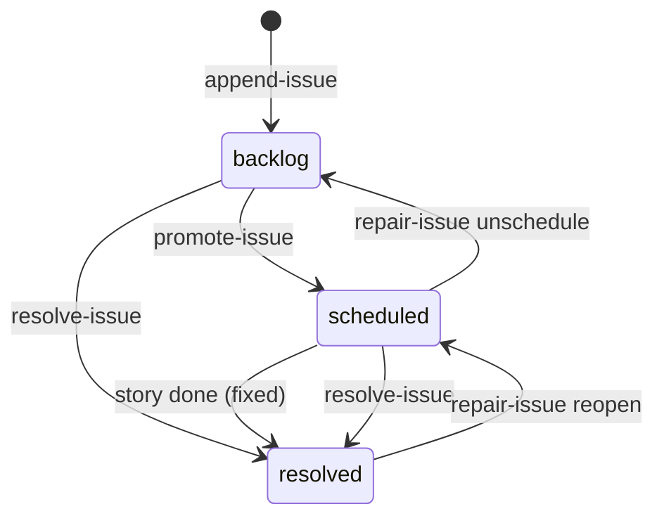

# Issue Lifecycle Implementation Plan

> **For agentic workers:** REQUIRED SUB-SKILL: Use superpowers:subagent-driven-development (recommended) or superpowers:executing-plans to implement this plan task-by-task. Steps use checkbox (`- [ ]`) syntax for tracking.

**Goal:** Give l3io-pm's deferred-issue backlog a full lifecycle: resolve, re-severity, promote to a story, auto-resolve on `done`, audit, triage, and repair. Keys are never reused, and nothing requires a hand edit.

**Architecture:** New verbs in the single self-installed `skills/_shared/pm-status.py` (ADR-0001), built on an `IssueStore` that loads `issues.yaml` and the new `issues-resolved.yaml` together under `issues_lock`. The verbs use non-exiting core functions that raise `PMError`, with thin `cmd_` wrappers. Heuristic auditing lives in doctor's own `scripts/audit-backlog.py`. The skill surfaces are markdown step-file changes: doctor `triage`, `pm-plan` intake, the producers, and `pm-sync`.

**Tech Stack:** Python ≥3.11 with `ruamel.yaml>=0.18` (PEP-723, `uv run`); `unittest`; Node 24 with `node:test`; GitHub Actions.

**Spec:** `docs/superpowers/specs/2026-09-10-issue-lifecycle-design.md` (approved 2026-09-10). ADRs: `docs/adr/0001…0003`. Read the spec section each task cites.

## Global Constraints

- **Edit canonical sources only.** Shared files are authored in `skills/_shared/`. Never hand-edit a per-skill copy (`skills/l3io-pm-*/scripts|steps|references/**`, `skills/l3io-util-doctor/scripts/pm-status.py`); they are regenerated by `npm run sync:scripts`.
- **Regenerate manifests with every payload change:** `node scripts/write-payload-manifest.mjs`. Never hand-edit a `payload-manifest.json`.
- **Every commit must pass** `npm run -s check:scripts`, `check:manifest`, `check:docs`, and `check:version`, plus the full pm-status suite.
- **Leave versions alone.** Do not touch the `pm-status-version` marker, `PM_STATUS_VERSION`, `package.json` `version`, `module.yaml`, or `marketplace.json`; `postbump` owns them. Do not bump the issues schema; new keys are additive.
- **`pm-status.py` stays one file (ADR-0001).** New shared runtime code goes inside it. Single-consumer code goes in its skill's own `scripts/`.
- **Exit codes:** `0` success, `2` usage error or refusal, `3` not found, `4` verification failure, `5` epic locked by another session.
- **Canonical BL key:** `BL-E` + 3 digits + `-` + 3 digits. Allocation is `max(next[epic], highest suffix for the epic in either file + 1)`, and `next` never decreases.
- **Lock order:** `epic_node_lock` before `issues_lock`, never the reverse. Never hold two `epic_node_lock`s at once.
- **Validate before writing:** every mutating verb validates everything before its first write, so a non-zero exit means nothing was written.
- **Keep `skills/_shared/steps/shared/step-00-digest.md` unchanged** (its byte budget is gated by check 8).
- **Keep the triage dispatch agent name `l3io-util-triage` out of live docs** (`README.md`, `CLAUDE.md`, `docs/*.md`), or check 1 fails.
- **Keep `list-issues --status backlog` out of `|` table rows** in `skills/l3io-pm-help/SKILL.md` and `skills/l3io-util-doctor/SKILL.md`; check 6 validates `--status` values in those tables against state folders.
- **Tests go through the real CLI** (`pm.main([...])` or a subprocess). Hand-written YAML is allowed only for epic/sprint/story fixture nodes (no verb creates them) and for deliberately corrupt states that prove an audit detects them.
- **Git:** Conventional Commits with DCO sign-off (`git commit -s`). Stage by explicit path only, never `-A` or `.`. Other agents may share this checkout, so run `git status --short` before staging and stage only this task's paths. Do not push.
- **CI Node runtime** is `24`; `package.json` `engines.node` is `">=22"`; `.nvmrc` is `24`.

## Conventions

**Test commands** (run from the repo root):

```bash
# one class
uv run -q --with 'ruamel.yaml>=0.18' python3 skills/_shared/tests/test-pm-status.py TestIssueAllocator
# whole pm-status suite
uv run -q --with 'ruamel.yaml>=0.18' python3 skills/_shared/tests/test-pm-status.py 2>&1 | tail -4
```

**Finish procedure (F).** Every task ends with it. The task lists its own `PATHS` and commit subject.

```bash
npm run sync:scripts                      # regenerates per-skill copies AND git-adds them
node scripts/write-payload-manifest.mjs   # regenerates every payload-manifest.json
npm run -s check:scripts && npm run -s check:manifest && npm run -s check:docs && npm run -s check:version
uv run -q --with 'ruamel.yaml>=0.18' python3 skills/_shared/tests/test-pm-status.py 2>&1 | tail -4   # must end "OK"
git status --short                        # confirm only this task's files (plus synced copies) changed
git add -- $PATHS skills/*/payload-manifest.json
git commit -s -F - <<'MSG'
<subject from the task>

<one paragraph: what changed and why, citing the spec section>

Co-Authored-By: Claude Opus 5 (1M context) <noreply@anthropic.com>
MSG
```

Tasks that change no payload file (docs-only or CI-only) skip the first two commands and the manifest glob.

## File map

| File | Responsibility | Tasks |
|---|---|---|
| `skills/_shared/pm-status.py` | `PMError`, `IssueStore`, allocator, `resolve-issue`, `update-issue`, `promote-issue`, `story-doc-init`, `audit-issues`, `repair-issue`, the `list-issues`/`append-issue` changes, the estimate cores, the `set-status` hook, `set-field` refusals | 1–11 |
| `skills/_shared/tests/test-pm-status.py` | `IssueBase` fixture plus one test class per verb | 1–11 |
| `docs/l3io-pm-reference.md` | subcommand table rows (check 4); Backlog section | 1–11, 18 |
| `skills/_shared/status-files.md` | §7 subcommand rows; §1, §3, §4, §9 narrative | 1–11, 15, 18 |
| `skills/l3io-util-doctor/scripts/audit-backlog.py` (new) | heuristic verdicts | 12 |
| `skills/l3io-util-doctor/scripts/tests/test-audit-backlog.py` (new) | its tests | 12 |
| `skills/l3io-util-doctor/steps/triage.md` (new), `SKILL.md`, `steps/health-check.md`, `steps/backlog.md`, `steps/stats.md`, `steps/harvest-debt.md` | triage mode and readers | 13 |
| `skills/_shared/steps/plan/step-backlog-intake.md` (new), `skills/l3io-pm-plan/SKILL.md`, `scripts/sync-shared-scripts.mjs` | intake | 14 |
| `skills/_shared/steps/closure/{epic,sprint}-closure.md`, `steps/execute/step-04-arch-gate.md`, `steps/sprint/step-03-dev-loop.md`, `steps/sprint/step-02-story-prep.md`, `skills/l3io-util-doctor/assets/migrate-state.md`, `skills/l3io-pm-help/SKILL.md` | producers and readers | 15 |
| `skills/_shared/steps/sync/step-03-operations.md` | pull only on completion | 16 |
| `scripts/check-docs.mjs`, `scripts/tests/check-docs.test.mjs` (new), `package.json`, `.nvmrc` (new), `.github/workflows/checks.yml` | check 11, `node:test`, Node 24 | 17 |
| `CLAUDE.md`, `docs/architecture.md`, `docs/getting-started.md` | narrative docs | 18 |

---

### Task 1: Issue store, allocator, and `append-issue` addressing

Implements spec §1.1, §1.4 (invariants 2 and 6), §1.6, §2 common rules, §2.1 (addressing and keys), and §2.7 (`issue_opened`). The key-reuse fix and its regression test land here, first.

**Files:**
- Modify: `skills/_shared/pm-status.py`. Add `PMError` and `_run_core` after `_die_notfound` (~l.400). Add the issue-store section right after `_BL_KEY_RE` (~l.4196). Rewrite `cmd_append_issue` (~l.4258). Update the `append-issue` parser (~l.4950) and the module docstring's `append-issue` entry.
- Modify: `skills/_shared/tests/test-pm-status.py`. Add `_build_issue_tree`, `IssueBase`, and `TestIssueAllocator` after `ISSUES_FIXTURE`.
- Modify: `docs/l3io-pm-reference.md` (`append-issue` row) and `skills/_shared/status-files.md` (§3 bullet and §7 `append-issue` row).

**Interfaces:**
- Produces:
  - `PMError(code: int, msg: str)` with `.code` and `.msg`.
  - `_run_core(fn: Callable[[], int]) -> int`.
  - `_int_or_none(v) -> int | None`; `canonical_bl_key(key) -> str | None`; `issues_paths(state_root) -> (open_path, resolved_path)`.
  - Constants `ISSUES_FILENAME`, `RESOLVED_FILENAME`, `OPEN_ISSUE_STATUSES`, `RESOLUTIONS`, `SEVERITY_RANK`.
  - `IssueStore(open_path)` with:
    - `.open_path`, `.resolved_path`, `.state_root`, `.backlog`, `.resolved`, `.open`, `.res`;
    - `.open_items(key)`, `.resolved_items(key)`, `.highest_suffix(epic_norm)`, `.stored_next(epic_norm)`, `.raise_next(epic_norm, at_least)`, `.allocate(epic_norm) -> key`;
    - `.save_open()`, `.save_resolved()`.
  - `_issue_event(state_root, event, item, session=None, cause="cli", **fields)`.
  - `_remove_identity(lst, obj)`.
  - Test side: `_build_issue_tree(root)`, and `IssueBase` with `run_all(argv) -> (code, out, err)`, `append(title, epic="001", sprint="01", severity="Low", source=…, *extra)`, `open_keys()`, `resolved_keys()`, `load_open()`, `load_resolved()`, `events()`.

- [ ] **Step 1: Add the fixture and failing tests**

Append to `skills/_shared/tests/test-pm-status.py`, directly after the `ISSUES_FIXTURE` string:

```python
from unittest import mock


def _build_issue_tree(root):
    """State tree for issue-lifecycle tests. Epic/sprint nodes are hand-written
    because no verb creates them; every ISSUE is created through the real CLI.
      active/epic-001: S01 in-progress, S02 backlog
      planned/epic-005: S01 backlog
    """
    nodes = {
        "active/epic-001/epic.yaml": "key: 'E001'\ntitle: 'Foundation'\nstatus: in-progress\n",
        "active/epic-001/sprint-01/sprint.yaml":
            "key: 'S01'\nepic: 'E001'\ntitle: 'One'\nstatus: in-progress\n",
        "active/epic-001/sprint-02/sprint.yaml":
            "key: 'S02'\nepic: 'E001'\ntitle: 'Two'\nstatus: backlog\n",
        "planned/epic-005/epic.yaml": "key: 'E005'\ntitle: 'Later'\nstatus: backlog\n",
        "planned/epic-005/sprint-01/sprint.yaml":
            "key: 'S01'\nepic: 'E005'\ntitle: 'Later one'\nstatus: backlog\n",
    }
    for rel, text in nodes.items():
        p = os.path.join(root, rel)
        os.makedirs(os.path.dirname(p), exist_ok=True)
        with open(p, "w", encoding="utf-8") as fh:
            fh.write(text)


class IssueBase(Base):
    """impl/ is the artifacts root; impl/state the state root."""

    def setUp(self):
        super().setUp()
        self.addCleanup(shutil.rmtree, self.d, True)
        self.arts = os.path.join(self.d, "impl")
        self.root = os.path.join(self.arts, "state")
        _build_issue_tree(self.root)
        self.issues = os.path.join(self.root, "issues.yaml")
        self.resolved = os.path.join(self.root, "issues-resolved.yaml")

    def run_all(self, argv):
        out, err = io.StringIO(), io.StringIO()
        code = 0
        try:
            with redirect_stdout(out), redirect_stderr(err):
                code = pm.main(argv)
        except SystemExit as e:
            code = e.code if isinstance(e.code, int) else 1
        return code, out.getvalue(), err.getvalue()

    def append(self, title, epic="001", sprint="01", severity="Low",
               source="code-review (E001-S01-001)", *extra):
        return self.run_all(["append-issue", "--state-root", self.root, "--epic", epic,
                             "--sprint", sprint, "--title", title, "--source", source,
                             "--severity", severity, *extra])

    def load_open(self):
        return pm._load(self.issues)[1] or {}

    def load_resolved(self):
        return pm._load(self.resolved)[1] or {}

    def open_keys(self):
        return [str(i["key"]) for i in (self.load_open().get("backlog") or [])]

    def resolved_keys(self):
        return [str(i["key"]) for i in (self.load_resolved().get("resolved") or [])]

    def events(self, name=None):
        p = pm.events_path(self.root)
        if not os.path.exists(p):
            return []
        with open(p, encoding="utf-8") as fh:
            evs = [json.loads(l) for l in fh if l.strip()]
        return [e for e in evs if name is None or e.get("event") == name]


class TestIssueAllocator(IssueBase):
    def test_hand_deleted_highest_key_is_never_reused(self):
        """The reproduced defect: after the newest item is deleted by hand, the old
        allocator ('highest surviving + 1') gave its key to an unrelated finding."""
        for t in ("A first", "B second", "C third"):
            self.assertEqual(self.append(t)[0], 0)
        y, data = pm._load(self.issues)
        data["backlog"] = [i for i in data["backlog"] if i["key"] != "BL-E001-003"]
        pm._atomic_dump(y, data, self.issues)
        code, out, err = self.append("D unrelated")
        self.assertEqual(code, 0, err)
        self.assertIn("BL-E001-004", out)
        self.assertNotIn("BL-E001-003", self.open_keys())

    def test_next_is_written_per_epic(self):
        self.append("A")
        self.append("B")
        self.append("C", epic="005", sprint="01", source="qa (Q-1)")
        nxt = self.load_open()["next"]
        self.assertEqual(int(nxt["001"]), 3)
        self.assertEqual(int(nxt["005"]), 2)

    def test_seeds_from_highest_suffix_in_both_files(self):
        for t in ("A", "B", "C", "D", "E"):
            self.append(t)
        y, data = pm._load(self.issues)
        del data["next"]
        pm._atomic_dump(y, data, self.issues)
        # a pre-existing resolved record that predates `next` (deliberately hand-built)
        with open(self.resolved, "w", encoding="utf-8") as fh:
            fh.write("resolved:\n- key: BL-E001-007\n  epic: '001'\n  title: old\n"
                     "  resolution: fixed\n")
        code, out, err = self.append("F")
        self.assertEqual(code, 0, err)
        self.assertIn("BL-E001-008", out)

    def test_hand_written_item_beyond_stale_next(self):
        self.append("A")
        y, data = pm._load(self.issues)
        from ruamel.yaml.comments import CommentedMap
        data["backlog"].append(CommentedMap([("key", "BL-E001-009"), ("epic", "001"),
                                             ("title", "hand"), ("status", "backlog")]))
        pm._atomic_dump(y, data, self.issues)
        self.assertIn("BL-E001-010", self.append("B")[1])

    def test_malformed_next_warns_and_never_goes_backwards(self):
        self.append("A")
        self.append("B")
        y, data = pm._load(self.issues)
        data["next"] = "garbage"
        pm._atomic_dump(y, data, self.issues)
        code, out, err = self.append("C")
        self.assertEqual(code, 0, err)
        self.assertIn("warning", err)
        self.assertIn("BL-E001-003", out)

    def test_explicit_key_is_canonicalized_and_raises_next(self):
        code, out, err = self.append("A", "001", "01", "Low", "qa", "--key", "BL-E1-5")
        self.assertEqual(code, 0, err)
        self.assertEqual(self.open_keys(), ["BL-E001-005"])
        self.assertIn("BL-E001-006", self.append("B")[1])

    def test_explicit_key_epic_must_match(self):
        code, _, err = self.append("A", "001", "01", "Low", "qa", "--key", "BL-E002-001")
        self.assertEqual(code, 2)
        self.assertIn("epic", err)
        self.assertFalse(os.path.exists(self.issues))

    def test_explicit_key_that_cannot_be_canonical_is_refused(self):
        for bad in ("not-a-key", "BL-E1000-1", "BL-E001-000"):
            self.assertEqual(self.append("A", "001", "01", "Low", "qa", "--key", bad)[0], 2, bad)

    def test_explicit_key_present_in_resolved_file_is_refused(self):
        with open(self.resolved, "w", encoding="utf-8") as fh:
            fh.write("resolved:\n- key: BL-E001-004\n  epic: '001'\n  title: old\n"
                     "  resolution: fixed\n")
        code, _, err = self.append("A", "001", "01", "Low", "qa", "--key", "BL-E001-004")
        self.assertEqual(code, 2)
        self.assertIn("already exists", err)

    def test_state_root_with_mismatched_file_is_refused(self):
        code, _, err = self.run_all(["append-issue", "--state-root", self.root,
                                     "--file", os.path.join(self.d, "other.yaml"),
                                     "--epic", "001", "--title", "A", "--source", "qa",
                                     "--severity", "Low"])
        self.assertEqual(code, 2, err)

    def test_file_only_is_still_accepted(self):
        code, out, err = self.run_all(["append-issue", "--file", self.issues, "--epic", "001",
                                       "--title", "A", "--source", "qa", "--severity", "Low"])
        self.assertEqual(code, 0, err)
        self.assertEqual(self.open_keys(), ["BL-E001-001"])

    def test_neither_file_nor_state_root_is_refused(self):
        code, _, _ = self.run_all(["append-issue", "--epic", "001", "--title", "A",
                                   "--source", "qa", "--severity", "Low"])
        self.assertEqual(code, 2)

    def test_append_writes_issue_opened_event(self):
        self.append("A", "001", "01", "Medium", "qa", "--session-id", "S-1")
        ev = self.events("issue_opened")
        self.assertEqual(len(ev), 1)
        self.assertEqual(ev[0]["key"], "BL-E001-001")
        self.assertEqual(ev[0]["session"], "S-1")
        self.assertEqual(ev[0]["cause"], "cli")
        self.assertEqual(ev[0]["severity"], "Medium")
        self.assertIn("ts", ev[0])
```

- [ ] **Step 2: Run the tests and confirm they fail**

Run: `uv run -q --with 'ruamel.yaml>=0.18' python3 skills/_shared/tests/test-pm-status.py TestIssueAllocator`
Expected: FAIL. Most tests exit 2 with `unrecognized arguments: --state-root`.

- [ ] **Step 3: Add `PMError` and `_run_core`**

In `skills/_shared/pm-status.py`, directly after `def _die_notfound(...)`:

```python
class PMError(Exception):
    """A refusal or failure raised by a non-exiting core function.

    Core functions never call sys.exit: in-process callers -- the set-status done
    hook, promote-issue's estimate -- must be able to catch a failure. Only a cmd_
    wrapper turns one into an exit code, through _run_core."""

    def __init__(self, code: int, msg: str):
        super().__init__(msg)
        self.code = code
        self.msg = msg


def _run_core(fn) -> int:
    """Run a cmd_ body, mapping PMError onto the exit-code contract."""
    try:
        return fn()
    except PMError as e:
        sys.stderr.write(f"pm-status.py: {e.msg}\n")
        return e.code
```

- [ ] **Step 4: Add the issue-store section**

Directly after `_BL_KEY_RE = re.compile(r"^BL-E(\d+)-(\d+)$")`:

```python
# --------------------------------------------------------------------------- #
# Issue store -- issues.yaml (open items) + issues-resolved.yaml (resolved).
# Spec: docs/superpowers/specs/2026-09-10-issue-lifecycle-design.md; ADR-0002.
# --------------------------------------------------------------------------- #
ISSUES_FILENAME = "issues.yaml"
RESOLVED_FILENAME = "issues-resolved.yaml"
OPEN_ISSUE_STATUSES = ("backlog", "scheduled")
RESOLUTIONS = ("fixed", "wontfix", "duplicate", "obsolete")
SEVERITY_RANK = {"Low": 0, "Medium": 1, "High": 2, "Critical": 3}


def _int_or_none(v):
    if isinstance(v, bool):
        return None
    try:
        return int(str(v).strip())
    except (TypeError, ValueError):
        return None


def canonical_bl_key(key):
    """'BL-E1-2' -> 'BL-E001-002'. None when the key cannot be written canonically."""
    m = _BL_KEY_RE.match(str(key).strip())
    if not m:
        return None
    epic, n = int(m.group(1)), int(m.group(2))
    if epic > 999 or n > 999 or n < 1:
        return None
    return f"BL-E{epic:03d}-{n:03d}"


def issues_paths(state_root: str) -> tuple:
    return (os.path.join(state_root, ISSUES_FILENAME),
            os.path.join(state_root, RESOLVED_FILENAME))


def _remove_identity(lst, obj) -> None:
    """Remove `obj` itself -- not an equal mapping -- from a list."""
    for i, x in enumerate(lst):
        if x is obj:
            del lst[i]
            return


class IssueStore:
    """Both issue files, loaded together. The caller holds issues_lock(open_path)
    across the whole load -> mutate -> save cycle; the resolved file lives beside
    the open one, so one lock covers both."""

    def __init__(self, open_path: str):
        from ruamel.yaml.comments import CommentedMap, CommentedSeq
        self.open_path = open_path
        self.state_root = os.path.dirname(os.path.abspath(open_path))
        self.resolved_path = os.path.join(self.state_root, RESOLVED_FILENAME)
        self.y, self.open = _load(open_path)
        self.yr, self.res = _load(self.resolved_path)
        if self.open is None:
            self.open = CommentedMap()
        if self.open.get("backlog") is None:
            self.open["backlog"] = CommentedSeq()
        if self.res is None:
            self.res = CommentedMap()
        if self.res.get("resolved") is None:
            self.res["resolved"] = CommentedSeq()
        for name, lst, path in (("backlog", self.open["backlog"], open_path),
                                ("resolved", self.res["resolved"], self.resolved_path)):
            if not isinstance(lst, list):
                raise PMError(2, f"{path} has a malformed '{name}' field (expected a list, "
                                 f"got {type(lst).__name__}: {lst!r}); refusing to write -- "
                                 f"a list that cannot say what is recorded cannot be trusted "
                                 f"to receive more. Fix or restore it by hand, then retry.")

    @property
    def backlog(self):
        return self.open["backlog"]

    @property
    def resolved(self):
        return self.res["resolved"]

    @staticmethod
    def _matching(lst, key):
        return [i for i in lst if isinstance(i, dict) and str(i.get("key", "")) == key]

    def open_items(self, key):
        return self._matching(self.backlog, key)

    def resolved_items(self, key):
        return self._matching(self.resolved, key)

    def highest_suffix(self, epic_norm: str) -> int:
        highest = 0
        for item in list(self.backlog) + list(self.resolved):
            if not isinstance(item, dict):
                continue
            m = _BL_KEY_RE.match(str(item.get("key", "")))
            if m and _norm_num(m.group(1), 3) == epic_norm:
                highest = max(highest, int(m.group(2)))
        return highest

    def stored_next(self, epic_norm: str):
        nxt = self.open.get("next")
        if not isinstance(nxt, dict) or epic_norm not in nxt:
            return None
        n = _int_or_none(nxt.get(epic_norm))
        if n is None:
            sys.stderr.write(f"pm-status.py: warning -- next[{epic_norm!r}] = "
                             f"{nxt.get(epic_norm)!r} is not an integer; ignoring it\n")
        return n

    def _next_map(self):
        from ruamel.yaml.comments import CommentedMap
        nxt = self.open.get("next")
        if nxt is not None and not isinstance(nxt, dict):
            sys.stderr.write(f"pm-status.py: warning -- {self.open_path} has a malformed "
                             f"'next' ({nxt!r}); rebuilding it from the highest keys\n")
            nxt = None
        if nxt is None:
            nxt = CommentedMap()
            if "next" in self.open:
                self.open["next"] = nxt
            else:
                self.open.insert(0, "next", nxt)
        return nxt

    def raise_next(self, epic_norm: str, at_least: int) -> None:
        """`next` never decreases: store max(what is stored, at_least)."""
        stored = self.stored_next(epic_norm)
        self._next_map()[epic_norm] = max(stored or 0, at_least)

    def allocate(self, epic_norm: str) -> str:
        n = max(self.stored_next(epic_norm) or 1, self.highest_suffix(epic_norm) + 1)
        self.raise_next(epic_norm, n + 1)
        return f"BL-E{epic_norm}-{n:03d}"

    def save_open(self) -> None:
        _atomic_dump(self.y, self.open, self.open_path)

    def save_resolved(self) -> None:
        _atomic_dump(self.yr, self.res, self.resolved_path)


def _issue_event(state_root, event, item, session=None, cause="cli", **fields) -> None:
    payload = {"ts": _now_iso(), "event": event, "key": str(item.get("key", "")),
               "epic": str(item.get("epic", "")), "session": session, "cause": cause}
    payload.update(fields)
    append_event(state_root, payload)
```

- [ ] **Step 5: Rewrite `cmd_append_issue`**

Replace the whole of `def cmd_append_issue(args) -> int:` (keep its docstring; add one closing paragraph: "Keys come from `IssueStore.allocate`: `max(next[epic], highest suffix in either issue file + 1)`, so a deleted or resolved item's key is never handed out again.") with:

```python
def cmd_append_issue(args) -> int:
    # (existing docstring, plus the paragraph above)
    return _run_core(lambda: _append_issue(args))


def _issues_open_path(args) -> str:
    """The open issues file from --state-root, or from --file (compatibility)."""
    sr = getattr(args, "state_root", "") or ""
    f = getattr(args, "file", "") or ""
    if sr:
        p = issues_paths(sr)[0]
        if f and os.path.abspath(f) != os.path.abspath(p):
            raise PMError(2, f"append-issue: --file {f} is not {p} -- pass --state-root "
                             f"alone (--file is kept only for compatibility)")
        return p
    if f:
        return f
    raise PMError(2, "append-issue: pass --state-root (or, for compatibility, --file)")


def _append_issue(args) -> int:
    from ruamel.yaml.comments import CommentedMap
    open_path = _issues_open_path(args)
    epic_norm = _norm_num(args.epic, 3)
    sprint_norm = _norm_num(args.sprint, 2) if args.sprint else ""
    norm_title = _norm_issue_title(args.title)
    explicit = None
    if args.key:
        explicit = canonical_bl_key(args.key)
        if explicit is None:
            raise PMError(2, f"append-issue: --key {args.key!r} is not a backlog key "
                             f"(expected BL-E{{nnn}}-{{nnn}})")
        if explicit[4:7] != epic_norm:
            raise PMError(2, f"append-issue: --key {explicit} belongs to epic "
                             f"{explicit[4:7]}, not --epic {epic_norm}")
    with issues_lock(open_path):
        store = IssueStore(open_path)
        if explicit is not None:
            clash = store.open_items(explicit) + store.resolved_items(explicit)
            if clash:
                raise PMError(2, f"append-issue: --key {explicit!r} already exists "
                                 f"(title: {clash[0].get('title', '')!r}) -- refusing to "
                                 f"silently assign a different key; pick a key that is not "
                                 f"already taken, or omit --key to auto-allocate the next "
                                 f"one for this epic")
        if not args.allow_duplicate:
            dup = _find_issue_by_content(store.backlog, epic_norm, sprint_norm,
                                         args.source, norm_title)
            if dup is not None:
                sys.stdout.write(
                    f"OK append-issue skipped -- matches existing {dup.get('key', '')} "
                    f"(same title/epic/sprint/source); nothing written. Pass "
                    f"--allow-duplicate to force a second entry.\n")
                return 0
        if explicit is not None:
            key = explicit
            store.raise_next(epic_norm, int(explicit[-3:]) + 1)
        else:
            key = store.allocate(epic_norm)
        item = CommentedMap()
        item["key"] = key
        item["epic"] = args.epic
        item["sprint"] = args.sprint if args.sprint else ""
        item["title"] = args.title
        item["source"] = args.source
        item["severity"] = args.severity
        item["status"] = "backlog"
        if args.description:
            item["description"] = args.description
        store.backlog.append(item)
        store.save_open()
    _issue_event(store.state_root, "issue_opened", item,
                 getattr(args, "session_id", None), "cli", severity=args.severity)
    sys.stdout.write(f"OK append-issue {key} -> {open_path}\n")
    return 0
```

- [ ] **Step 6: Update the parser**

In `build_parser`, replace the `ai.add_argument("--file", required=True)` line with:

```python
    ai.add_argument("--state-root", dest="state_root", default="",
                    help="path to {implementation_artifacts}/state (preferred)")
    ai.add_argument("--file", default="",
                    help="compatibility alias for <state-root>/issues.yaml")
    ai.add_argument("--session-id", dest="session_id", default=None)
```

- [ ] **Step 7: Run the tests and confirm they pass**

Run: `uv run -q --with 'ruamel.yaml>=0.18' python3 skills/_shared/tests/test-pm-status.py TestIssueAllocator TestAppendIssue TestConcurrentAppendIssue`
Expected: PASS. `TestAppendIssue` covers the unchanged messages: `Existing issue` on stderr, and `malformed`/`backlog` with the file untouched.

- [ ] **Step 8: Update the docs this task changes**

- Module docstring, `append-issue` entry. Replace its first line with `append-issue  (--state-root S | --file F)  [--key BL-E{nnn}-{nnn}]  --epic E  [--sprint S]  --title T`, and add one line after `[--allow-duplicate]`: `[--session-id ID]   (keys: max(next[epic], highest suffix in either issue file + 1); an explicit --key is canonicalized and must match --epic)`.
- `docs/l3io-pm-reference.md` `append-issue` row. Replace the addressing text with: `` `--state-root` (preferred) or `--file` (compatibility; must equal `<state-root>/issues.yaml`). `--key` is optional: omitted, the key is allocated as max(`next[epic]`, highest suffix in either issue file + 1); given, it is canonicalized, must match `--epic`, and exits 2 if it exists in either file. `--allow-duplicate` forces a content duplicate. ``
- `skills/_shared/status-files.md` §7 row `` | `append-issue` | `--file` (the one exception; see above) | `` becomes `` | `append-issue` | `--state-root` (preferred) or `--file` (compatibility) | ``. In §3's backlog-key bullet, append: ``Allocation is `max(next[epic], highest suffix in either issues.yaml or issues-resolved.yaml + 1)` — the per-epic `next:` map in `issues.yaml` is a high-water mark that never decreases, so a deleted or resolved key is never reused.``

- [ ] **Step 9: Finish (F)**

`PATHS="skills/_shared/pm-status.py skills/_shared/tests/test-pm-status.py docs/l3io-pm-reference.md skills/_shared/status-files.md"`
Subject: `fix(l3io-pm): never reuse a BL key -- per-epic next high-water allocator`

---

### Task 2: `resolve-issue`

Implements spec §1.2, §1.4 (invariants 1 and 5), and §2.2.

**Files:**
- Modify: `skills/_shared/pm-status.py`. Add the resolve core and `cmd_resolve_issue` after `_append_issue`, the parser entry after `append-issue`'s, and a docstring entry.
- Modify: `skills/_shared/tests/test-pm-status.py`. Add `TestResolveIssue` and `TestConcurrentResolveAppend`.
- Modify: `docs/l3io-pm-reference.md` and `skills/_shared/status-files.md` §7 (add a row each).

**Interfaces:**
- Consumes (Task 1): `IssueStore`, `PMError`, `_run_core`, `canonical_bl_key`, `issues_paths`, `issues_lock`, `_issue_event`, `_remove_identity`, `RESOLUTIONS`.
- Produces:
  - `resolve_issue_core(store, key, resolution, ref=None, note=None, session=None, cause="cli") -> str`. The caller holds `issues_lock(store.open_path)`. It returns a one-line description and raises `PMError`.
  - `_STORY_KEY_RE` and `_SHA_RE`.
  - The CLI: `resolve-issue --state-root S --key K --resolution R [--ref] [--note] [--session-id] [--cause {cli,triage,plan-intake}]`.

- [ ] **Step 1: Write the failing tests**

Append to the test file:

```python
class TestResolveIssue(IssueBase):
    def resolve(self, key, resolution, *extra):
        return self.run_all(["resolve-issue", "--state-root", self.root, "--key", key,
                             "--resolution", resolution, *extra])

    def test_resolve_moves_the_item_whole(self):
        self.append("A", "001", "01", "Medium")
        code, out, err = self.resolve("BL-E001-001", "wontfix", "--note", "accepted risk")
        self.assertEqual(code, 0, err)
        self.assertEqual(self.open_keys(), [])
        self.assertEqual(self.resolved_keys(), ["BL-E001-001"])
        entry = self.load_resolved()["resolved"][0]
        self.assertEqual(entry["status"], "resolved")
        self.assertEqual(entry["resolution"], "wontfix")
        self.assertEqual(entry["note"], "accepted risk")
        self.assertEqual(entry["severity"], "Medium")
        self.assertTrue(entry["resolved_at"])

    def test_resolving_the_highest_then_appending_never_reuses(self):
        for t in ("A", "B", "C"):
            self.append(t)
        self.assertEqual(self.resolve("BL-E001-003", "obsolete", "--note", "gone")[0], 0)
        self.assertIn("BL-E001-004", self.append("D")[1])

    def test_required_flags_refuse_and_write_nothing(self):
        self.append("A")
        before = open(self.issues, encoding="utf-8").read()
        for argv in (("fixed",), ("wontfix",), ("obsolete",), ("duplicate",),
                     ("fixed", "--ref", "later")):
            code, _, _ = self.resolve("BL-E001-001", *argv)
            self.assertEqual(code, 2, argv)
        self.assertEqual(open(self.issues, encoding="utf-8").read(), before)
        self.assertFalse(os.path.exists(self.resolved))

    def test_fixed_ref_accepts_story_key_or_sha(self):
        self.append("A")
        self.append("B", "001", "02")
        self.assertEqual(self.resolve("BL-E001-001", "fixed", "--ref", "E001-S01-001")[0], 0)
        self.assertEqual(self.resolve("BL-E001-002", "fixed", "--ref", "abc1234")[0], 0)

    def test_duplicate_ref_rules_forbid_chains(self):
        self.append("A")
        self.append("B", "001", "02")
        self.append("C", "001", "03")
        self.assertEqual(self.resolve("BL-E001-002", "duplicate", "--ref", "BL-E001-002")[0], 2)
        self.assertEqual(self.resolve("BL-E001-002", "duplicate", "--ref", "BL-E001-099")[0], 2)
        self.assertEqual(self.resolve("BL-E001-002", "duplicate", "--ref", "BL-E001-001")[0], 0)
        # B is now a resolved duplicate: C may not point at it
        self.assertEqual(self.resolve("BL-E001-003", "duplicate", "--ref", "BL-E001-002")[0], 2)

    def test_rerun_is_idempotent(self):
        self.append("A")
        self.resolve("BL-E001-001", "obsolete", "--note", "gone")
        code, out, _ = self.resolve("BL-E001-001", "obsolete", "--note", "gone")
        self.assertEqual(code, 0)
        self.assertIn("already resolved", out)
        self.assertEqual(self.resolved_keys(), ["BL-E001-001"])

    def test_unknown_key_exits_3(self):
        self.assertEqual(self.resolve("BL-E001-042", "obsolete", "--note", "x")[0], 3)

    def test_crash_between_writes_is_cleared_by_rerun(self):
        self.append("A")
        real, calls = pm._atomic_dump, {"n": 0}

        def flaky(y, data, path):
            calls["n"] += 1
            if calls["n"] == 2:            # the second save is the open file
                raise OSError("injected")
            return real(y, data, path)

        with mock.patch.object(pm, "_atomic_dump", flaky):
            with self.assertRaises(OSError):
                pm.main(["resolve-issue", "--state-root", self.root, "--key", "BL-E001-001",
                         "--resolution", "obsolete", "--note", "gone"])
        self.assertEqual(self.open_keys(), ["BL-E001-001"])      # premise: both files
        self.assertEqual(self.resolved_keys(), ["BL-E001-001"])
        code, out, _ = self.resolve("BL-E001-001", "obsolete", "--note", "gone")
        self.assertEqual(code, 0)
        self.assertIn("removed the stale open copy", out)
        self.assertEqual(self.open_keys(), [])
        self.assertEqual(self.resolved_keys(), ["BL-E001-001"])

    def test_key_duplicated_in_open_file_is_refused(self):
        self.append("A")
        y, data = pm._load(self.issues)
        from ruamel.yaml.comments import CommentedMap
        data["backlog"].append(CommentedMap(data["backlog"][0]))
        pm._atomic_dump(y, data, self.issues)
        code, _, err = self.resolve("BL-E001-001", "obsolete", "--note", "x")
        self.assertEqual(code, 2)
        self.assertIn("1i", err)

    def test_malformed_resolved_list_is_refused(self):
        self.append("A")
        with open(self.resolved, "w", encoding="utf-8") as fh:
            fh.write("resolved: oops\n")
        self.assertEqual(self.resolve("BL-E001-001", "obsolete", "--note", "x")[0], 2)
        self.assertEqual(self.open_keys(), ["BL-E001-001"])

    def test_event_carries_resolution_and_cause(self):
        self.append("A")
        self.resolve("BL-E001-001", "fixed", "--ref", "abc1234", "--session-id", "S-9",
                     "--cause", "triage")
        ev = self.events("issue_resolved")[-1]
        self.assertEqual((ev["resolution"], ev["ref"], ev["session"], ev["cause"]),
                         ("fixed", "abc1234", "S-9", "triage"))


class TestConcurrentResolveAppend(unittest.TestCase):
    """Real subprocesses: _file_lock's re-entrancy counter is per process, so
    threads would pass vacuously with the lock removed."""
    N = 6

    def setUp(self):
        self.d = tempfile.mkdtemp()
        self.addCleanup(shutil.rmtree, self.d, True)
        self.root = os.path.join(self.d, "state")
        _build_issue_tree(self.root)
        for i in range(1, self.N + 1):
            self.assertEqual(pm.main(["append-issue", "--state-root", self.root, "--epic", "001",
                                      "--title", f"seed {i}", "--source", "qa",
                                      "--severity", "Low"]), 0)

    def test_parallel_resolves_and_appends_lose_nothing(self):
        import subprocess
        procs = [subprocess.Popen([sys.executable, SCRIPT, "resolve-issue", "--state-root",
                                   self.root, "--key", f"BL-E001-{i:03d}", "--resolution",
                                   "obsolete", "--note", "x"],
                                  stdout=subprocess.PIPE, stderr=subprocess.PIPE)
                 for i in range(1, self.N + 1)]
        procs += [subprocess.Popen([sys.executable, SCRIPT, "append-issue", "--state-root",
                                    self.root, "--epic", "001", "--title", f"new {i}",
                                    "--source", "qa", "--severity", "Low"],
                                   stdout=subprocess.PIPE, stderr=subprocess.PIPE)
                  for i in range(1, self.N + 1)]
        for p in procs:
            _, err = p.communicate(timeout=120)
            self.assertEqual(p.returncode, 0, err.decode())
        _, o = pm._load(os.path.join(self.root, "issues.yaml"))
        _, r = pm._load(os.path.join(self.root, "issues-resolved.yaml"))
        open_keys = [str(i["key"]) for i in o["backlog"]]
        res_keys = [str(i["key"]) for i in r["resolved"]]
        self.assertEqual(sorted(res_keys), [f"BL-E001-{i:03d}" for i in range(1, self.N + 1)])
        self.assertEqual(len(open_keys), self.N)
        self.assertEqual(len(set(open_keys)), self.N, "a key was allocated twice")
        self.assertFalse(set(open_keys) & set(res_keys), "a key is in both files")
```

- [ ] **Step 2: Run the tests and confirm they fail**

Run: `uv run -q --with 'ruamel.yaml>=0.18' python3 skills/_shared/tests/test-pm-status.py TestResolveIssue TestConcurrentResolveAppend`
Expected: FAIL with `invalid choice: 'resolve-issue'` (exit 2).

- [ ] **Step 3: Implement the resolve core and wrapper**

Add after `_append_issue`:

```python
_STORY_KEY_RE = re.compile(r"^E\d{3}-S\d{2}-\d{3}$")
_SHA_RE = re.compile(r"^[0-9a-f]{7,40}$")


def _validate_resolution_flags(resolution, ref, note) -> None:
    if resolution not in RESOLUTIONS:
        raise PMError(2, f"--resolution must be one of {', '.join(RESOLUTIONS)}")
    if resolution == "fixed":
        if not ref:
            raise PMError(2, "--resolution fixed needs --ref (a story key or a commit SHA)")
        if not (_STORY_KEY_RE.match(ref) or _SHA_RE.match(ref)):
            raise PMError(2, f"--ref {ref!r} is neither a story key (E{{nnn}}-S{{nn}}-{{nnn}}) "
                             f"nor a commit SHA")
    elif resolution == "duplicate":
        if not ref:
            raise PMError(2, "--resolution duplicate needs --ref naming the surviving BL key")
    elif not (note or "").strip():
        raise PMError(2, f"--resolution {resolution} needs --note saying why")


def resolve_issue_core(store, key, resolution, ref=None, note=None,
                       session=None, cause="cli") -> str:
    """Resolve one open item. The caller holds issues_lock(store.open_path).

    Order is the contract (spec §2.2): a key already in the resolved file has any
    stale open copy removed BEFORE the idempotent return, so a crash between the
    two writes below is always cleared by a rerun; otherwise the item is appended
    to the resolved file first and removed from the open file second, so a crash
    can duplicate it but never lose it."""
    from ruamel.yaml.comments import CommentedMap
    _validate_resolution_flags(resolution, ref, note)
    k = canonical_bl_key(key)
    if k is None:
        raise PMError(2, f"{key!r} is not a backlog key")
    opens, done = store.open_items(k), store.resolved_items(k)
    if len(opens) > 1:
        raise PMError(2, f"{k} appears {len(opens)} times in {store.open_path} -- resolve it "
                         f"by hand (audit-issues finding 1i)")
    if done:
        prior = done[-1].get("resolution")
        if opens:
            _remove_identity(store.backlog, opens[0])
            store.save_open()
            return f"{k} already resolved ({prior}); removed the stale open copy"
        return f"{k} already resolved ({prior})"
    if not opens:
        raise PMError(3, f"{k} is in neither {store.open_path} nor {store.resolved_path}")
    if resolution == "duplicate":
        r = canonical_bl_key(ref)
        if r is None or r == k:
            raise PMError(2, f"--ref {ref!r} must name a different BL key")
        t_open, t_res = store.open_items(r), store.resolved_items(r)
        if not t_open and not t_res:
            raise PMError(2, f"--ref {r} does not exist")
        if not t_open and all(str(t.get("resolution")) == "duplicate" for t in t_res):
            raise PMError(2, f"--ref {r} is itself resolved as a duplicate -- point at the "
                             f"item it duplicates")
        ref = r
    item = opens[0]
    entry = CommentedMap()
    for kk, vv in item.items():
        entry[kk] = vv
    entry["status"] = "resolved"
    entry["resolution"] = resolution
    entry["resolved_at"] = _now_iso()
    if ref:
        entry["ref"] = ref
    if note:
        entry["note"] = note
    store.resolved.append(entry)
    store.save_resolved()
    _remove_identity(store.backlog, item)
    store.save_open()
    _issue_event(store.state_root, "issue_resolved", entry, session, cause,
                 resolution=resolution, ref=ref)
    tail = ""
    if str(item.get("status")) == "scheduled" and cause != "set-status":
        tail = f"; story {item.get('story')} still lists it in resolves"
    return f"{k} ({resolution}{', ref ' + ref if ref else ''}){tail}"


def cmd_resolve_issue(args) -> int:
    def run():
        open_path = issues_paths(args.state_root)[0]
        with issues_lock(open_path):
            msg = resolve_issue_core(IssueStore(open_path), args.key, args.resolution,
                                     args.ref, args.note, args.session_id, args.cause)
        sys.stdout.write(f"OK resolve-issue {msg}\n")
        return 0
    return _run_core(run)
```

Parser, after the `append-issue` block:

```python
    ri = sub.add_parser("resolve-issue",
                        help="resolve an open BL item into issues-resolved.yaml")
    ri.add_argument("--state-root", required=True)
    ri.add_argument("--key", required=True)
    ri.add_argument("--resolution", required=True, choices=list(RESOLUTIONS))
    ri.add_argument("--ref", default=None)
    ri.add_argument("--note", default=None)
    ri.add_argument("--session-id", dest="session_id", default=None)
    ri.add_argument("--cause", default="cli", choices=["cli", "triage", "plan-intake"])
    ri.set_defaults(func=cmd_resolve_issue)
```

- [ ] **Step 4: Run the tests and confirm they pass**

Run: `uv run -q --with 'ruamel.yaml>=0.18' python3 skills/_shared/tests/test-pm-status.py TestResolveIssue TestConcurrentResolveAppend TestIssueAllocator`
Expected: PASS.

- [ ] **Step 5: Update the docs**

- Module docstring, after the `list-issues` entry:
  ```
    resolve-issue --state-root S  --key K  --resolution {fixed,wontfix,duplicate,obsolete}
                  [--ref R] [--note N] [--session-id ID] [--cause {cli,triage,plan-intake}]
                  (moves an open item to issues-resolved.yaml -- resolved file first, open
                  file second; fixed needs --ref story key or SHA, duplicate needs --ref an
                  open or non-duplicate BL key, wontfix/obsolete need --note; an already
                  resolved key exits 0 after clearing any stale open copy)
  ```
- `docs/l3io-pm-reference.md`, a new row after `list-issues`: `` | `resolve-issue` | `--state-root --key K --resolution {fixed,wontfix,duplicate,obsolete}` + `--ref`/`--note` as the resolution requires, optional `--session-id`/`--cause`. Moves the item to `issues-resolved.yaml`; idempotent. | ``
- `skills/_shared/status-files.md` §7, the same row.

- [ ] **Step 6: Finish (F)**

`PATHS="skills/_shared/pm-status.py skills/_shared/tests/test-pm-status.py docs/l3io-pm-reference.md skills/_shared/status-files.md"`
Subject: `feat(l3io-pm): resolve-issue moves BL items to issues-resolved.yaml`

---

### Task 3: `append-issue` dedupe against resolved items

Implements the dedupe rules in spec §2.1.

**Files:**
- Modify: `skills/_shared/pm-status.py`. Split `_find_issue_by_content` into `_content_matches` plus its loop, add `_last_resolved_match`, and extend `_append_issue`.
- Modify: `skills/_shared/tests/test-pm-status.py`. Add `TestAppendDedupeResolved`.
- Modify: the docstring's `append-issue` entry.

**Interfaces:**
- Consumes: Task 1's `_append_issue` and `SEVERITY_RANK`; Task 2's `resolve-issue` (used by the tests).
- Produces: `_content_matches(item, epic_norm, sprint_norm, source, norm_title) -> bool`; `_last_resolved_match(resolved, epic_norm, sprint_norm, source, norm_title) -> item | None`.

- [ ] **Step 1: Write the failing tests**

```python
class TestAppendDedupeResolved(IssueBase):
    def resolve(self, key, *argv):
        code, _, err = self.run_all(["resolve-issue", "--state-root", self.root,
                                     "--key", key, *argv])
        self.assertEqual(code, 0, err)

    def test_wontfix_same_or_lower_severity_is_skipped(self):
        self.append("A", "001", "01", "Medium")
        self.resolve("BL-E001-001", "--resolution", "wontfix", "--note", "risk accepted")
        for sev in ("Medium", "Low"):
            code, out, _ = self.append("A", "001", "01", sev)
            self.assertEqual(code, 0)
            self.assertIn("skipped", out)
            self.assertIn("resolved as wontfix", out)
        self.assertEqual(self.open_keys(), [])

    def test_higher_severity_than_wontfix_is_appended_as_reraised(self):
        self.append("A", "001", "01", "Low")
        self.resolve("BL-E001-001", "--resolution", "wontfix", "--note", "minor")
        code, out, _ = self.append("A", "001", "01", "High")
        self.assertEqual(code, 0)
        self.assertIn("re-raised above BL-E001-001 wontfix at Low", out)
        self.assertEqual(self.open_keys(), ["BL-E001-002"])

    def test_fixed_match_is_a_recurrence(self):
        self.append("A")
        self.resolve("BL-E001-001", "--resolution", "fixed", "--ref", "E001-S01-001")
        code, out, _ = self.append("A")
        self.assertIn("recurrence of BL-E001-001", out)
        self.assertEqual(self.open_keys(), ["BL-E001-002"])

    def test_newest_resolved_match_decides(self):
        self.append("A")
        self.resolve("BL-E001-001", "--resolution", "fixed", "--ref", "E001-S01-001")
        self.append("A")                                     # recurrence -> 002
        self.resolve("BL-E001-002", "--resolution", "wontfix", "--note", "stop")
        code, out, _ = self.append("A")
        self.assertIn("skipped", out)
        self.assertIn("BL-E001-002", out)

    def test_allow_duplicate_bypasses_resolved_match(self):
        self.append("A")
        self.resolve("BL-E001-001", "--resolution", "obsolete", "--note", "gone")
        self.append("A", "001", "01", "Low", "code-review (E001-S01-001)", "--allow-duplicate")
        self.assertEqual(self.open_keys(), ["BL-E001-002"])
```

- [ ] **Step 2: Run the tests and confirm they fail**

Run: `uv run -q --with 'ruamel.yaml>=0.18' python3 skills/_shared/tests/test-pm-status.py TestAppendDedupeResolved`
Expected: FAIL. The re-append is written, since resolved items aren't consulted yet.

- [ ] **Step 3: Implement**

Replace `_find_issue_by_content` (keep its docstring) with:

```python
def _content_matches(item, epic_norm: str, sprint_norm: str, source: str, norm_title: str) -> bool:
    return (isinstance(item, dict)
            and _norm_num(item.get("epic", ""), 3) == epic_norm
            and _norm_num(item.get("sprint", "") or "", 2) == sprint_norm
            and str(item.get("source", "")) == source
            and _norm_issue_title(item.get("title", "")) == norm_title)


def _find_issue_by_content(backlog, epic_norm: str, sprint_norm: str, source: str, norm_title: str):
    # (existing docstring)
    for item in backlog:
        if _content_matches(item, epic_norm, sprint_norm, source, norm_title):
            return item
    return None


def _last_resolved_match(resolved, epic_norm, sprint_norm, source, norm_title):
    """The NEWEST resolved item with the same content. issues-resolved.yaml is appended
    in resolution order, so the last match is the newest."""
    hits = [r for r in resolved if _content_matches(r, epic_norm, sprint_norm, source, norm_title)]
    return hits[-1] if hits else None
```

In `_append_issue`, replace the `if not args.allow_duplicate:` block with:

```python
        note = ""
        if not args.allow_duplicate:
            dup = _find_issue_by_content(store.backlog, epic_norm, sprint_norm,
                                         args.source, norm_title)
            if dup is not None:
                sys.stdout.write(
                    f"OK append-issue skipped -- matches existing {dup.get('key', '')} "
                    f"(same title/epic/sprint/source); nothing written. Pass "
                    f"--allow-duplicate to force a second entry.\n")
                return 0
            prior = _last_resolved_match(store.resolved, epic_norm, sprint_norm,
                                         args.source, norm_title)
            if prior is not None:
                res, psev = str(prior.get("resolution", "")), str(prior.get("severity", ""))
                if res == "fixed":
                    note = f" (recurrence of {prior.get('key')})"
                elif SEVERITY_RANK.get(args.severity, 0) > SEVERITY_RANK.get(psev, 0):
                    note = f" (re-raised above {prior.get('key')} {res} at {psev})"
                else:
                    sys.stdout.write(
                        f"OK append-issue skipped -- matches {prior.get('key')} resolved as "
                        f"{res} (severity {psev}); nothing written. Pass --allow-duplicate "
                        f"to force a second entry.\n")
                    return 0
```

Change the final `sys.stdout.write` in `_append_issue` to `sys.stdout.write(f"OK append-issue {key} -> {open_path}{note}\n")`.

- [ ] **Step 4: Run the tests and confirm they pass**

Run: `uv run -q --with 'ruamel.yaml>=0.18' python3 skills/_shared/tests/test-pm-status.py TestAppendDedupeResolved TestAppendIssue TestIssueAllocator`
Expected: PASS.

- [ ] **Step 5: Update the docstring**

In the `append-issue` entry, replace the dedupe sentence with: `A content duplicate (same normalized title/epic/sprint/source) of an open item, or of a resolved wontfix/duplicate/obsolete item at the same or higher severity, is skipped (exit 0, nothing written); a match against a resolved fixed item is appended as a recurrence, and one above a wontfix/duplicate/obsolete severity as re-raised. The newest resolved match decides. --allow-duplicate bypasses all of it.`

- [ ] **Step 6: Finish (F)**

`PATHS="skills/_shared/pm-status.py skills/_shared/tests/test-pm-status.py"`
Subject: `feat(l3io-pm): dedupe appends against resolved items; flag recurrences`

---

### Task 4: `update-issue`

Implements spec §2.3.

**Files:**
- Modify: `skills/_shared/pm-status.py`. Add `cmd_update_issue` after `cmd_resolve_issue`, plus its parser entry and docstring entry.
- Modify: `skills/_shared/tests/test-pm-status.py`. Add `TestUpdateIssue`.
- Modify: `docs/l3io-pm-reference.md` and `skills/_shared/status-files.md` §7 (add a row each).

**Interfaces:**
- Consumes: Task 1's `IssueStore`, `PMError`, `_run_core`, `_issue_event`, `canonical_bl_key`.
- Produces: `update_issue_core(store, key, severity, note=None, session=None, cause="cli") -> str`, and the CLI `update-issue --state-root S --key K --severity {Low,Medium,High,Critical} [--note] [--session-id] [--cause]`.

- [ ] **Step 1: Write the failing tests**

```python
class TestUpdateIssue(IssueBase):
    def update(self, key, sev, *extra):
        return self.run_all(["update-issue", "--state-root", self.root, "--key", key,
                             "--severity", sev, *extra])

    def test_severity_actually_changes(self):
        """The assertion epic-closure §4's old 'promote via append-issue' never had:
        that path printed OK and changed nothing."""
        self.append("A", "001", "01", "Low")
        code, out, err = self.update("BL-E001-001", "High", "--note", "wider blast radius")
        self.assertEqual(code, 0, err)
        self.assertEqual(self.load_open()["backlog"][0]["severity"], "High")
        ev = self.events("issue_updated")[-1]
        self.assertEqual((ev["from"], ev["to"], ev["note"]), ("Low", "High", "wider blast radius"))

    def test_resolved_key_exits_2_naming_resolution(self):
        self.append("A")
        self.run_all(["resolve-issue", "--state-root", self.root, "--key", "BL-E001-001",
                      "--resolution", "obsolete", "--note", "gone"])
        code, _, err = self.update("BL-E001-001", "High")
        self.assertEqual(code, 2)
        self.assertIn("obsolete", err)

    def test_unknown_key_exits_3(self):
        self.assertEqual(self.update("BL-E001-077", "High")[0], 3)

    def test_invalid_severity_is_a_usage_error(self):
        self.append("A")
        self.assertEqual(self.update("BL-E001-001", "Severe")[0], 2)
```

- [ ] **Step 2: Run the tests and confirm they fail**

Run: `uv run -q --with 'ruamel.yaml>=0.18' python3 skills/_shared/tests/test-pm-status.py TestUpdateIssue`
Expected: FAIL with `invalid choice: 'update-issue'`.

- [ ] **Step 3: Implement**

```python
def update_issue_core(store, key, severity, note=None, session=None, cause="cli") -> str:
    """Change an open item's severity. The caller holds issues_lock(store.open_path)."""
    k = canonical_bl_key(key)
    if k is None:
        raise PMError(2, f"{key!r} is not a backlog key")
    opens = store.open_items(k)
    if not opens:
        done = store.resolved_items(k)
        if done:
            raise PMError(2, f"{k} is resolved ({done[-1].get('resolution')}) -- only open "
                             f"items can be re-severitied")
        raise PMError(3, f"{k} is not in {store.open_path}")
    if len(opens) > 1:
        raise PMError(2, f"{k} appears {len(opens)} times in {store.open_path} (audit-issues 1i)")
    item = opens[0]
    before = str(item.get("severity", ""))
    item["severity"] = severity
    store.save_open()
    _issue_event(store.state_root, "issue_updated", item, session, cause,
                 **{"from": before, "to": severity, "note": note})
    return f"{k} severity {before} -> {severity}"


def cmd_update_issue(args) -> int:
    def run():
        open_path = issues_paths(args.state_root)[0]
        with issues_lock(open_path):
            msg = update_issue_core(IssueStore(open_path), args.key, args.severity,
                                    args.note, args.session_id, args.cause)
        sys.stdout.write(f"OK update-issue {msg}\n")
        return 0
    return _run_core(run)
```

Parser, after `resolve-issue`:

```python
    ui = sub.add_parser("update-issue", help="change an open BL item's severity")
    ui.add_argument("--state-root", required=True)
    ui.add_argument("--key", required=True)
    ui.add_argument("--severity", required=True, choices=["Low", "Medium", "High", "Critical"])
    ui.add_argument("--note", default=None)
    ui.add_argument("--session-id", dest="session_id", default=None)
    ui.add_argument("--cause", default="cli", choices=["cli", "triage", "plan-intake"])
    ui.set_defaults(func=cmd_update_issue)
```

- [ ] **Step 4: Run the tests and confirm they pass**

Run: `uv run -q --with 'ruamel.yaml>=0.18' python3 skills/_shared/tests/test-pm-status.py TestUpdateIssue`
Expected: PASS.

- [ ] **Step 5: Update the docs**

- Docstring, after `resolve-issue`:
  ```
    update-issue  --state-root S  --key K  --severity {Low,Medium,High,Critical}
                  [--note N] [--session-id ID] [--cause {cli,triage,plan-intake}]
                  (re-severities an OPEN item; a resolved key exits 2, an unknown one 3)
  ```
- Reference-doc row and `status-files.md` §7 row: `` | `update-issue` | `--state-root --key K --severity S` + optional `--note`/`--session-id`/`--cause` — re-severities an open item (the promotion path epic closure uses). | ``

- [ ] **Step 6: Finish (F)**

`PATHS="skills/_shared/pm-status.py skills/_shared/tests/test-pm-status.py docs/l3io-pm-reference.md skills/_shared/status-files.md"`
Subject: `feat(l3io-pm): update-issue re-severities an open BL item`

---

### Task 5: `list-issues` — status, resolved, `--all`, `origin_archived`

Implements spec §2.5.

**Files:**
- Modify: `skills/_shared/pm-status.py`. Rewrite `cmd_list_issues`, add `_origin_archived`, and extend its parser and docstring entries.
- Modify: `skills/_shared/tests/test-pm-status.py`. Add `TestListIssuesLifecycle` and `TestListAllConsistency`.
- Modify: the reference-doc and `status-files.md` §7 `list-issues` rows.

**Interfaces:**
- Consumes: Task 1's `IssueStore` and `issues_paths`; Task 2's `resolve-issue` (in the tests).
- Produces:
  - `_origin_archived(state_root, epic) -> bool`.
  - New `list-issues` flags: `--status {backlog,scheduled}`, `--resolved`, `--resolution R` (only with `--resolved`), and `--all` (JSON only; returns `{"open": [...], "resolved": [...]}` read under one `issues_lock`).
  - Every JSON item gains `"origin_archived": bool`.

- [ ] **Step 1: Write the failing tests**

```python
class TestListIssuesLifecycle(IssueBase):
    def ls(self, *extra):
        code, out, err = self.run_all(["list-issues", "--state-root", self.root,
                                       "--format", "json", *extra])
        self.assertEqual(code, 0, err)
        return json.loads(out)

    def test_resolved_flag_and_resolution_filter(self):
        self.append("A")
        self.append("B", "001", "02")
        self.run_all(["resolve-issue", "--state-root", self.root, "--key", "BL-E001-001",
                      "--resolution", "obsolete", "--note", "x"])
        self.assertEqual([i["key"] for i in self.ls()], ["BL-E001-002"])
        self.assertEqual([i["key"] for i in self.ls("--resolved")], ["BL-E001-001"])
        self.assertEqual(self.ls("--resolved", "--resolution", "fixed"), [])

    def test_all_returns_both_lists(self):
        self.append("A")
        self.append("B", "001", "02")
        self.run_all(["resolve-issue", "--state-root", self.root, "--key", "BL-E001-002",
                      "--resolution", "obsolete", "--note", "x"])
        data = self.ls("--all")
        self.assertEqual([i["key"] for i in data["open"]], ["BL-E001-001"])
        self.assertEqual([i["key"] for i in data["resolved"]], ["BL-E001-002"])

    def test_flag_combinations_that_make_no_sense_exit_2(self):
        for argv in (["--resolution", "fixed"], ["--resolved", "--status", "backlog"]):
            code, _, _ = self.run_all(["list-issues", "--state-root", self.root,
                                       "--format", "json", *argv])
            self.assertEqual(code, 2, argv)
        code, _, _ = self.run_all(["list-issues", "--state-root", self.root, "--all"])
        self.assertEqual(code, 2, "--all is JSON only")

    def test_origin_archived_follows_the_epic_directory(self):
        self.append("Later thing", "005", "01", "Low", "qa (Q-1)")
        self.assertFalse(self.ls()[0]["origin_archived"])
        self.assertEqual(self.run_all(["archive-epic", "--state-root", self.root,
                                       "--epic", "E005"])[0], 0)
        self.assertTrue(self.ls()[0]["origin_archived"])
        code, out, _ = self.run_all(["list-issues", "--state-root", self.root])
        self.assertIn("archived", out)

    def test_status_filter(self):
        self.append("A")
        y, data = pm._load(self.issues)      # a scheduled item (promote lands in Task 8)
        data["backlog"][0]["status"] = "scheduled"
        pm._atomic_dump(y, data, self.issues)
        self.append("B", "001", "02")
        self.assertEqual([i["key"] for i in self.ls("--status", "scheduled")], ["BL-E001-001"])
        self.assertEqual([i["key"] for i in self.ls("--status", "backlog")], ["BL-E001-002"])

    def test_all_on_missing_state_root_creates_nothing(self):
        ghost = os.path.join(self.d, "nope")
        code, out, _ = self.run_all(["list-issues", "--state-root", ghost, "--all",
                                     "--format", "json"])
        self.assertEqual(code, 0)
        self.assertEqual(json.loads(out), {"open": [], "resolved": []})
        self.assertFalse(os.path.exists(ghost))


class TestListAllConsistency(unittest.TestCase):
    """--all reads both files under issues_lock: a concurrent resolve can never show
    a key in both lists or in neither."""
    N = 8

    def setUp(self):
        self.d = tempfile.mkdtemp()
        self.addCleanup(shutil.rmtree, self.d, True)
        self.root = os.path.join(self.d, "state")
        _build_issue_tree(self.root)
        for i in range(1, self.N + 1):
            pm.main(["append-issue", "--state-root", self.root, "--epic", "001",
                     "--title", f"t{i}", "--source", "qa", "--severity", "Low"])

    def test_snapshots_are_consistent_under_concurrent_resolves(self):
        import subprocess
        procs = [subprocess.Popen([sys.executable, SCRIPT, "resolve-issue", "--state-root",
                                   self.root, "--key", f"BL-E001-{i:03d}", "--resolution",
                                   "obsolete", "--note", "x"],
                                  stdout=subprocess.PIPE, stderr=subprocess.PIPE)
                 for i in range(1, self.N + 1)]
        snapshots = []
        for _ in range(15):
            r = subprocess.run([sys.executable, SCRIPT, "list-issues", "--state-root",
                                self.root, "--all", "--format", "json"],
                               capture_output=True, text=True)
            self.assertEqual(r.returncode, 0, r.stderr)
            snapshots.append(json.loads(r.stdout))
        for p in procs:
            p.communicate(timeout=120)
        for s in snapshots:
            o = {i["key"] for i in s["open"]}
            r = {i["key"] for i in s["resolved"]}
            self.assertFalse(o & r, "key in both lists")
            self.assertEqual(len(o | r), self.N, "a key vanished")
```

- [ ] **Step 2: Run the tests and confirm they fail**

Run: `uv run -q --with 'ruamel.yaml>=0.18' python3 skills/_shared/tests/test-pm-status.py TestListIssuesLifecycle TestListAllConsistency`
Expected: FAIL with `unrecognized arguments: --resolved`.

- [ ] **Step 3: Implement**

Replace `cmd_list_issues` (keep its docstring and add: "`--all` reads both files under one issues_lock so a concurrent resolve cannot tear the snapshot.") with:

```python
def _origin_archived(state_root, epic) -> bool:
    try:
        d = find_epic_dir(state_root, "E" + _norm_num(epic, 3))
    except ValueError:
        return False
    return d is not None and os.path.basename(os.path.dirname(d)) == "archived"


def cmd_list_issues(args) -> int:
    # (existing docstring + the sentence above)
    return _run_core(lambda: _list_issues(args))


def _list_issues(args) -> int:
    if args.resolution and not args.resolved:
        raise PMError(2, "--resolution filters resolved items; add --resolved")
    if args.status and (args.resolved or args.all):
        raise PMError(2, "--status filters open items; drop --resolved/--all")
    if args.all and args.format != "json":
        raise PMError(2, "--all is JSON only; add --format json")
    open_path, res_path = issues_paths(args.state_root)
    if args.all:
        if not os.path.isdir(args.state_root):
            opened, resolved = [], []
        else:
            with issues_lock(open_path):
                opened = list((_load(open_path)[1] or {}).get("backlog") or [])
                resolved = list((_load(res_path)[1] or {}).get("resolved") or [])
    else:
        src = res_path if args.resolved else open_path
        items = list((_load(src)[1] or {}).get("resolved" if args.resolved else "backlog") or [])

    epic_filter = _norm_num(args.epic, 3) if args.epic else None
    sprint_filter = _norm_num(args.sprint, 2) if args.sprint else None
    severity_filter = set(args.severity) if args.severity else None

    def matches(item) -> bool:
        if not isinstance(item, dict):
            return False
        if epic_filter is not None and _norm_num(item.get("epic", ""), 3) != epic_filter:
            return False
        if sprint_filter is not None:
            item_sprint = str(item.get("sprint", "") or "").strip()
            # empty sprint = epic-level item; it never satisfies a --sprint filter
            if not item_sprint or _norm_num(item_sprint, 2) != sprint_filter:
                return False
        if severity_filter is not None and item.get("severity") not in severity_filter:
            return False
        if args.status and str(item.get("status", "")) != args.status:
            return False
        if args.resolution and str(item.get("resolution", "")) != args.resolution:
            return False
        return True

    def as_json(item):
        d = dict(item)
        d["origin_archived"] = _origin_archived(args.state_root, item.get("epic", ""))
        return d

    if args.all:
        sys.stdout.write(json.dumps({"open": [as_json(i) for i in opened if matches(i)],
                                     "resolved": [as_json(i) for i in resolved if matches(i)]},
                                    indent=2) + "\n")
        return 0
    filtered = [i for i in items if matches(i)]
    if args.format == "json":
        sys.stdout.write(json.dumps([as_json(i) for i in filtered], indent=2) + "\n")
        return 0
    if not filtered:
        sys.stdout.write("(no matching issues)\n")
        return 0
    state_col = "RESOLUTION" if args.resolved else "STATUS"
    headers = ["KEY", "EPIC", "SPRINT", "SEVERITY", state_col, "ORIGIN", "TITLE"]
    rows = [[str(i.get("key", "")), str(i.get("epic", "")), str(i.get("sprint", "")) or "-",
             str(i.get("severity", "")),
             str(i.get("resolution" if args.resolved else "status", "")),
             "archived" if _origin_archived(args.state_root, i.get("epic", "")) else "-",
             str(i.get("title", ""))] for i in filtered]
    widths = [max(len(headers[c]), *(len(r[c]) for r in rows)) for c in range(len(headers))]

    def _fmt_row(cells):
        last = len(cells) - 1
        return "  ".join(c if idx == last else c.ljust(widths[idx]) for idx, c in enumerate(cells))

    sys.stdout.write(_fmt_row(headers) + "\n")
    for r in rows:
        sys.stdout.write(_fmt_row(r) + "\n")
    return 0
```

Check that `json` is imported at module level. It is (`import json` in the header block), so remove any function-local `import json`.

Parser: extend the `li` block with:

```python
    li.add_argument("--status", choices=["backlog", "scheduled"],
                    help="open items with this status")
    li.add_argument("--resolved", action="store_true", help="list issues-resolved.yaml instead")
    li.add_argument("--resolution", choices=list(RESOLUTIONS), help="with --resolved only")
    li.add_argument("--all", action="store_true",
                    help='JSON {"open": [...], "resolved": [...]} read under one lock')
```

- [ ] **Step 4: Run the tests and confirm they pass**

Run: `uv run -q --with 'ruamel.yaml>=0.18' python3 skills/_shared/tests/test-pm-status.py TestListIssuesLifecycle TestListAllConsistency TestListIssues`
Expected: PASS. The existing `TestListIssues` still passes because the new column and field are additive.

- [ ] **Step 5: Update the docs**

- Docstring `list-issues` entry: append the line `[--status {backlog,scheduled}] [--resolved [--resolution R]] [--all]   (--all: JSON {open, resolved} under one lock; every JSON item carries origin_archived)`.
- Reference-doc and `status-files.md` §7 `list-issues` rows: `` `--state-root` + optional `--epic`/`--sprint`/`--severity`/`--format`, `--status {backlog,scheduled}`, `--resolved [--resolution R]`, `--all` (JSON `{open, resolved}` read under one lock). Every item reports `origin_archived`. ``

- [ ] **Step 6: Finish (F)**

`PATHS="skills/_shared/pm-status.py skills/_shared/tests/test-pm-status.py docs/l3io-pm-reference.md skills/_shared/status-files.md"`
Subject: `feat(l3io-pm): list-issues reads resolved items, --all snapshot, origin_archived`

---

### Task 6: Non-exiting estimate cores

Implements the spec §2 common rule that in-process callers use core functions that never exit. `promote-issue` (Task 8) needs to compute a story estimate in memory and roll up parents without `sys.exit`. The CLI behaviour of `estimate-story` and `estimate-rollup` is unchanged.

**Files:**
- Modify: `skills/_shared/pm-status.py`. Refactor `cmd_estimate_story` (~l.2294) and `cmd_estimate_rollup` (~l.2420).
- Modify: `skills/_shared/tests/test-pm-status.py`. Add `TestEstimateCores`.

**Interfaces:**
- Consumes: Task 1's `PMError`.
- Produces:
  - `compute_story_estimate(state_root, node, cls, model, overrides, confidence=None) -> applied_scope_ratios`. It mutates `node` in memory (`estimate`, `classification`, `updated_at`), never saves, and raises `PMError(2)` for an unpriceable model.
  - `rollup_parent_estimate(state_root, epic, sprint, model, overrides) -> (level, counted)`. It computes and saves the parent (a sprint when `sprint` is given, else the epic), and raises `PMError(3)` for a missing parent or `PMError(2)` when there's nothing to roll up or an unpriceable model.

- [ ] **Step 1: Write the failing tests**

```python
class TestEstimateCores(TestLayoutResolution):
    def run_main(self, argv):
        buf = io.StringIO()
        try:
            with redirect_stdout(buf), redirect_stderr(io.StringIO()):
                code = pm.main(argv)
        except SystemExit as e:
            code = e.code
        return code, buf.getvalue()

    def test_compute_story_estimate_raises_instead_of_exiting(self):
        path = pm.story_file(self.root, "E001-S01-003")
        before = open(path, encoding="utf-8").read()
        _, node = pm.load_node(path)
        with self.assertRaises(pm.PMError) as cm:
            pm.compute_story_estimate(self.root, node, "standard", "no-such-model", None)
        self.assertEqual(cm.exception.code, 2)
        self.assertEqual(open(path, encoding="utf-8").read(), before, "core must never save")

    def test_compute_story_estimate_fills_node_in_memory(self):
        _, node = pm.load_node(pm.story_file(self.root, "E001-S01-003"))
        applied = pm.compute_story_estimate(self.root, node, "simple", pm.DEFAULT_ESTIMATE_MODEL, None)
        self.assertIn("man_hours", applied)
        self.assertIn("cost", node["estimate"])
        self.assertEqual(node["classification"], "simple")

    def test_rollup_parent_estimate_raises_for_missing_sprint(self):
        with self.assertRaises(pm.PMError) as cm:
            pm.rollup_parent_estimate(self.root, "E001", "S09", pm.DEFAULT_ESTIMATE_MODEL, None)
        self.assertEqual(cm.exception.code, 3)

    def test_rollup_parent_estimate_raises_when_nothing_to_roll_up(self):
        with self.assertRaises(pm.PMError) as cm:
            pm.rollup_parent_estimate(self.root, "E001", "S01", pm.DEFAULT_ESTIMATE_MODEL, None)
        self.assertEqual(cm.exception.code, 2)

    def test_cli_unknown_model_still_exits_2_and_writes_nothing(self):
        path = pm.story_file(self.root, "E001-S01-003")
        before = open(path, encoding="utf-8").read()
        code, _ = self.run_main(["estimate-story", "--state-root", self.root, "--story",
                                 "E001-S01-003", "--classification", "simple",
                                 "--model", "no-such-model"])
        self.assertEqual(code, 2)
        self.assertEqual(open(path, encoding="utf-8").read(), before)
```

- [ ] **Step 2: Run the tests and confirm they fail**

Run: `uv run -q --with 'ruamel.yaml>=0.18' python3 skills/_shared/tests/test-pm-status.py TestEstimateCores`
Expected: FAIL with `AttributeError: module 'pm_status' has no attribute 'compute_story_estimate'`.

- [ ] **Step 3: Extract `compute_story_estimate`**

Replace `cmd_estimate_story` with the two functions below. Move the existing docstring onto `compute_story_estimate`, and append: "Never saves and never exits: cmd_estimate_story saves after it; promote-issue writes the new node and its estimate in one save."

```python
def compute_story_estimate(state_root, node, cls, model, overrides, confidence=None):
    # (existing cmd_estimate_story docstring + the sentence above)
    _, cal = load_calibration(state_root)
    fix = active_fix_factor(cal, cls)
    fix = COLD_START_FIX_FACTOR if fix is None else fix

    from ruamel.yaml.comments import CommentedMap
    est = node.get("estimate")
    if est is None:
        est = CommentedMap()
        node["estimate"] = est

    applied = CommentedMap()
    for metric, (lo, hi) in BASE_BANDS[cls].items():
        mid = (lo + hi) / 2.0
        ratio = active_scope_ratio(cal, cls, metric)
        if ratio is None:
            ratio = COLD_START_SCOPE_RATIO
        applied[metric] = round(ratio, 4)
        value = mid * ratio * fix
        est[metric] = int(round(value)) if metric == "tokens_k" else round(value, 2)

    # The band produces FRESH tokens, matching what the scope ratio now measures.
    # cache_read is then projected from the observed mix rather than banded: it
    # tracks corpus x agent count, so a story-size band cannot predict it, but the
    # ratio it bears to fresh tokens is exactly what token_mix samples record.
    fresh_total = est.pop("tokens_k")
    mix = observed_mix(cal)
    fshare = fresh_share(mix)
    counts = split_tokens(fresh_total, {c: mix.get(c, 0.0) / fshare for c in FRESH_TOKEN_CLASSES})
    counts["cache_read"] = int(round(fresh_total * (mix.get("cache_read", 0.0) / fshare)))
    est["tokens_k"] = tokens_block(counts)
    try:
        est["cost"] = cost_from_tokens(counts, model, overrides)
    except KeyError as e:
        # e.args[0], not str(e) -- KeyError.__str__ repr-quotes its argument.
        raise PMError(2, e.args[0])
    est["model"] = model

    est["fix_factor"] = round(fix, 4)
    est["scope_ratios"] = applied
    est.pop("scope_ratio", None)   # the superseded single-value form
    if confidence:
        est["confidence"] = confidence
    node["classification"] = cls
    node["updated_at"] = _now_iso()
    return applied


def cmd_estimate_story(args) -> int:
    """CLI wrapper over compute_story_estimate: resolve, compute, save, report."""
    path = story_file(args.state_root, args.story)
    if path is None:
        _die_notfound(f"story {args.story}")
    y, node = load_node(path)
    if node is None:
        _die_notfound(f"story {args.story} — file is empty")
    try:
        applied = compute_story_estimate(args.state_root, node, args.classification,
                                         args.model or DEFAULT_ESTIMATE_MODEL,
                                         rate_overrides(args), args.confidence)
    except PMError as e:
        _die_usage(e.msg)
    save_node(y, node, path)
    shown = " ".join(f"{m}={v}" for m, v in applied.items())
    sys.stdout.write(f"OK estimate-story {args.story} class={args.classification} "
                     f"scope_ratios[{shown}] fix_factor={node['estimate']['fix_factor']}\n")
    return 0
```

- [ ] **Step 4: Extract `rollup_parent_estimate`**

Replace `cmd_estimate_rollup`. Move the existing docstring onto `rollup_parent_estimate` and append "Never exits: raises PMError(3) for a missing parent, PMError(2) for nothing to roll up or an unpriceable model."

```python
def rollup_parent_estimate(state_root, epic, sprint, model, overrides):
    # (existing cmd_estimate_rollup docstring + the sentence above)
    level = "sprint" if sprint else "epic"
    if level == "sprint":
        ppath = sprint_file(state_root, epic, sprint)
        child_paths = list_story_files(state_root, epic, sprint)
    else:
        ppath = epic_file(state_root, epic)
        child_paths = [sprint_file(state_root, epic, _sprint_key_from_dir(d))
                       for d in list_sprint_dirs(state_root, epic)]
    if ppath is None:
        raise PMError(3, f"{level} {sprint or epic}")
    y, pnode = load_node(ppath)
    if pnode is None:
        raise PMError(3, f"{level} file is empty")

    _, cal = load_calibration(state_root)
    from ruamel.yaml.comments import CommentedMap
    est = CommentedMap()
    applied = CommentedMap()
    orch_applied = CommentedMap()
    counted = 0
    for metric, (lo_key, hi_key) in CLOSURE_RANGE_KEYS.items():
        total = 0.0
        seen = 0
        for cp in child_paths:
            if cp is None:
                continue
            _, cn = load_node(cp)
            v = _child_estimate_value(cn, metric)
            if v is not None:
                total += v
                seen += 1
        if seen == 0:
            continue
        counted = max(counted, seen)
        ratio = active_closure_ratio(cal, level, metric)
        if ratio is None:
            ratio = 1.0            # cold start: the closure band applies unscaled
        applied[metric] = round(ratio, 4)

        frac = active_orchestration_fraction(cal, level, metric)
        orch_applied[metric] = round(frac, 4) if frac is not None else 0
        of = frac or 0.0
        lo = total * (1 + ratio * COLD_START_CLOSURE_BAND[0] + of * ORCH_SPREAD[0])
        hi = total * (1 + ratio * COLD_START_CLOSURE_BAND[1] + of * ORCH_SPREAD[1])
        if metric == "tokens_k":
            est[lo_key], est[hi_key] = int(round(lo)), int(round(hi))
        else:
            est[lo_key], est[hi_key] = round(lo, 2), round(hi, 2)

    if counted == 0:
        raise PMError(2, f"{level} {sprint or epic} has no child estimates to roll up")

    est["closure_ratios"] = applied
    est["orchestration_ratios"] = orch_applied
    # (keep the existing comment block about ANY inactive metric warning, verbatim)
    inactive = [m for m, v in orch_applied.items() if not v]
    if inactive:
        sys.stderr.write(
            "pm-status.py: warning — orchestration is unestimated for "
            f"{', '.join(inactive)} (component has <{MIN_SAMPLES} samples at "
            f"{level} level); this estimate is known-low on those metrics.\n")

    mix = observed_mix(cal)
    try:
        for bound, key in (("tokens_k_min", "cost_low"), ("tokens_k_max", "cost_high")):
            tv = _num_or_none(est.get(bound))
            if tv is not None:
                est[key] = cost_from_tokens(split_tokens(tv, mix), model, overrides)
    except KeyError as e:
        raise PMError(2, e.args[0])
    est["model"] = model

    est["confidence"] = "medium"
    pnode["estimate"] = est
    pnode["updated_at"] = _now_iso()
    save_node(y, pnode, ppath)
    return level, counted


def cmd_estimate_rollup(args) -> int:
    """CLI wrapper over rollup_parent_estimate."""
    try:
        level, counted = rollup_parent_estimate(args.state_root, args.epic, args.sprint,
                                                args.model or DEFAULT_ESTIMATE_MODEL,
                                                rate_overrides(args))
    except PMError as e:
        if e.code == 3:
            _die_notfound(e.msg)
        _die_usage(e.msg)
    sys.stdout.write(f"OK estimate-rollup {level} {args.sprint or args.epic} "
                     f"from {counted} children\n")
    return 0
```

- [ ] **Step 5: Run the tests and confirm nothing else moved**

Run: `uv run -q --with 'ruamel.yaml>=0.18' python3 skills/_shared/tests/test-pm-status.py TestEstimateCores TestEstimateStory TestEstimateTokensAndCost TestEstimateRollup TestRollupOrchestrationBand TestEstimateFactors`
Expected: PASS. The existing estimate classes prove the CLI output is unchanged.

- [ ] **Step 6: Finish (F)**

`PATHS="skills/_shared/pm-status.py skills/_shared/tests/test-pm-status.py"`
Subject: `refactor(l3io-pm): non-exiting estimate cores behind the estimate CLI`

---

### Task 7: `story-doc-init` — one owner of the story-document skeleton

Implements spec §2.8, on the pm-status side. Story prep switches to it in Task 15.

**Files:**
- Modify: `skills/_shared/pm-status.py`. Add `init_story_doc` and `cmd_story_doc_init` after `cmd_sync_story_doc`, plus a parser entry after `sync-story-doc` and a docstring entry.
- Modify: `skills/_shared/tests/test-pm-status.py`. Add `TestStoryDocInit`.
- Modify: the reference-doc and `status-files.md` §7 (add a row each).

**Interfaces:**
- Consumes: Task 1's `PMError`; the existing `story_doc_path`, `story_file`, `load_node`, `_yaml`.
- Produces: `init_story_doc(state_root, artifacts_root, story_key, context_md="", ac_lines=None, must_not_exist=False) -> "created" | "exists"`, and the CLI `story-doc-init --state-root S --artifacts-root A --story KEY`.

- [ ] **Step 1: Write the failing tests**

```python
class TestStoryDocInit(TestLayoutResolution):
    def setUp(self):
        super().setUp()
        self.arts = os.path.join(self.d, "impl")
        self.doc = os.path.join(self.arts, "epic-001", "sprint-01", "stories", "E001-S01-003.md")

    def run_all(self, argv):
        out, err = io.StringIO(), io.StringIO()
        try:
            with redirect_stdout(out), redirect_stderr(err):
                code = pm.main(argv)
        except SystemExit as e:
            code = e.code
        return code, out.getvalue(), err.getvalue()

    def init(self):
        return self.run_all(["story-doc-init", "--state-root", self.root,
                             "--artifacts-root", self.arts, "--story", "E001-S01-003"])

    def test_creates_skeleton_from_the_state_node(self):
        code, out, err = self.init()
        self.assertEqual(code, 0, err)
        self.assertIn("created", out)
        text = open(self.doc, encoding="utf-8").read()
        self.assertTrue(text.startswith("---\n"))
        meta = pm._yaml().load(text.split("---\n")[1])
        self.assertEqual(meta["key"], "E001-S01-003")
        self.assertEqual(meta["status"], "review")
        self.assertIn("## Acceptance Criteria", text)

    def test_existing_document_is_left_untouched(self):
        os.makedirs(os.path.dirname(self.doc))
        with open(self.doc, "w", encoding="utf-8") as fh:
            fh.write("hand written\n")
        code, out, _ = self.init()
        self.assertEqual(code, 0)
        self.assertIn("exists", out)
        self.assertEqual(open(self.doc, encoding="utf-8").read(), "hand written\n")

    def test_missing_state_node_exits_3(self):
        code, _, _ = self.run_all(["story-doc-init", "--state-root", self.root,
                                   "--artifacts-root", self.arts, "--story", "E001-S01-099"])
        self.assertEqual(code, 3)

    def test_must_not_exist_refuses_an_existing_document(self):
        os.makedirs(os.path.dirname(self.doc))
        open(self.doc, "w").close()
        with self.assertRaises(pm.PMError) as cm:
            pm.init_story_doc(self.root, self.arts, "E001-S01-003", must_not_exist=True)
        self.assertEqual(cm.exception.code, 2)

    def test_context_and_acceptance_lines(self):
        pm.init_story_doc(self.root, self.arts, "E001-S01-003",
                          context_md="## Context\n\nfrom BL-E001-002",
                          ac_lines=["The deferred finding BL-E001-002 is resolved: X"])
        text = open(self.doc, encoding="utf-8").read()
        self.assertIn("## Context\n\nfrom BL-E001-002", text)
        self.assertIn("- The deferred finding BL-E001-002 is resolved: X", text)
        self.assertLess(text.index("## Context"), text.index("## Acceptance Criteria"))
```

- [ ] **Step 2: Run the tests and confirm they fail**

Run: `uv run -q --with 'ruamel.yaml>=0.18' python3 skills/_shared/tests/test-pm-status.py TestStoryDocInit`
Expected: FAIL with `invalid choice: 'story-doc-init'`.

- [ ] **Step 3: Implement**

```python
def init_story_doc(state_root, artifacts_root, story_key, context_md="", ac_lines=None,
                   must_not_exist=False) -> str:
    """Create a story document's skeleton from its state node -- the only writer of
    that skeleton (story prep and promote-issue both call it). Returns 'created' or
    'exists'. Raises PMError: 2 for a bad key or, under must_not_exist, an existing
    document; 3 for a missing state node."""
    from ruamel.yaml.comments import CommentedMap
    from ruamel.yaml.scalarstring import SingleQuotedScalarString as SQ
    try:
        doc = story_doc_path(artifacts_root, story_key)
    except ValueError as e:
        raise PMError(2, str(e))
    path = story_file(state_root, story_key)
    if path is None:
        raise PMError(3, f"story {story_key}")
    _, node = load_node(path)
    if node is None:
        raise PMError(3, f"story {story_key} — file is empty")
    if os.path.exists(doc):
        if must_not_exist:
            raise PMError(2, f"story document {doc} already exists -- refusing to adopt it")
        return "exists"
    title = str(node.get("title") or story_key)
    meta = CommentedMap()
    meta["key"] = SQ(story_key)
    meta["title"] = SQ(title)
    meta["status"] = str(node.get("status") or "backlog")
    meta["classification"] = str(node.get("classification") or "standard")
    buf = io.StringIO()
    _yaml().dump(meta, buf)
    parts = ["---\n", buf.getvalue(), "---\n\n", f"# {title}\n\n"]
    if context_md:
        parts.append(context_md.rstrip("\n") + "\n\n")
    parts.append("## Acceptance Criteria\n\n")
    if ac_lines:
        parts.extend(f"- {line}\n" for line in ac_lines)
    else:
        parts.append("<!-- Technical ACs to be added below -->\n")
    os.makedirs(os.path.dirname(doc), exist_ok=True)
    fd, tmp = tempfile.mkstemp(prefix=".pm-status.", suffix=".tmp", dir=os.path.dirname(doc))
    with os.fdopen(fd, "w", encoding="utf-8") as fh:
        fh.write("".join(parts))
    os.replace(tmp, doc)
    return "created"


def cmd_story_doc_init(args) -> int:
    def run():
        result = init_story_doc(args.state_root, args.artifacts_root, args.story)
        sys.stdout.write(f"OK story-doc-init {args.story} {result} -> "
                         f"{story_doc_path(args.artifacts_root, args.story)}\n")
        return 0
    return _run_core(run)
```

Parser, after `sync-story-doc`:

```python
    di = sub.add_parser("story-doc-init",
                        help="create a story document skeleton from its state node")
    di.add_argument("--state-root", required=True)
    di.add_argument("--artifacts-root", required=True,
                    help="implementation_artifacts root (NOT the state root)")
    di.add_argument("--story", required=True)
    di.set_defaults(func=cmd_story_doc_init)
```

- [ ] **Step 4: Run the tests and confirm they pass**

Run: `uv run -q --with 'ruamel.yaml>=0.18' python3 skills/_shared/tests/test-pm-status.py TestStoryDocInit TestSyncStoryDoc`
Expected: PASS.

- [ ] **Step 5: Update the docs**

- Docstring, after `sync-story-doc`:
  ```
    story-doc-init --state-root S  --artifacts-root R  --story KEY
                  (creates the story document skeleton from the state node when absent;
                  an existing document is left untouched, exit 0 "exists")
  ```
- Reference-doc and `status-files.md` §7 row: `` | `story-doc-init` | `--state-root --artifacts-root A --story KEY` — creates the story markdown skeleton from its state node if absent; the only writer of that skeleton. | ``

- [ ] **Step 6: Finish (F)**

`PATHS="skills/_shared/pm-status.py skills/_shared/tests/test-pm-status.py docs/l3io-pm-reference.md skills/_shared/status-files.md"`
Subject: `feat(l3io-pm): story-doc-init owns the story document skeleton`

---

### Task 8: `promote-issue`

Implements spec §1.3, §2.4, and the `resolves` part of §2.6.

**Files:**
- Modify: `skills/_shared/pm-status.py`. Add the promote helpers and `cmd_promote_issue` after `cmd_update_issue`, add `"resolves"` to `DERIVED_NODE_FIELDS` (~l.1209), and add a parser entry and a docstring entry.
- Modify: `skills/_shared/tests/test-pm-status.py`. Add `TestPromoteIssue` and `TestConcurrentPromote`.
- Modify: the reference-doc and `status-files.md` §7 (add a row each).

**Interfaces:**
- Consumes:
  - Task 1: `IssueStore`, `canonical_bl_key`, `issues_paths`, `_issue_event`, `PMError`, `_run_core`, `_int_or_none`.
  - Task 6: `compute_story_estimate` and `rollup_parent_estimate`.
  - Task 7: `init_story_doc`.
  - Existing: `epic_node_lock`, `issues_lock`, `resolve_rates`, `rate_overrides`, `TOKEN_CLASSES`, `_parse_iso`, `_lock_age_minutes`, `list_sprint_dirs`, `list_story_files`, `_sprint_key_from_dir`.
- Produces:
  - `_foreign_lock_error(epath, session_id) -> PMError | None`.
  - `_next_story_key(state_root, artifacts_root, epic_key, sprint_key) -> str`.
  - `_partial_promotion(state_root, epic_key, keys) -> story_key | None`.
  - `_promotable_items(store, keys) -> [item]`.
  - The CLI: `promote-issue --state-root S --artifacts-root A --key K [--key K2…] --epic E --sprint S --classification C [--title] [--model] [--token-rates] [--session-id] [--cause]`.
  - The story node field `resolves: [BL-…]`.

- [ ] **Step 1: Write the failing tests**

```python
def _tree_snapshot(top):
    snap = {}
    for dp, _, files in os.walk(top):
        for f in files:
            if f.endswith(".lock"):
                continue
            p = os.path.join(dp, f)
            with open(p, "rb") as fh:
                snap[os.path.relpath(p, top)] = fh.read()
    return snap


class TestPromoteIssue(IssueBase):
    def promote(self, *keys, epic="001", sprint="02", cls="standard", extra=()):
        argv = ["promote-issue", "--state-root", self.root, "--artifacts-root", self.arts]
        for k in keys:
            argv += ["--key", k]
        argv += ["--epic", epic, "--sprint", sprint, "--classification", cls, *extra]
        return self.run_all(argv)

    def story(self, key="E001-S02-001"):
        return pm.load_node(pm.story_file(self.root, key))[1]

    def test_promote_creates_estimated_story_and_schedules_item(self):
        self.append("Replace linear scan", "001", "01", "Medium")
        code, out, err = self.promote("BL-E001-001")
        self.assertEqual(code, 0, err)
        self.assertIn("E001-S02-001", out)
        node = self.story()
        self.assertEqual(node["status"], "backlog")
        self.assertEqual(list(node["resolves"]), ["BL-E001-001"])
        self.assertIn("cost", node["estimate"])
        self.assertIn("estimate", pm.load_node(pm.sprint_file(self.root, "E001", "S02"))[1])
        self.assertIn("estimate", pm.load_node(pm.epic_file(self.root, "E001"))[1])
        item = self.load_open()["backlog"][0]
        self.assertEqual((item["status"], item["story"]), ("scheduled", "E001-S02-001"))
        doc = open(pm.story_doc_path(self.arts, "E001-S02-001"), encoding="utf-8").read()
        self.assertIn("## Context", doc)
        self.assertIn("- The deferred finding BL-E001-001 is resolved: Replace linear scan", doc)
        ev = self.events("issue_scheduled")
        self.assertEqual((ev[-1]["key"], ev[-1]["story"]), ("BL-E001-001", "E001-S02-001"))

    def test_refusals_write_nothing(self):
        self.append("A")
        cases = [
            (dict(sprint="01"), 2),                               # sprint in-progress
            (dict(extra=("--model", "no-such-model")), 2),
            (dict(extra=("--token-rates", "{")), 2),
            (dict(sprint="09"), 3),                               # sprint missing
            (dict(epic="042", sprint="01"), 3),                   # epic missing
        ]
        for kwargs, want in cases:
            before = _tree_snapshot(self.d)
            code, _, err = self.promote("BL-E001-001", **kwargs)
            self.assertEqual(code, want, (kwargs, err))
            self.assertEqual(_tree_snapshot(self.d), before, kwargs)
        before = _tree_snapshot(self.d)
        self.assertEqual(self.promote("BL-E001-999")[0], 2)                   # not open
        self.assertEqual(self.promote("BL-E001-001", "BL-E001-001x")[0], 2)   # bad key
        self.assertEqual(_tree_snapshot(self.d), before)

    def test_two_keys_need_a_title(self):
        self.append("A")
        self.append("B", "001", "02")
        self.assertEqual(self.promote("BL-E001-001", "BL-E001-002")[0], 2)
        code, _, err = self.promote("BL-E001-001", "BL-E001-002", extra=("--title", "Batch"))
        self.assertEqual(code, 0, err)
        self.assertEqual(list(self.story()["resolves"]), ["BL-E001-001", "BL-E001-002"])
        self.assertEqual({i["status"] for i in self.load_open()["backlog"]}, {"scheduled"})

    def test_archived_epic_is_refused(self):
        self.append("Later", "005", "01", "Low", "qa (Q-1)")
        self.run_all(["archive-epic", "--state-root", self.root, "--epic", "E005"])
        before = _tree_snapshot(self.d)
        code, _, err = self.promote("BL-E005-001", epic="005", sprint="01")
        self.assertEqual(code, 2)
        self.assertIn("archived", err)
        self.assertEqual(_tree_snapshot(self.d), before)

    def test_already_scheduled_is_refused_naming_the_story(self):
        self.append("A")
        self.promote("BL-E001-001")
        code, _, err = self.promote("BL-E001-001")
        self.assertEqual(code, 2)
        self.assertIn("E001-S02-001", err)

    def test_live_foreign_lock_refuses_own_lock_allows(self):
        self.append("A")
        self.run_all(["set-lock", "--state-root", self.root, "--epic", "E001",
                      "--session-id", "other"])
        self.assertEqual(self.promote("BL-E001-001")[0], 5)
        code, _, err = self.promote("BL-E001-001", extra=("--session-id", "other"))
        self.assertEqual(code, 0, err)

    def test_allocation_skips_an_artifact_only_document(self):
        self.append("A")
        stories = os.path.join(self.arts, "epic-001", "sprint-02", "stories")
        os.makedirs(stories)
        with open(os.path.join(stories, "E001-S02-001.md"), "w", encoding="utf-8") as fh:
            fh.write("an unrelated story nobody bootstrapped\n")
        code, out, err = self.promote("BL-E001-001")
        self.assertEqual(code, 0, err)
        self.assertIn("E001-S02-002", out)
        self.assertEqual(open(os.path.join(stories, "E001-S02-001.md"), encoding="utf-8").read(),
                         "an unrelated story nobody bootstrapped\n")

    def test_retry_resumes_a_promote_that_stopped_before_scheduling(self):
        self.append("A")
        with mock.patch.object(pm.IssueStore, "save_open", side_effect=OSError("injected")):
            with self.assertRaises(OSError):
                pm.main(["promote-issue", "--state-root", self.root, "--artifacts-root",
                         self.arts, "--key", "BL-E001-001", "--epic", "001", "--sprint",
                         "02", "--classification", "standard"])
        self.assertEqual(list(self.story()["resolves"]), ["BL-E001-001"])    # premise
        self.assertEqual(self.load_open()["backlog"][0]["status"], "backlog")
        code, out, err = self.promote("BL-E001-001")
        self.assertEqual(code, 0, err)
        self.assertIn("resumed", out)
        self.assertIsNone(pm.story_file(self.root, "E001-S02-002"), "no second story")
        self.assertEqual(self.load_open()["backlog"][0]["story"], "E001-S02-001")

    def test_set_field_refuses_resolves(self):
        self.append("A")
        self.promote("BL-E001-001")
        code, _, err = self.run_all(["set-field", "--state-root", self.root, "--story",
                                     "E001-S02-001", "--field", "resolves", "--value", "x"])
        self.assertEqual(code, 2)
        self.assertIn("promote-issue", err)


class TestConcurrentPromote(unittest.TestCase):
    N = 4

    def setUp(self):
        self.d = tempfile.mkdtemp()
        self.addCleanup(shutil.rmtree, self.d, True)
        self.arts = os.path.join(self.d, "impl")
        self.root = os.path.join(self.arts, "state")
        _build_issue_tree(self.root)
        for i in range(1, self.N + 1):
            pm.main(["append-issue", "--state-root", self.root, "--epic", "001", "--sprint",
                     "01", "--title", f"t{i}", "--source", "qa", "--severity", "Low"])

    def test_parallel_promotes_get_distinct_stories_and_a_complete_rollup(self):
        import subprocess
        procs = [subprocess.Popen([sys.executable, SCRIPT, "promote-issue", "--state-root",
                                   self.root, "--artifacts-root", self.arts, "--key",
                                   f"BL-E001-{i:03d}", "--epic", "001", "--sprint", "02",
                                   "--classification", "simple"],
                                  stdout=subprocess.PIPE, stderr=subprocess.PIPE)
                 for i in range(1, self.N + 1)]
        for p in procs:
            _, err = p.communicate(timeout=180)
            self.assertEqual(p.returncode, 0, err.decode())
        stories = pm.list_story_files(self.root, "E001", "S02")
        self.assertEqual(len(stories), self.N)
        after_race = dict(pm.load_node(pm.sprint_file(self.root, "E001", "S02"))[1]["estimate"])
        pm.rollup_parent_estimate(self.root, "E001", "S02", pm.DEFAULT_ESTIMATE_MODEL, None)
        fresh = dict(pm.load_node(pm.sprint_file(self.root, "E001", "S02"))[1]["estimate"])
        self.assertEqual(after_race["man_hours_low"], fresh["man_hours_low"],
                         "the last roll-up saved during the race missed a story")
```

- [ ] **Step 2: Run the tests and confirm they fail**

Run: `uv run -q --with 'ruamel.yaml>=0.18' python3 skills/_shared/tests/test-pm-status.py TestPromoteIssue TestConcurrentPromote`
Expected: FAIL with `invalid choice: 'promote-issue'`.

- [ ] **Step 3: Implement the helpers**

After `cmd_update_issue`:

```python
_STORY_FILE_RE = re.compile(r"^E\d{3}-S\d{2}-(\d{3})\.(yaml|md)$")


def _foreign_lock_error(epath: str, session_id):
    """PMError(5) when the epic holds a live lock another session owns, else None.
    Mirrors cmd_set_lock: a stale lock (age > ttl) does not block; an unreadable one does."""
    _, data = load_node(epath)
    lock = (data or {}).get("_lock")
    if lock is None:
        return None
    if not isinstance(lock, dict):
        return PMError(5, f"epic lock in {epath} is malformed -- refusing")
    holder = str(lock.get("session_id", ""))
    if session_id and holder == session_id:
        return None
    claimed = _parse_iso(lock.get("claimed_at"))
    if claimed is None:
        return PMError(5, f"epic lock held by {holder!r} has no readable claimed_at -- refusing")
    ttl = _int_or_none(lock.get("ttl_minutes")) or 30
    if _lock_age_minutes(claimed) <= ttl:
        return PMError(5, f"epic is locked by session {holder!r} -- pass that --session-id, "
                          f"or wait for the lock to expire")
    return None


def _next_story_key(state_root, artifacts_root, epic_key, sprint_key) -> str:
    """Highest story number in the sprint across the state directory AND the artifact
    stories/ directory, plus one: a document without a state node still owns its key."""
    prefix = f"{epic_key}-{sprint_key}-"
    dirs = [os.path.join(find_epic_dir(state_root, epic_key), sprint_dirname(sprint_key)),
            os.path.join(artifacts_root, epic_dirname(epic_key), sprint_dirname(sprint_key),
                         "stories")]
    highest = 0
    for d in dirs:
        if not os.path.isdir(d):
            continue
        for name in os.listdir(d):
            m = _STORY_FILE_RE.match(name)
            if m and name.startswith(prefix):
                highest = max(highest, int(m.group(1)))
    return f"{prefix}{highest + 1:03d}"


def _partial_promotion(state_root, epic_key, keys):
    """The story in this epic whose resolves lists every key -- a promote that stopped
    before scheduling. PMError(2) when more than one claims them (audit 1h)."""
    found = []
    for sd in list_sprint_dirs(state_root, epic_key):
        for p in list_story_files(state_root, epic_key, _sprint_key_from_dir(sd)):
            n = load_node(p)[1] or {}
            if set(keys) <= {str(k) for k in (n.get("resolves") or [])}:
                found.append(str(n.get("key")))
    if len(found) > 1:
        raise PMError(2, f"{', '.join(keys)} listed by stories {found} -- run "
                         f"/l3io-util-doctor triage (audit-issues 1h)")
    return found[0] if found else None


def _promotable_items(store, keys):
    items = []
    for k in keys:
        opens = store.open_items(k)
        if len(opens) != 1:
            done = store.resolved_items(k)
            if done:
                raise PMError(2, f"{k} is already resolved ({done[-1].get('resolution')})")
            if not opens:
                raise PMError(2, f"{k} is not an open backlog item")
            raise PMError(2, f"{k} appears {len(opens)} times in {store.open_path} "
                             f"(audit-issues 1i)")
        item = opens[0]
        if str(item.get("status", "backlog")) == "scheduled":
            raise PMError(2, f"{k} is already scheduled to story {item.get('story')}")
        items.append(item)
    return items


def _promotion_context(items) -> str:
    lines = ["## Context", "", "Promoted from deferred finding(s):"]
    for it in items:
        desc = str(it.get("description", "") or "").strip()
        lines.append(f"- {it.get('key')} ({it.get('severity')}, {it.get('source')})"
                     + (f" — {desc}" if desc else ""))
    return "\n".join(lines)
```

- [ ] **Step 4: Implement the command**

```python
def cmd_promote_issue(args) -> int:
    """Turn open BL items into a new story (spec §2.4). Every refusal is checked before
    the first write. Writes, in order: story node WITH its estimate (one save) and its
    document; sprint then epic roll-ups -- all under epic_node_lock; then the items are
    scheduled under issues_lock, nested inside. Story first, so a failure after it leaves
    a story whose `done` still resolves the items, and a retry resumes it."""
    return _run_core(lambda: _promote_issue(args))


def _promote_issue(args) -> int:
    from ruamel.yaml.comments import CommentedMap, CommentedSeq
    from ruamel.yaml.scalarstring import SingleQuotedScalarString as SQ
    sr, ar = args.state_root, args.artifacts_root
    keys = []
    for raw in args.key:
        k = canonical_bl_key(raw)
        if k is None:
            raise PMError(2, f"--key {raw!r} is not a backlog key")
        if k not in keys:
            keys.append(k)
    if len(keys) > 1 and not args.title:
        raise PMError(2, "promoting several items into one story needs --title")
    model = args.model or DEFAULT_ESTIMATE_MODEL
    overrides = rate_overrides(args)                      # bad JSON exits 2 here, pre-write
    try:
        rates = resolve_rates(model, overrides)
    except KeyError as e:
        raise PMError(2, e.args[0])
    missing = [c for c in TOKEN_CLASSES if c not in rates]
    if missing:
        raise PMError(2, f"model {model!r} has no rate for {missing}")
    epic_key = "E" + _norm_num(args.epic, 3)
    sprint_key = "S" + _norm_num(args.sprint, 2)
    epath = epic_file(sr, epic_key)
    if epath is None:
        raise PMError(3, f"epic {epic_key} not found under {sr}")
    if os.path.basename(os.path.dirname(os.path.dirname(epath))) == "archived":
        raise PMError(2, f"epic {epic_key} is archived -- promote into a planned or active epic")
    spath = sprint_file(sr, epic_key, sprint_key)
    if spath is None:
        raise PMError(3, f"sprint {epic_key}-{sprint_key} not found")
    sstatus = str((load_node(spath)[1] or {}).get("status", ""))
    if sstatus != "backlog":
        raise PMError(2, f"sprint {epic_key}-{sprint_key} is {sstatus!r}, not backlog -- "
                         f"promote into a sprint that has not started")
    open_path = issues_paths(sr)[0]
    with issues_lock(open_path):
        items = _promotable_items(IssueStore(open_path), keys)
    err = _foreign_lock_error(epath, args.session_id)          # advisory
    if err:
        raise err
    with epic_node_lock(epath):
        err = _foreign_lock_error(epath, args.session_id)      # decisive
        if err:
            raise err
        story_key = _partial_promotion(sr, epic_key, keys)
        resumed = story_key is not None
        if not resumed:
            story_key = _next_story_key(sr, ar, epic_key, sprint_key)
            if os.path.exists(story_doc_path(ar, story_key)):
                raise PMError(2, f"story document for {story_key} already exists -- "
                                 f"refusing to adopt it")
            node = CommentedMap()
            node["key"] = SQ(story_key)
            node["epic"] = SQ(epic_key)
            node["sprint"] = SQ(sprint_key)
            node["title"] = args.title or str(items[0].get("title", ""))
            node["status"] = "backlog"
            node["classification"] = args.classification
            seq = CommentedSeq(keys)
            seq.fa.set_flow_style()
            node["resolves"] = seq
            compute_story_estimate(sr, node, args.classification, model, overrides)
            _atomic_dump(_yaml(), node, os.path.join(os.path.dirname(spath), f"{story_key}.yaml"))
        init_story_doc(sr, ar, story_key, context_md=_promotion_context(items),
                       ac_lines=[f"The deferred finding {i.get('key')} is resolved: "
                                 f"{i.get('title')}" for i in items],
                       must_not_exist=not resumed)
        _, story_sprint, _ = parse_story_key(story_key)
        rollup_parent_estimate(sr, epic_key, story_sprint, model, overrides)
        rollup_parent_estimate(sr, epic_key, None, model, overrides)
        with issues_lock(open_path):
            store = IssueStore(open_path)
            items = _promotable_items(store, keys)
            for it in items:
                it["status"] = "scheduled"
                it["story"] = story_key
                it["scheduled_at"] = _now_iso()
            store.save_open()
    for it in items:
        _issue_event(sr, "issue_scheduled", it, args.session_id, args.cause, story=story_key)
    sys.stdout.write(f"OK promote-issue {', '.join(keys)} -> {story_key}"
                     f"{' (resumed)' if resumed else ''}\n")
    return 0
```

Add to `DERIVED_NODE_FIELDS`:

```python
    "resolves":
        "written by `promote-issue`, which also schedules the items it names -- a hand "
        "write would link a story the backlog does not know about",
```

Parser, after `update-issue`:

```python
    pi = sub.add_parser("promote-issue", help="turn open BL items into a new estimated story")
    pi.add_argument("--state-root", required=True)
    pi.add_argument("--artifacts-root", required=True,
                    help="implementation_artifacts root (NOT the state root)")
    pi.add_argument("--key", required=True, action="append", help="repeatable")
    pi.add_argument("--epic", required=True)
    pi.add_argument("--sprint", required=True)
    pi.add_argument("--classification", required=True, choices=list(CLASSIFICATIONS))
    pi.add_argument("--title", default="")
    pi.add_argument("--model", default="")
    pi.add_argument("--token-rates", dest="token_rates", default="")
    pi.add_argument("--session-id", dest="session_id", default=None)
    pi.add_argument("--cause", default="cli", choices=["cli", "triage", "plan-intake"])
    pi.set_defaults(func=cmd_promote_issue)
```

- [ ] **Step 5: Run the tests and confirm they pass**

Run: `uv run -q --with 'ruamel.yaml>=0.18' python3 skills/_shared/tests/test-pm-status.py TestPromoteIssue TestConcurrentPromote TestSetFieldTyping`
Expected: PASS.

- [ ] **Step 6: Update the docs**

- Docstring, after `update-issue`:
  ```
    promote-issue --state-root S  --artifacts-root R  --key K [--key K2 ...]  --epic E
                  --sprint S  --classification {simple,standard,complex}  [--title T]
                  [--model M] [--token-rates JSON] [--session-id ID] [--cause C]
                  (creates an estimated story whose `resolves:` lists the items, writes its
                  document, rolls up sprint and epic, then marks the items scheduled; every
                  refusal is checked before the first write; a retry after an interrupted
                  run resumes the existing story)
  ```
- Reference-doc and `status-files.md` §7 row: `` | `promote-issue` | `--state-root --artifacts-root A --key K [--key K2…] --epic E --sprint S --classification C` + optional `--title` (required with several keys), `--model`, `--token-rates`, `--session-id`, `--cause`. Refuses archived epics, sprints not in `backlog`, and live foreign locks (exit 5). | ``
- Reference-doc `set-field` extras row: change "currently `completion_evidence.tests_passing`" to "currently `completion_evidence.tests_passing` and `resolves`".

- [ ] **Step 7: Finish (F)**

`PATHS="skills/_shared/pm-status.py skills/_shared/tests/test-pm-status.py docs/l3io-pm-reference.md skills/_shared/status-files.md"`
Subject: `feat(l3io-pm): promote-issue turns BL items into an estimated story`

---

### Task 9: The `done` hook, and `set-field` refusing `status`

Implements spec §2.6 and ADR-0003.

**Files:**
- Modify: `skills/_shared/pm-status.py`. Add `_resolve_story_items` before `cmd_set_status`, call it from `cmd_set_status`, add `"status"` to `DERIVED_NODE_FIELDS`, and update the `set-status` and `set-field` docstring entries.
- Modify: `skills/_shared/tests/test-pm-status.py`. Add `TestDoneHook`.
- Modify: `docs/l3io-pm-reference.md` (the `set-status`/`set-field` extras rows).

**Interfaces:**
- Consumes: Task 2's `resolve_issue_core`; Task 1's `IssueStore`, `issues_paths`, `PMError`; Task 8's `promote-issue` (used by the tests).
- Produces: `_resolve_story_items(state_root, node, story_key, session) -> None`, which never raises except `KeyboardInterrupt`.

- [ ] **Step 1: Write the failing tests**

```python
class TestDoneHook(IssueBase):
    def setUp(self):
        super().setUp()
        self.append("A")
        code, _, err = self.run_all(["promote-issue", "--state-root", self.root,
                                     "--artifacts-root", self.arts, "--key", "BL-E001-001",
                                     "--epic", "001", "--sprint", "02",
                                     "--classification", "simple"])
        self.assertEqual(code, 0, err)

    def set_status(self, status, *extra, story="E001-S02-001"):
        return self.run_all(["set-status", "--state-root", self.root, "--story", story,
                             "--status", status, *extra])

    def story_status(self, key="E001-S02-001"):
        return pm.load_node(pm.story_file(self.root, key))[1]["status"]

    def test_done_resolves_the_items_the_story_lists(self):
        code, out, err = self.set_status("done", "--session-id", "S-3")
        self.assertEqual(code, 0, err)
        self.assertIn("resolved BL-E001-001 (fixed, ref E001-S02-001)", out)
        self.assertEqual(self.open_keys(), [])
        entry = self.load_resolved()["resolved"][0]
        self.assertEqual((entry["resolution"], entry["ref"]), ("fixed", "E001-S02-001"))
        ev = self.events("issue_resolved")[-1]
        self.assertEqual((ev["cause"], ev["session"]), ("set-status", "S-3"))

    def test_hook_runs_under_no_events(self):
        self.set_status("done", "--no-events")
        self.assertEqual(self.resolved_keys(), ["BL-E001-001"])

    def test_second_done_is_a_noop(self):
        self.set_status("done")
        code, out, _ = self.set_status("done")
        self.assertEqual(code, 0)
        self.assertIn("already resolved", out)
        self.assertEqual(self.resolved_keys(), ["BL-E001-001"])

    def test_hook_failure_warns_and_set_status_still_exits_0(self):
        with mock.patch.object(pm, "resolve_issue_core", side_effect=SystemExit(2)):
            code, _, err = self.set_status("done")
        self.assertEqual(code, 0)
        self.assertIn("done hook failed", err)
        self.assertEqual(self.story_status(), "done")
        self.assertEqual(self.open_keys(), ["BL-E001-001"])

    def test_malformed_issues_file_warns_and_status_stands(self):
        with open(self.issues, "w", encoding="utf-8") as fh:
            fh.write("backlog: oops\n")
        code, _, err = self.set_status("done")
        self.assertEqual(code, 0)
        self.assertIn("warning", err)
        self.assertEqual(self.story_status(), "done")

    def test_other_statuses_do_not_resolve(self):
        self.set_status("in-progress")
        self.set_status("review")
        self.assertEqual(self.open_keys(), ["BL-E001-001"])

    def test_story_without_resolves_touches_no_issue_file(self):
        p = os.path.join(self.root, "active", "epic-001", "sprint-01", "E001-S01-001.yaml")
        with open(p, "w", encoding="utf-8") as fh:
            fh.write("key: 'E001-S01-001'\nepic: 'E001'\nsprint: 'S01'\nstatus: review\n")
        self.set_status("done", story="E001-S01-001")
        self.assertFalse(os.path.exists(self.resolved))

    def test_set_field_refuses_status(self):
        code, _, err = self.run_all(["set-field", "--state-root", self.root, "--story",
                                     "E001-S02-001", "--field", "status", "--value", "done"])
        self.assertEqual(code, 2)
        self.assertIn("set-status", err)
        self.assertEqual(self.story_status(), "backlog")
        self.assertEqual(self.open_keys(), ["BL-E001-001"])
```

- [ ] **Step 2: Run the tests and confirm they fail**

Run: `uv run -q --with 'ruamel.yaml>=0.18' python3 skills/_shared/tests/test-pm-status.py TestDoneHook`
Expected: FAIL. `set-status done` resolves nothing, and `set-field --field status` exits 0.

- [ ] **Step 3: Implement**

Before `def cmd_set_status`:

```python
def _resolve_story_items(state_root, node, story_key, session) -> None:
    """After a story reaches `done`, resolve every key in its `resolves:` as fixed.

    ADR-0003: this never fails set-status. The status save already happened and is
    durable; reporting it as failed would invite a retry or a rollback of finished
    work. Every exception except KeyboardInterrupt -- SystemExit included -- becomes
    a warning, and audit-issues finding 1c catches what was missed."""
    keys = [str(k) for k in (node.get("resolves") or [])]
    if not keys:
        return
    try:
        open_path = issues_paths(state_root)[0]
        with issues_lock(open_path):
            store = IssueStore(open_path)
            for k in keys:
                try:
                    msg = resolve_issue_core(store, k, "fixed", story_key, None,
                                             session, "set-status")
                    sys.stdout.write(f"resolved {msg}\n")
                except PMError as e:
                    sys.stderr.write(f"pm-status.py: warning -- could not resolve {k} "
                                     f"for {story_key}: {e.msg}\n")
    except KeyboardInterrupt:
        raise
    except BaseException as e:  # noqa: BLE001 -- deliberate, ADR-0003
        sys.stderr.write(f"pm-status.py: warning -- done hook failed for {story_key}: "
                         f"{e!r}; the status write stands. Run /l3io-util-doctor triage "
                         f"(audit-issues finding 1c) to finish it.\n")
```

In `cmd_set_status`, replace the final two lines (`sys.stdout.write(f"OK set-status {label} -> {args.status}\n")` / `return 0`) with:

```python
    sys.stdout.write(f"OK set-status {label} -> {args.status}\n")
    if kind == "story" and args.status == "done":
        _resolve_story_items(args.state_root, node, args.story,
                             getattr(args, "session_id", None))
    return 0
```

Add to `DERIVED_NODE_FIELDS`:

```python
    "status":
        "status changes go through `set-status`, which records the transition event and "
        "runs the done hook that resolves a story's backlog items",
```

- [ ] **Step 4: Run the tests and confirm they pass**

Run: `uv run -q --with 'ruamel.yaml>=0.18' python3 skills/_shared/tests/test-pm-status.py TestDoneHook TestEvents TestKeyBasedAddressing TestSetFieldTyping`
Expected: PASS.

- [ ] **Step 5: Update the docs**

- Docstring `set-status` entry: append the line `(a story set to done resolves every key in its resolves: as fixed, ref the story; a failure there warns and still exits 0 -- ADR-0003)`.
- Docstring `set-field` entry: change `e.g. completion_evidence.tests_passing — use add-test-run instead` to `completion_evidence.tests_passing (use add-test-run), status (use set-status), resolves (use promote-issue)`.
- `docs/l3io-pm-reference.md`:
  - In the `set-status`, `set-actual` extras row, append `; set-status --status done on a story resolves the backlog items its resolves: lists (a failure warns, never fails the call)`.
  - In the `set-field` extras row, list `status` and `resolves` alongside `completion_evidence.tests_passing`.

- [ ] **Step 6: Finish (F)**

`PATHS="skills/_shared/pm-status.py skills/_shared/tests/test-pm-status.py docs/l3io-pm-reference.md"`
Subject: `feat(l3io-pm): story done resolves its backlog items; set-field refuses status`

---

### Task 10: `audit-issues` — integrity checks 1a–1j

Implements spec §1.4 and §3.1.

**Files:**
- Modify: `skills/_shared/pm-status.py`. Add `_walk_story_nodes`, `_audit_findings`, and `cmd_audit_issues` after `cmd_promote_issue`, plus a parser entry and a docstring entry.
- Modify: `skills/_shared/tests/test-pm-status.py`. Add `TestAuditIssues`.
- Modify: the reference-doc and `status-files.md` §7 (add a row each).

**Interfaces:**
- Consumes: Task 1's `IssueStore` and `canonical_bl_key`; Tasks 2, 8, and 9 (their verbs build the fixtures); the existing `STATUS_DIRS` and `load_node`.
- Produces:
  - `_walk_story_nodes(state_root) -> iter[(story_key, status_dir, node)]`.
  - `_audit_findings(state_root, store) -> list[dict]`. The caller holds `issues_lock`. Each finding is `{"id": "1a"…"1j", "key": str, "story": str|None, "epic": str|None, "detail": str, "repair": str}`. For 1e, `key` is `"BL-E{nnn}"` (or `"next"` when the map is malformed) and `epic` is the epic number.
  - The CLI: `audit-issues --state-root S [--format {text,json}]`, which exits 4 when there are findings.

- [ ] **Step 1: Write the failing tests**

```python
class TestAuditIssues(IssueBase):
    def audit(self):
        code, out, err = self.run_all(["audit-issues", "--state-root", self.root,
                                       "--format", "json"])
        self.assertIn(code, (0, 4), err)
        return code, json.loads(out)["findings"]

    def found(self, fid, key):
        code, findings = self.audit()
        self.assertEqual(code, 4)
        self.assertIn((fid, key), {(f["id"], f["key"]) for f in findings}, findings)

    def promote(self, key="BL-E001-001", epic="001", sprint="02"):
        code, _, err = self.run_all(["promote-issue", "--state-root", self.root,
                                     "--artifacts-root", self.arts, "--key", key, "--epic", epic,
                                     "--sprint", sprint, "--classification", "simple"])
        self.assertEqual(code, 0, err)

    def edit_story(self, key, fn):
        p = pm.story_file(self.root, key)
        y, n = pm.load_node(p)
        fn(n)
        pm.save_node(y, n, p)

    def edit_open(self, fn):
        y, data = pm._load(self.issues)
        fn(data)
        pm._atomic_dump(y, data, self.issues)

    def test_clean_lifecycle_exits_0(self):
        self.append("A")
        self.promote()
        self.run_all(["set-status", "--state-root", self.root, "--story", "E001-S02-001",
                      "--status", "done"])
        self.assertEqual(self.audit(), (0, []))

    def test_missing_state_root_is_clean(self):
        code, out, _ = self.run_all(["audit-issues", "--state-root",
                                     os.path.join(self.d, "nope")])
        self.assertEqual(code, 0)

    def test_1a_key_in_both_files(self):
        self.append("A")
        real, calls = pm._atomic_dump, {"n": 0}

        def flaky(y, data, path):
            calls["n"] += 1
            if calls["n"] == 2:
                raise OSError("injected")
            return real(y, data, path)

        with mock.patch.object(pm, "_atomic_dump", flaky):
            with self.assertRaises(OSError):
                pm.main(["resolve-issue", "--state-root", self.root, "--key", "BL-E001-001",
                         "--resolution", "obsolete", "--note", "x"])
        self.found("1a", "BL-E001-001")

    def test_1b_scheduled_to_a_missing_story(self):
        self.append("A")
        self.promote()
        os.remove(pm.story_file(self.root, "E001-S02-001"))
        self.found("1b", "BL-E001-001")

    def test_1b_resolves_names_an_unknown_key(self):
        self.append("A")
        self.promote()
        self.edit_story("E001-S02-001", lambda n: n["resolves"].append("BL-E001-050"))
        self.found("1b", "BL-E001-050")

    def test_1c_done_story_with_item_still_open(self):
        self.append("A")
        self.promote()
        self.edit_story("E001-S02-001", lambda n: n.__setitem__("status", "done"))  # hook bypassed
        self.found("1c", "BL-E001-001")

    def test_1d_promote_stopped_before_scheduling(self):
        self.append("A")
        with mock.patch.object(pm.IssueStore, "save_open", side_effect=OSError("injected")):
            with self.assertRaises(OSError):
                pm.main(["promote-issue", "--state-root", self.root, "--artifacts-root",
                         self.arts, "--key", "BL-E001-001", "--epic", "001", "--sprint", "02",
                         "--classification", "simple"])
        self.found("1d", "BL-E001-001")

    def test_1e_stale_next(self):
        self.append("A")
        self.append("B", "001", "02")
        self.edit_open(lambda d: d["next"].__setitem__("001", 1))
        self.found("1e", "BL-E001")

    def test_1f_bad_open_status(self):
        self.append("A")
        self.edit_open(lambda d: d["backlog"][0].__setitem__("status", "weird"))
        self.found("1f", "BL-E001-001")

    def test_1g_scheduled_to_an_archived_story_that_never_finished(self):
        self.append("Later", "005", "01", "Low", "qa (Q-1)")
        self.promote("BL-E005-001", "005", "01")
        self.run_all(["archive-epic", "--state-root", self.root, "--epic", "E005"])
        self.found("1g", "BL-E005-001")

    def test_1h_two_stories_claim_one_item(self):
        self.append("A")
        self.promote()
        p = os.path.join(self.root, "active", "epic-001", "sprint-02", "E001-S02-002.yaml")
        with open(p, "w", encoding="utf-8") as fh:
            fh.write("key: 'E001-S02-002'\nepic: 'E001'\nsprint: 'S02'\nstatus: backlog\n"
                     "resolves: [BL-E001-001]\n")
        self.found("1h", "BL-E001-001")

    def test_1i_duplicate_key_in_a_file(self):
        self.append("A")
        from ruamel.yaml.comments import CommentedMap
        self.edit_open(lambda d: d["backlog"].append(CommentedMap(d["backlog"][0])))
        self.found("1i", "BL-E001-001")

    def test_1j_story_reverted_after_done(self):
        self.append("A")
        self.promote()
        for st in ("done", "in-progress"):
            self.run_all(["set-status", "--state-root", self.root, "--story", "E001-S02-001",
                          "--status", st])
        self.found("1j", "BL-E001-001")

    def test_text_format_names_the_repair(self):
        self.append("A")
        self.edit_open(lambda d: d["backlog"][0].__setitem__("status", "weird"))
        code, out, _ = self.run_all(["audit-issues", "--state-root", self.root])
        self.assertEqual(code, 4)
        self.assertIn("1f", out)
        self.assertIn("repair:", out)
```

- [ ] **Step 2: Run the tests and confirm they fail**

Run: `uv run -q --with 'ruamel.yaml>=0.18' python3 skills/_shared/tests/test-pm-status.py TestAuditIssues`
Expected: FAIL with `invalid choice: 'audit-issues'`.

- [ ] **Step 3: Implement**

After `cmd_promote_issue`:

```python
def _walk_story_nodes(state_root):
    """Yield (story_key, status_dir, node) for every story node in every status folder."""
    for sdir in STATUS_DIRS:
        base = os.path.join(state_root, sdir)
        if not os.path.isdir(base):
            continue
        for ename in sorted(os.listdir(base)):
            edir = os.path.join(base, ename)
            if not (ename.startswith("epic-") and os.path.isdir(edir)):
                continue
            for sname in sorted(os.listdir(edir)):
                spd = os.path.join(edir, sname)
                if not (sname.startswith("sprint-") and os.path.isdir(spd)):
                    continue
                for fname in sorted(os.listdir(spd)):
                    if not fname.endswith(".yaml") or fname == "sprint.yaml":
                        continue
                    node = load_node(os.path.join(spd, fname))[1]
                    if node is not None:
                        yield str(node.get("key") or fname[:-5]), sdir, node


def _audit_findings(state_root, store) -> list:
    """Structural integrity findings 1a-1j (spec §3.1). The caller holds issues_lock."""
    findings = []

    def add(fid, key, detail, repair, story=None, epic=None):
        findings.append({"id": fid, "key": key, "story": story, "epic": epic,
                         "detail": detail, "repair": repair})

    stories, claims = {}, {}
    for skey, sdir, node in _walk_story_nodes(state_root):
        stories[skey] = (sdir, str(node.get("status", "")))
        for k in node.get("resolves") or []:
            claims.setdefault(str(k), []).append(skey)
    open_by, res_by = {}, {}
    for lst, by in ((store.backlog, open_by), (store.resolved, res_by)):
        for it in lst:
            if isinstance(it, dict):
                by.setdefault(str(it.get("key", "")), []).append(it)

    for by, fname in ((open_by, ISSUES_FILENAME), (res_by, RESOLVED_FILENAME)):
        for k, its in by.items():
            if len(its) > 1:
                add("1i", k, f"appears {len(its)} times in {fname}",
                    "report only -- rekey or merge by hand")
            elif canonical_bl_key(k) != k:
                add("1i", k, f"non-canonical key in {fname}", "report only -- rekey by hand")
    for k in open_by:
        if k in res_by:
            add("1a", k, "present in both issue files",
                "resolve-issue rerun -- it clears the open copy")
    for k, its in open_by.items():
        it = its[0]
        st = str(it.get("status", ""))
        if st not in OPEN_ISSUE_STATUSES:
            add("1f", k, f"open item has status {st!r}", "report only")
        if st == "scheduled":
            sk = str(it.get("story", "") or "")
            if sk not in stories or sk not in claims.get(k, []):
                add("1b", k, f"scheduled to {sk or '(none)'}, which is missing or does not "
                             f"list it", "repair-issue --action unschedule", story=sk or None)
            elif stories[sk][0] == "archived" and stories[sk][1] != "done":
                add("1g", k, f"scheduled to {sk}, which is archived and not done",
                    "repair-issue --action unschedule", story=sk)
    for k, sks in claims.items():
        if len(sks) > 1:
            add("1h", k, f"listed in resolves of {', '.join(sks)}",
                "report only -- decide which story owns it")
        if k not in open_by and k not in res_by:
            add("1b", k, f"named in resolves of {', '.join(sks)} but in neither issue file",
                "report only -- remove it from resolves by hand", story=sks[0])
            continue
        if k not in open_by:
            continue
        it = open_by[k][0]
        for sk in sks:
            if sk not in stories:
                continue
            if stories[sk][1] == "done":
                add("1c", k, f"story {sk} is done but {k} is still open",
                    f"resolve-issue --key {k} --resolution fixed --ref {sk}", story=sk)
            elif str(it.get("status", "")) == "backlog":
                add("1d", k, f"story {sk} lists {k}, which is still backlog",
                    f"repair-issue --action link --story {sk}", story=sk)
    nxt = store.open.get("next")
    if nxt is not None and not isinstance(nxt, dict):
        add("1e", "next", f"next is malformed ({nxt!r})", "repair-issue --action reseed")
    elif nxt:
        for e in sorted(nxt):
            en = _norm_num(e, 3)
            stored, highest = _int_or_none(nxt.get(e)), store.highest_suffix(en)
            if stored is None or stored <= highest:
                add("1e", f"BL-E{en}", f"next[{e}] = {nxt.get(e)!r} but the highest key is "
                                      f"{highest:03d}", "repair-issue --action reseed", epic=en)
    for k, its in res_by.items():
        it = its[-1]
        ref = str(it.get("ref", "") or "")
        if str(it.get("resolution")) == "fixed" and ref in stories and stories[ref][1] != "done":
            add("1j", k, f"resolved fixed by {ref}, which is now {stories[ref][1]!r}",
                "repair-issue --action reopen", story=ref)
    return findings


def cmd_audit_issues(args) -> int:
    """Structural integrity of the backlog (spec §3.1). Read-only; both issue files are
    read under issues_lock so a concurrent resolve cannot fake a finding. Exit 4 when
    anything is found. Heuristic checks live in l3io-util-doctor/scripts/audit-backlog.py."""
    findings = []
    if os.path.isdir(args.state_root):
        open_path = issues_paths(args.state_root)[0]
        with issues_lock(open_path):
            try:
                store = IssueStore(open_path)
            except PMError as e:
                sys.stderr.write(f"pm-status.py: {e.msg}\n")
                return 4
            findings = _audit_findings(args.state_root, store)
    if args.format == "json":
        sys.stdout.write(json.dumps({"findings": findings}, indent=2) + "\n")
    elif not findings:
        sys.stdout.write("audit-issues: no integrity findings\n")
    else:
        for f in findings:
            sys.stdout.write(f"{f['id']}  {f['key']}  {f['detail']}\n"
                             f"      repair: {f['repair']}\n")
    return 4 if findings else 0
```

Parser, after `promote-issue`:

```python
    au = sub.add_parser("audit-issues", help="structural integrity checks over the backlog")
    au.add_argument("--state-root", required=True)
    au.add_argument("--format", choices=["text", "json"], default="text")
    au.set_defaults(func=cmd_audit_issues)
```

- [ ] **Step 4: Run the tests and confirm they pass**

Run: `uv run -q --with 'ruamel.yaml>=0.18' python3 skills/_shared/tests/test-pm-status.py TestAuditIssues`
Expected: PASS.

- [ ] **Step 5: Update the docs**

- Docstring, after `promote-issue`:
  ```
    audit-issues  --state-root S  [--format {text,json}]
                  (read-only integrity checks 1a-1j over both issue files and the story
                  nodes' resolves:, read under issues_lock; exit 4 when anything is found)
  ```
- Reference-doc and `status-files.md` §7 row: `` | `audit-issues` | `--state-root [--format {text,json}]` — read-only integrity findings 1a–1j (key in both files, broken scheduling, missed done hook, unlinked promotion, stale `next`, bad status, archived undone story, double claim, duplicate/non-canonical key, fixed-but-reverted); exit 4 when any is found. | ``

- [ ] **Step 6: Finish (F)**

`PATHS="skills/_shared/pm-status.py skills/_shared/tests/test-pm-status.py docs/l3io-pm-reference.md skills/_shared/status-files.md"`
Subject: `feat(l3io-pm): audit-issues reports backlog integrity findings 1a-1j`

---

### Task 11: `repair-issue` — narrow structural repairs

Implements spec §3.4.

**Files:**
- Modify: `skills/_shared/pm-status.py`. Add `cmd_repair_issue` after `cmd_audit_issues`, plus a parser entry and a docstring entry.
- Modify: `skills/_shared/tests/test-pm-status.py`. Add `TestRepairIssue`.
- Modify: the reference-doc and `status-files.md` §7 (add a row each).

**Interfaces:**
- Consumes: Task 10's `_audit_findings`; Task 1's `IssueStore`, `_issue_event`, `_remove_identity`, `canonical_bl_key`.
- Produces: the CLI `repair-issue --state-root S --key K --action {unschedule,link,reseed,reopen} [--story KEY] [--session-id] [--cause]`, and the event `issue_reopened`.

- [ ] **Step 1: Write the failing tests**

```python
class TestRepairIssue(TestAuditIssues):
    """Inherits TestAuditIssues' helpers, so each corrupt state is built the same way
    the audit test proved it detectable. The inherited audit tests run again here too;
    that is harmless and keeps the fixture code in one place."""

    def repair(self, key, action, *extra):
        return self.run_all(["repair-issue", "--state-root", self.root, "--key", key,
                             "--action", action, *extra])

    def ids(self):
        return {(f["id"], f["key"]) for f in self.audit()[1]}

    def test_unschedule_clears_1b(self):
        self.append("A")
        self.promote()
        os.remove(pm.story_file(self.root, "E001-S02-001"))
        code, _, err = self.repair("BL-E001-001", "unschedule")
        self.assertEqual(code, 0, err)
        item = self.load_open()["backlog"][0]
        self.assertEqual(item["status"], "backlog")
        self.assertNotIn("story", item)
        self.assertNotIn(("1b", "BL-E001-001"), self.ids())

    def test_unschedule_clears_1g(self):
        self.append("Later", "005", "01", "Low", "qa (Q-1)")
        self.promote("BL-E005-001", "005", "01")
        self.run_all(["archive-epic", "--state-root", self.root, "--epic", "E005"])
        self.assertEqual(self.repair("BL-E005-001", "unschedule")[0], 0)
        self.assertNotIn(("1g", "BL-E005-001"), self.ids())

    def test_unschedule_refused_on_a_healthy_item(self):
        self.append("A")
        self.promote()
        before = open(self.issues, encoding="utf-8").read()
        self.assertEqual(self.repair("BL-E001-001", "unschedule")[0], 2)
        self.assertEqual(open(self.issues, encoding="utf-8").read(), before)

    def test_link_clears_1d_and_is_refused_for_the_wrong_story(self):
        self.append("A")
        with mock.patch.object(pm.IssueStore, "save_open", side_effect=OSError("injected")):
            with self.assertRaises(OSError):
                pm.main(["promote-issue", "--state-root", self.root, "--artifacts-root",
                         self.arts, "--key", "BL-E001-001", "--epic", "001", "--sprint", "02",
                         "--classification", "simple"])
        self.assertEqual(self.repair("BL-E001-001", "link")[0], 2)                       # no --story
        self.assertEqual(self.repair("BL-E001-001", "link", "--story", "E001-S02-009")[0], 2)
        code, _, err = self.repair("BL-E001-001", "link", "--story", "E001-S02-001")
        self.assertEqual(code, 0, err)
        self.assertEqual(self.audit(), (0, []))

    def test_reseed_clears_1e(self):
        self.append("A")
        self.append("B", "001", "02")
        self.edit_open(lambda d: d["next"].__setitem__("001", 1))
        self.assertEqual(self.repair("BL-E001-001", "reseed")[0], 0)
        self.assertEqual(int(self.load_open()["next"]["001"]), 3)
        self.assertEqual(self.audit(), (0, []))

    def test_reseed_rebuilds_a_malformed_map(self):
        self.append("A")
        self.edit_open(lambda d: d.__setitem__("next", "garbage"))
        self.assertEqual(self.repair("BL-E001-001", "reseed")[0], 0)
        self.assertEqual(int(self.load_open()["next"]["001"]), 2)

    def test_reseed_refused_when_next_is_fine(self):
        self.append("A")
        self.assertEqual(self.repair("BL-E001-001", "reseed")[0], 2)

    def test_reopen_clears_1j(self):
        self.append("A")
        self.promote()
        for st in ("done", "in-progress"):
            self.run_all(["set-status", "--state-root", self.root, "--story", "E001-S02-001",
                          "--status", st])
        code, _, err = self.repair("BL-E001-001", "reopen", "--session-id", "S-4")
        self.assertEqual(code, 0, err)
        item = self.load_open()["backlog"][0]
        self.assertEqual((item["status"], item["story"]), ("scheduled", "E001-S02-001"))
        self.assertNotIn("resolution", item)
        self.assertEqual(self.resolved_keys(), [])
        self.assertEqual(self.events("issue_reopened")[-1]["session"], "S-4")
        self.assertEqual(self.audit(), (0, []))

    def test_reopen_refused_without_1j(self):
        self.append("A")
        self.run_all(["resolve-issue", "--state-root", self.root, "--key", "BL-E001-001",
                      "--resolution", "obsolete", "--note", "x"])
        self.assertEqual(self.repair("BL-E001-001", "reopen")[0], 2)

    def test_reopen_interrupted_after_the_open_write_completes_on_rerun(self):
        self.append("A")
        self.promote()
        for st in ("done", "in-progress"):
            self.run_all(["set-status", "--state-root", self.root, "--story", "E001-S02-001",
                          "--status", st])
        real, calls = pm._atomic_dump, {"n": 0}

        def flaky(y, data, path):
            calls["n"] += 1
            if calls["n"] == 2:            # save_open succeeded; save_resolved fails
                raise OSError("injected")
            return real(y, data, path)

        with mock.patch.object(pm, "_atomic_dump", flaky):
            with self.assertRaises(OSError):
                pm.main(["repair-issue", "--state-root", self.root, "--key", "BL-E001-001",
                         "--action", "reopen"])
        self.assertEqual(self.repair("BL-E001-001", "reopen")[0], 0)
        self.assertEqual(self.open_keys(), ["BL-E001-001"], "no duplicate open copy")
        self.assertEqual(self.resolved_keys(), [])
```

- [ ] **Step 2: Run the tests and confirm they fail**

Run: `uv run -q --with 'ruamel.yaml>=0.18' python3 skills/_shared/tests/test-pm-status.py TestRepairIssue`
Expected: FAIL. The new tests exit 2 with `invalid choice: 'repair-issue'`; the inherited audit tests pass.

- [ ] **Step 3: Implement**

After `cmd_audit_issues`:

```python
def cmd_repair_issue(args) -> int:
    """Narrow structural repairs (spec §3.4). Each action refuses (exit 2) unless its
    audit finding holds for --key, so it can only move the backlog toward a state
    audit-issues accepts -- never invent one it would flag."""
    return _run_core(lambda: _repair_issue(args))


def _repair_issue(args) -> int:
    from ruamel.yaml.comments import CommentedMap
    k = canonical_bl_key(args.key)
    if k is None:
        raise PMError(2, f"--key {args.key!r} is not a backlog key")
    epic = k[4:7]
    act = args.action
    open_path = issues_paths(args.state_root)[0]
    with issues_lock(open_path):
        store = IssueStore(open_path)
        findings = _audit_findings(args.state_root, store)

        def holds(ids, story=None):
            return any(f["id"] in ids and f["key"] == k and (story is None or f["story"] == story)
                       for f in findings)

        if act == "unschedule":
            opens = store.open_items(k)
            if not (holds({"1b", "1g"}) and len(opens) == 1
                    and str(opens[0].get("status")) == "scheduled"):
                raise PMError(2, f"unschedule: audit finding 1b/1g does not hold for {k}")
            it = opens[0]
            it["status"] = "backlog"
            it.pop("story", None)
            it.pop("scheduled_at", None)
            store.save_open()
            msg = f"{k} unscheduled -> backlog"
        elif act == "link":
            if not args.story:
                raise PMError(2, "--action link needs --story")
            if not holds({"1d"}, story=args.story):
                raise PMError(2, f"link: audit finding 1d does not hold for {k} and {args.story}")
            it = store.open_items(k)[0]
            it["status"] = "scheduled"
            it["story"] = args.story
            it["scheduled_at"] = _now_iso()
            store.save_open()
            _issue_event(store.state_root, "issue_scheduled", it, args.session_id, args.cause,
                         story=args.story)
            msg = f"{k} scheduled to {args.story}"
        elif act == "reseed":
            if not any(f["id"] == "1e" and (f["epic"] == epic or f["key"] == "next")
                       for f in findings):
                raise PMError(2, f"reseed: audit finding 1e does not hold for epic {epic}")
            nxt = store.open.get("next")
            if not isinstance(nxt, dict):
                nxt = CommentedMap()
                store.open["next"] = nxt
                epics = sorted({canonical_bl_key(str(i.get("key", "")))[4:7]
                                for i in list(store.backlog) + list(store.resolved)
                                if isinstance(i, dict) and canonical_bl_key(str(i.get("key", "")))})
                for e in epics:
                    nxt[e] = store.highest_suffix(e) + 1
            else:
                nxt[epic] = store.highest_suffix(epic) + 1
            store.save_open()
            msg = f"next reseeded ({', '.join(f'{e}={v}' for e, v in nxt.items())})"
        else:  # reopen
            if not holds({"1j"}):
                raise PMError(2, f"reopen: audit finding 1j does not hold for {k}")
            entry = store.resolved_items(k)[-1]
            ref = str(entry.get("ref"))
            if not store.open_items(k):        # absent unless a previous reopen was interrupted
                item = CommentedMap()
                for kk, vv in entry.items():
                    if kk not in ("resolution", "resolved_at", "ref", "note"):
                        item[kk] = vv
                item["status"] = "scheduled"
                item["story"] = ref
                item["scheduled_at"] = _now_iso()
                store.backlog.append(item)
                store.save_open()               # add first: an item is never lost
            _remove_identity(store.resolved, entry)
            store.save_resolved()
            _issue_event(store.state_root, "issue_reopened", entry, args.session_id,
                         args.cause, story=ref)
            msg = f"{k} reopened, scheduled to {ref}"
    sys.stdout.write(f"OK repair-issue {msg}\n")
    return 0
```

Parser, after `audit-issues`:

```python
    rp = sub.add_parser("repair-issue", help="structural repair gated on an audit-issues finding")
    rp.add_argument("--state-root", required=True)
    rp.add_argument("--key", required=True, help="the item; for reseed, any key of the epic")
    rp.add_argument("--action", required=True, choices=["unschedule", "link", "reseed", "reopen"])
    rp.add_argument("--story", default=None, help="with --action link")
    rp.add_argument("--session-id", dest="session_id", default=None)
    rp.add_argument("--cause", default="cli", choices=["cli", "triage", "plan-intake"])
    rp.set_defaults(func=cmd_repair_issue)
```

- [ ] **Step 4: Run the tests and confirm they pass**

Run: `uv run -q --with 'ruamel.yaml>=0.18' python3 skills/_shared/tests/test-pm-status.py TestRepairIssue TestAuditIssues`
Expected: PASS.

- [ ] **Step 5: Update the docs**

- Docstring, after `audit-issues`:
  ```
    repair-issue  --state-root S  --key K  --action {unschedule,link,reseed,reopen}
                  [--story KEY] [--session-id ID] [--cause C]
                  (each action refuses unless its audit finding holds: unschedule 1b/1g,
                  link 1d (--story must be the story that lists K), reseed 1e, reopen 1j)
  ```
- Reference-doc and `status-files.md` §7 row: `` | `repair-issue` | `--state-root --key K --action {unschedule,link,reseed,reopen}` + `--story` for link — structural repairs, each refused (exit 2) unless its `audit-issues` finding holds (1b/1g, 1d, 1e, 1j). | ``

- [ ] **Step 6: Finish (F)**

`PATHS="skills/_shared/pm-status.py skills/_shared/tests/test-pm-status.py docs/l3io-pm-reference.md skills/_shared/status-files.md"`
Subject: `feat(l3io-pm): repair-issue applies structural fixes gated on audit findings`

---

### Task 12: `audit-backlog.py` — heuristic verdicts

Implements spec §3.2 and §6.2. The script is doctor's own file (ADR-0001), outside the sync scope and outside every payload manifest.

**Files:**
- Create: `skills/l3io-util-doctor/scripts/audit-backlog.py`
- Create: `skills/l3io-util-doctor/scripts/tests/test-audit-backlog.py`
- Modify: `.github/workflows/checks.yml` (a new test step after the `init-sanctum.py unit tests` step).

**Interfaces:**
- Consumes: Task 5's `pm-status.py list-issues --state-root S --all --format json` → `{"open": [...], "resolved": [...]}`, with `origin_archived` on every item.
- Produces: the CLI `audit-backlog.py --pm-status P --state-root S --artifacts-root A --project-root R [--format {text,json}]`, which outputs JSON `{"verdicts": [{key, verdict, basis, evidence, pointer, ref, origin_archived}], "warnings": [str]}`.
  - `verdict` is one of `open`, `fixed-candidate`, `obsolete-candidate`, `duplicate-candidate`, `needs-review`.
  - It exits 0 on success, and 2 when the items can't be listed.

- [ ] **Step 1: Write the failing tests**

Create `skills/l3io-util-doctor/scripts/tests/test-audit-backlog.py`:

```python
#!/usr/bin/env python3
"""
Tests for audit-backlog.py. Run with:
  uv run -q --with 'ruamel.yaml>=0.18' python3 skills/l3io-util-doctor/scripts/tests/test-audit-backlog.py
Items are always created through the real pm-status.py CLI, never hand-written.
"""
import importlib.util
import io
import json
import os
import shutil
import subprocess
import sys
import tempfile
import unittest
from contextlib import redirect_stdout

HERE = os.path.dirname(os.path.abspath(__file__))
SCRIPT = os.path.join(os.path.dirname(HERE), "audit-backlog.py")
REPO = os.path.abspath(os.path.join(HERE, "..", "..", "..", ".."))
PM = os.path.join(REPO, "skills", "_shared", "pm-status.py")

_spec = importlib.util.spec_from_file_location("audit_backlog", SCRIPT)
ab = importlib.util.module_from_spec(_spec)
_spec.loader.exec_module(ab)


class Base(unittest.TestCase):
    def setUp(self):
        self.d = tempfile.mkdtemp()
        self.addCleanup(shutil.rmtree, self.d, True)
        self.proj = os.path.join(self.d, "proj")
        self.arts = os.path.join(self.proj, "_impl")
        self.state = os.path.join(self.arts, "state")
        os.makedirs(self.state)

    def pm(self, *args):
        p = subprocess.run([sys.executable, PM, *args], capture_output=True, text=True)
        self.assertEqual(p.returncode, 0, p.stderr)
        return p.stdout

    def append(self, title, source, epic="001", sprint="01", severity="Low", description=None):
        argv = ["append-issue", "--state-root", self.state, "--epic", epic, "--sprint", sprint,
                "--title", title, "--source", source, "--severity", severity]
        if description:
            argv += ["--description", description]
        return self.pm(*argv)

    def write(self, rel, text, base=None):
        p = os.path.join(base or self.proj, rel)
        os.makedirs(os.path.dirname(p), exist_ok=True)
        with open(p, "w", encoding="utf-8") as fh:
            fh.write(text)
        return p

    def run_audit(self):
        buf = io.StringIO()
        with redirect_stdout(buf):
            code = ab.main(["--pm-status", PM, "--state-root", self.state, "--artifacts-root",
                            self.arts, "--project-root", self.proj, "--format", "json"])
        self.assertEqual(code, 0)
        return json.loads(buf.getvalue())

    def verdicts(self):
        return {v["key"]: v for v in self.run_audit()["verdicts"]}


class TestMarkers(Base):
    MARKER = "# bmad-defer: linear scan over the cache. ceiling: <500. upgrade: index.\n"

    def test_marker_removed_is_fixed_candidate(self):
        self.write("src/a.py", "x = 1\n")
        self.append("linear scan over the cache.", "code-marker (src/a.py:3)")
        self.assertEqual(self.verdicts()["BL-E001-001"]["verdict"], "fixed-candidate")

    def test_marker_present_is_open_with_its_line(self):
        self.write("src/a.py", "x = 1\n" + self.MARKER)
        self.append("linear scan over the cache.", "code-marker (src/a.py:9)")
        v = self.verdicts()["BL-E001-001"]
        self.assertEqual(v["verdict"], "open")
        self.assertIn("src/a.py:2", v["evidence"])

    def test_title_text_outside_a_marker_line_does_not_count(self):
        self.write("src/a.py", "# linear scan over the cache, still here\n")
        self.append("linear scan over the cache.", "code-marker (src/a.py:1)")
        self.assertEqual(self.verdicts()["BL-E001-001"]["verdict"], "fixed-candidate")

    def test_marker_embedded_in_a_longer_source_is_recognized(self):
        self.write("src/b.py", "y = 2\n")
        self.append("debug print", "clean-release (code-marker src/b.py:9)")
        self.assertEqual(self.verdicts()["BL-E001-001"]["verdict"], "fixed-candidate")

    def test_deleted_file_is_obsolete_candidate_when_most_files_exist(self):
        self.write("src/b.py", self.MARKER)
        self.write("src/c.py", self.MARKER)
        self.append("linear scan over the cache.", "code-marker (src/gone.py:1)", sprint="01")
        self.append("linear scan over the cache.", "code-marker (src/b.py:1)", sprint="02")
        self.append("linear scan over the cache.", "code-marker (src/c.py:1)", sprint="03")
        self.assertEqual(self.verdicts()["BL-E001-001"]["verdict"], "obsolete-candidate")

    def test_mass_missing_files_suspect_the_project_root(self):
        for i, s in enumerate(("01", "02", "03"), 1):
            self.append(f"thing {i}", f"code-marker (src/missing{i}.py:1)", sprint=s)
        result = self.run_audit()
        self.assertNotIn("obsolete-candidate", {v["verdict"] for v in result["verdicts"]})
        self.assertTrue(any("project-root suspect" in w for w in result["warnings"]))


class TestDuplicates(Base):
    def test_same_epic_lower_severity_is_proposed(self):
        self.append("Missing input validation", "qa (Q-1)", sprint="01", severity="High")
        self.append("Missing input validation", "qa (Q-2)", sprint="02", severity="Low")
        v = self.verdicts()["BL-E001-002"]
        self.assertEqual((v["verdict"], v["ref"]), ("duplicate-candidate", "BL-E001-001"))

    def test_cross_epic_is_not_proposed(self):
        self.append("Missing input validation", "qa (Q-1)", epic="001")
        self.append("Missing input validation", "qa (Q-1)", epic="002")
        self.assertNotEqual(self.verdicts()["BL-E002-001"]["verdict"], "duplicate-candidate")

    def test_higher_severity_is_not_proposed(self):
        self.append("Missing input validation", "qa (Q-1)", sprint="01", severity="Low")
        self.append("Missing input validation", "qa (Q-2)", sprint="02", severity="Critical")
        self.assertNotEqual(self.verdicts()["BL-E001-002"]["verdict"], "duplicate-candidate")

    def test_duplicate_of_a_resolved_wontfix(self):
        self.append("Verbose logging", "qa (Q-1)", sprint="01", severity="Medium")
        self.pm("resolve-issue", "--state-root", self.state, "--key", "BL-E001-001",
                "--resolution", "wontfix", "--note", "by design")
        self.append("Verbose logging", "qa (Q-2)", sprint="02", severity="Low")
        v = self.verdicts()["BL-E001-002"]
        self.assertEqual((v["verdict"], v["ref"]), ("duplicate-candidate", "BL-E001-001"))


class TestPointers(Base):
    def test_see_description(self):
        rel = "_impl/epic-001/sprint-01/closure/review-E001-S01-001.md"
        self.write(rel, "F-1: something\n")
        self.append("A finding", "code-review (E001-S01-001)", description=f"See {rel}")
        v = self.verdicts()["BL-E001-001"]
        self.assertEqual(v["verdict"], "needs-review")
        self.assertTrue(v["pointer"].endswith("review-E001-S01-001.md"))

    def test_code_review_source_derives_the_review_file(self):
        self.write("epic-001/sprint-01/closure/review-E001-S01-002.md", "x\n", base=self.arts)
        self.append("A finding", "code-review (E001-S01-002) — unresolved after 3 fix iterations")
        self.assertTrue(self.verdicts()["BL-E001-001"]["pointer"].endswith("review-E001-S01-002.md"))

    def test_phase_id_searches_only_that_phase_report(self):
        self.write("epic-001/sprint-01/closure/adversarial-review.md", "F-3: real one\n", base=self.arts)
        self.write("epic-001/sprint-01/closure/redteam-report.md", "F-3: other phase\n", base=self.arts)
        self.append("A finding", "adversarial (F-3)")
        self.assertIn("adversarial-review.md:1", self.verdicts()["BL-E001-001"]["pointer"])

    def test_ambiguous_phase_id_is_untraceable(self):
        self.write("epic-001/sprint-01/closure/adversarial-review.md", "F-3\nsee F-3\n", base=self.arts)
        self.append("A finding", "adversarial (F-3)")
        v = self.verdicts()["BL-E001-001"]
        self.assertIsNone(v["pointer"])
        self.assertEqual(v["evidence"], "untraceable")

    def test_epic_level_item_points_into_epic_closure(self):
        self.write("epic-001/epic-closure/redteam-report.md", "R-1: auth bypass\n", base=self.arts)
        self.append("Auth bypass", "epic-redteam (R-1)", sprint="")
        self.assertIn("epic-closure/redteam-report.md:1", self.verdicts()["BL-E001-001"]["pointer"])

    def test_unrecognized_source_is_untraceable_not_an_error(self):
        self.append("Odd", "something nobody writes")
        self.assertEqual(self.verdicts()["BL-E001-001"]["evidence"], "untraceable")


class TestCli(Base):
    def test_json_through_a_subprocess(self):
        self.append("A finding", "qa (Q-1)")
        p = subprocess.run([sys.executable, SCRIPT, "--pm-status", PM, "--state-root", self.state,
                            "--artifacts-root", self.arts, "--project-root", self.proj,
                            "--format", "json"], capture_output=True, text=True)
        self.assertEqual(p.returncode, 0, p.stderr)
        self.assertEqual(json.loads(p.stdout)["verdicts"][0]["key"], "BL-E001-001")

    def test_unlistable_state_exits_2(self):
        with open(os.path.join(self.state, "issues.yaml"), "w", encoding="utf-8") as fh:
            fh.write("backlog: oops\n")
        self.assertEqual(ab.main(["--pm-status", PM, "--state-root", self.state,
                                  "--artifacts-root", self.arts, "--project-root", self.proj]), 2)


if __name__ == "__main__":
    unittest.main(verbosity=2)
```

`test_unlistable_state_exits_2` relies on `list-issues --all` refusing a malformed list. Task 5's `_list_issues` reads the lists without constructing an `IssueStore`, so it does **not** refuse a malformed shape. Add this to Task 12 Step 3's implementation list so the contract is explicit: in `_list_issues`'s `--all` branch of `pm-status.py`, raise `PMError(2, f"{path} has a malformed '{name}' field")` when either loaded value is present and not a list. Also add a test to `TestListIssuesLifecycle`:

```python
    def test_all_refuses_a_malformed_list(self):
        with open(self.issues, "w", encoding="utf-8") as fh:
            fh.write("backlog: oops\n")
        code, _, _ = self.run_all(["list-issues", "--state-root", self.root, "--all",
                                   "--format", "json"])
        self.assertEqual(code, 2)
```

- [ ] **Step 2: Run the tests and confirm they fail**

Run: `uv run -q --with 'ruamel.yaml>=0.18' python3 skills/l3io-util-doctor/scripts/tests/test-audit-backlog.py`
Expected: FAIL with `FileNotFoundError` for `audit-backlog.py`.

- [ ] **Step 3: Tighten `list-issues --all`**

In `_list_issues`'s `--all` branch (`skills/_shared/pm-status.py`), replace the two `list(...)` loads with:

```python
            with issues_lock(open_path):
                od, rd = _load(open_path)[1] or {}, _load(res_path)[1] or {}
            for name, data, path in (("backlog", od, open_path), ("resolved", rd, res_path)):
                if data.get(name) is not None and not isinstance(data.get(name), list):
                    raise PMError(2, f"{path} has a malformed '{name}' field")
            opened = list(od.get("backlog") or [])
            resolved = list(rd.get("resolved") or [])
```

Add `test_all_refuses_a_malformed_list` (above) to `TestListIssuesLifecycle`, and run it: `uv run -q --with 'ruamel.yaml>=0.18' python3 skills/_shared/tests/test-pm-status.py TestListIssuesLifecycle`. Expected: PASS.

- [ ] **Step 4: Create `audit-backlog.py`**

```python
#!/usr/bin/env -S uv run --quiet --script
# /// script
# requires-python = ">=3.11"
# dependencies = ["ruamel.yaml>=0.18"]
# ///
"""
audit-backlog.py -- heuristic audit of open l3io-pm backlog items. Read-only.

Why this exists
---------------
A backlog nothing ever pruned is full of findings that were fixed long ago. This
script proposes, with evidence, which open items look resolved: a bmad-defer: marker
that is gone, a file that no longer exists, a duplicate, and for everything else the
exact place the finding was recorded, so a reviewer checks one pointer instead of
searching. Every verdict is a proposal; doctor `triage` asks before acting.

Structural integrity lives in `pm-status.py audit-issues`. This script is the
single-consumer, heuristic half, so it ships in doctor's own scripts/ (ADR-0001), and
it reads items only through `pm-status.py list-issues --all` so issue-file layout
knowledge stays in one place.

Usage
-----
  audit-backlog.py --pm-status P --state-root S --artifacts-root A --project-root R
                   [--format {text,json}]
Exit 0 on success -- verdicts are proposals, not failures. Exit 2 when the items
cannot be listed.
"""
from __future__ import annotations

import argparse
import json
import os
import re
import subprocess
import sys

CODE_MARKER_RE = re.compile(r"code-marker \(([^():]+):(\d+)\)")
REVIEW_RE = re.compile(r"code-review \((E(\d{3})-S(\d{2})-\d{3})\)")
PHASE_RE = re.compile(r"^([A-Za-z][\w-]*) \(([^()]+)\)$")
SEE_RE = re.compile(r"^See (\S+)")
KEY_RE = re.compile(r"^BL-E\d{3}-(\d{3})$")
SEVERITY_RANK = {"Low": 0, "Medium": 1, "High": 2, "Critical": 3}


def norm(text) -> str:
    return " ".join(str(text).split()).casefold()


def epic_of(item) -> str:
    e = str(item.get("epic", "")).strip().lstrip("Ee")
    return f"{int(e):03d}" if e.isdigit() else e


def suffix(key) -> int:
    m = KEY_RE.match(str(key))
    return int(m.group(1)) if m else 0


def rank(item) -> int:
    return SEVERITY_RANK.get(str(item.get("severity", "")), 0)


def load_items(pm_status, state_root):
    proc = subprocess.run([sys.executable, pm_status, "list-issues", "--state-root", state_root,
                           "--all", "--format", "json"], capture_output=True, text=True)
    if proc.returncode != 0:
        raise RuntimeError(proc.stderr.strip() or f"list-issues exited {proc.returncode}")
    data = json.loads(proc.stdout)
    return data["open"], data["resolved"]


def verdict(item, kind, basis, evidence, pointer=None, ref=None) -> dict:
    return {"key": item.get("key"), "verdict": kind, "basis": basis, "evidence": evidence,
            "pointer": pointer, "ref": ref, "origin_archived": bool(item.get("origin_archived"))}


def marker_line(path, title):
    """Line number of a line carrying both `bmad-defer:` and the item's title text."""
    needle = norm(str(title).rstrip(" .;,"))
    with open(path, encoding="utf-8", errors="replace") as fh:
        for n, line in enumerate(fh, 1):
            low = norm(line)
            if "bmad-defer:" in low and needle and needle in low:
                return n
    return None


def duplicate_of(item, open_items, resolved):
    e, t = epic_of(item), norm(item.get("title", ""))
    for other in open_items:
        if other is item or epic_of(other) != e or norm(other.get("title", "")) != t:
            continue
        if suffix(other.get("key")) < suffix(item.get("key")) and rank(item) <= rank(other):
            return other.get("key"), (f"same title and epic as older open {other.get('key')} "
                                      f"({other.get('severity')})")
    for r in resolved:
        if str(r.get("resolution")) not in ("wontfix", "obsolete"):
            continue
        if epic_of(r) == e and norm(r.get("title", "")) == t and rank(item) <= rank(r):
            return r.get("key"), (f"same title and epic as {r.get('key')}, resolved "
                                  f"{r.get('resolution')} at {r.get('severity')}")
    return None


def _existing(path, *bases):
    if os.path.isabs(path):
        return path if os.path.isfile(path) else None
    for b in bases:
        p = os.path.join(b, path)
        if os.path.isfile(p):
            return p
    return None


def closure_dir(artifacts_root, item) -> str:
    e = epic_of(item)
    s = str(item.get("sprint", "") or "").strip().lstrip("Ss")
    if s.isdigit():
        return os.path.join(artifacts_root, f"epic-{e}", f"sprint-{int(s):02d}", "closure")
    return os.path.join(artifacts_root, f"epic-{e}", "epic-closure")


def pointer_for(item, project_root, artifacts_root):
    m = SEE_RE.match(str(item.get("description", "") or "").strip())
    if m:
        p = _existing(m.group(1), project_root, artifacts_root)
        if p:
            return p
    src = str(item.get("source", ""))
    m = REVIEW_RE.search(src)
    if m:
        p = os.path.join(artifacts_root, f"epic-{m.group(2)}", f"sprint-{m.group(3)}",
                         "closure", f"review-{m.group(1)}.md")
        return p if os.path.isfile(p) else None
    m = PHASE_RE.match(src.strip())
    if not m:
        return None
    phase, fid = m.group(1).casefold(), m.group(2)
    tokens = {phase, phase.removeprefix("epic-")}
    d = closure_dir(artifacts_root, item)
    hits = []
    if os.path.isdir(d):
        id_re = re.compile(rf"(?<![\w-]){re.escape(fid)}(?![\w-])")
        for name in sorted(os.listdir(d)):
            if not name.endswith(".md") or not any(t in name.casefold() for t in tokens):
                continue
            with open(os.path.join(d, name), encoding="utf-8", errors="replace") as fh:
                for n, line in enumerate(fh, 1):
                    if id_re.search(line):
                        hits.append(f"{os.path.join(d, name)}:{n}")
    return hits[0] if len(hits) == 1 else None


def audit(open_items, resolved, project_root, artifacts_root):
    verdicts, warnings = [], []
    markers = {}
    for it in open_items:
        m = CODE_MARKER_RE.search(str(it.get("source", "")))
        if m:
            markers[it.get("key")] = (m.group(1), os.path.join(project_root, m.group(1)))
    missing = [k for k, (_, p) in markers.items() if not os.path.isfile(p)]
    suspect = bool(markers) and len(missing) * 2 > len(markers)
    if suspect:
        warnings.append(f"project-root suspect: {len(missing)} of {len(markers)} code-marker "
                        f"files are missing under {project_root}; no obsolete-candidate "
                        f"verdicts emitted")
    for it in open_items:
        key = it.get("key")
        if key in markers:
            rel, path = markers[key]
            if not os.path.isfile(path):
                if suspect:
                    verdicts.append(verdict(it, "needs-review", "mechanical",
                                            f"{rel} not found (project-root suspect)", rel))
                else:
                    verdicts.append(verdict(it, "obsolete-candidate", "mechanical",
                                            f"{rel} no longer exists", rel))
                continue
            line = marker_line(path, it.get("title", ""))
            if line is None:
                verdicts.append(verdict(it, "fixed-candidate", "mechanical",
                                        f"no bmad-defer: line containing the marker text in {rel}",
                                        rel))
            else:
                verdicts.append(verdict(it, "open", "mechanical",
                                        f"marker present at {rel}:{line}", f"{rel}:{line}"))
            continue
        dup = duplicate_of(it, open_items, resolved)
        if dup:
            verdicts.append(verdict(it, "duplicate-candidate", "mechanical", dup[1], ref=dup[0]))
            continue
        ptr = pointer_for(it, project_root, artifacts_root)
        verdicts.append(verdict(it, "needs-review", "pointer" if ptr else "none",
                                f"finding recorded at {ptr}" if ptr else "untraceable", ptr))
    return verdicts, warnings


def main(argv=None) -> int:
    ap = argparse.ArgumentParser(prog="audit-backlog.py", description=__doc__,
                                 formatter_class=argparse.RawDescriptionHelpFormatter)
    ap.add_argument("--pm-status", required=True, help="path to pm-status.py")
    ap.add_argument("--state-root", required=True)
    ap.add_argument("--artifacts-root", required=True)
    ap.add_argument("--project-root", required=True)
    ap.add_argument("--format", choices=["text", "json"], default="text")
    a = ap.parse_args(argv)
    try:
        open_items, resolved = load_items(a.pm_status, a.state_root)
    except (RuntimeError, ValueError, KeyError) as e:
        sys.stderr.write(f"audit-backlog.py: {e}\n")
        return 2
    verdicts, warnings = audit(open_items, resolved, a.project_root, a.artifacts_root)
    if a.format == "json":
        sys.stdout.write(json.dumps({"verdicts": verdicts, "warnings": warnings}, indent=2) + "\n")
        return 0
    for w in warnings:
        sys.stdout.write(f"WARN {w}\n")
    for v in verdicts:
        tag = " (origin archived)" if v["origin_archived"] else ""
        sys.stdout.write(f"{v['key']:<13} {v['verdict']:<20} {v['evidence']}{tag}\n")
    if not verdicts:
        sys.stdout.write("audit-backlog: no open items\n")
    return 0


if __name__ == "__main__":
    sys.exit(main())
```

Then: `chmod +x skills/l3io-util-doctor/scripts/audit-backlog.py`.

- [ ] **Step 5: Run the tests and confirm they pass**

Run: `uv run -q --with 'ruamel.yaml>=0.18' python3 skills/l3io-util-doctor/scripts/tests/test-audit-backlog.py`
Expected: PASS (18 tests).

- [ ] **Step 6: Wire the tests into CI**

In `.github/workflows/checks.yml`, after the `init-sanctum.py unit tests` step, add:

```yaml
    - name: audit-backlog.py unit tests
      run: uv run -q --with 'ruamel.yaml>=0.18' python3 skills/l3io-util-doctor/scripts/tests/test-audit-backlog.py
```

- [ ] **Step 7: Finish (F)**

Run the whole of F. Only Step 3 touched payload (`pm-status.py`), but the sync and manifest commands are idempotent either way.
`PATHS="skills/_shared/pm-status.py skills/_shared/tests/test-pm-status.py skills/l3io-util-doctor/scripts/audit-backlog.py skills/l3io-util-doctor/scripts/tests/test-audit-backlog.py .github/workflows/checks.yml"`
Subject: `feat(l3io-util): audit-backlog.py proposes resolutions for open BL items`

---

### Task 13: Doctor `triage` mode, health-check Check 13, and backlog readers

Implements spec §3.3, §3.5, and the doctor half of §4.3.

**Files:**
- Create: `skills/l3io-util-doctor/steps/triage.md`
- Modify: `skills/l3io-util-doctor/SKILL.md` (frontmatter description, overview bullet, keyword-table row, help line, mode count)
- Modify: `skills/l3io-util-doctor/steps/health-check.md` (HC2 heading, Check 13, HC3 row, HC6 order, and the confirmation exception)
- Modify: `skills/l3io-util-doctor/steps/backlog.md` (BL2 onward)
- Modify: `skills/l3io-util-doctor/steps/stats.md` (the backlog bullet and output block)
- Modify: `skills/l3io-util-doctor/steps/harvest-debt.md` (Step H3)
- Modify: `CLAUDE.md` (the doctor mode count)

**Interfaces:**
- Consumes these CLIs, with exact flags:
  - Tasks 2, 4, 5, 10, 11: `list-issues`, `resolve-issue`, `update-issue`, `audit-issues`, `repair-issue`.
  - Task 12: `audit-backlog.py`.
- Produces: the doctor keyword `triage` and health-check flag `triage`.

These are prompt files, so there's no unit test. Verification is `check:docs` (checks 1, 3, 6, and 9 scan these files) plus Step 8's walkthrough.

- [ ] **Step 1: Create `skills/l3io-util-doctor/steps/triage.md`**

````markdown
## Triage Mode

Invoked with the `triage` argument. Reviews the open backlog in `{pm_issues_file}` and closes
what is already resolved — with evidence, and only on confirmation. It runs three passes:
structural integrity (`audit-issues`), mechanical evidence (`scripts/audit-backlog.py`), then
an optional agent review of whatever is left. All [Safety Rules](`SKILL.md` § Safety Rules)
apply: nothing is written without a yes, and nothing uncertain is closed.

### Step T1 — Load config

Load config (same as layout cleanup), then bind:

- `{model_review}` — `modules.l3io-pm.model_review` (default `{model}`)
- `{triage_session}` — `triage-{UTC timestamp, e.g. 20260910T153000Z}`; pass it as
  `--session-id` and `--cause triage` on every write below

If `{pm_issues_file}` does not exist, print `Backlog is empty — nothing to triage.` and exit.

### Step T2 — Integrity

```bash
uv run {pm_status} audit-issues --state-root {pm_state_root} --format json
```

Exit `0` → print `✓ Backlog integrity: no findings` and go to T3. Exit `4` → print every finding
(`id`, `key`, `detail`) and the command that repairs it:

| Finding | Repair |
|---|---|
| `1a` | `uv run {pm_status} resolve-issue --state-root {pm_state_root} --key {key} --resolution obsolete --note "clear stale open copy (audit 1a)"` — the resolution already recorded is kept; this only clears the open copy |
| `1b` with a scheduled item, `1g` | `uv run {pm_status} repair-issue --state-root {pm_state_root} --key {key} --action unschedule` |
| `1c` | `uv run {pm_status} resolve-issue --state-root {pm_state_root} --key {key} --resolution fixed --ref {story}` |
| `1d` | `uv run {pm_status} repair-issue --state-root {pm_state_root} --key {key} --action link --story {story}` |
| `1e` | `uv run {pm_status} repair-issue --state-root {pm_state_root} --key BL-E{epic}-001 --action reseed` (for a malformed `next`, any existing key) |
| `1j` | `uv run {pm_status} repair-issue --state-root {pm_state_root} --key {key} --action reopen` |
| `1b` naming an unknown key, `1f`, `1h`, `1i` | report only — print the finding's `repair` text as the manual fix |

Add `--session-id {triage_session} --cause triage` to every command. When one key carries both
`1a` and `1j`, run only `reopen`: it completes an interrupted reopen, whereas the `1a` repair
would re-close the item.

Ask: `Apply {n} repair(s)? (Y = all / p = pick / n = none)`. Run the confirmed ones, then rerun
`audit-issues` and report what remains.

### Step T3 — Mechanical proposals

```bash
uv run {skill-root}/scripts/audit-backlog.py --pm-status {pm_status} \
  --state-root {pm_state_root} --artifacts-root {implementation_artifacts} \
  --project-root {project-root} --format json
```

Print every `warnings` entry first. A `project-root suspect` warning means the paths do not line
up. Say so plainly and do not continue past this step until the user confirms the project root.

Table every `fixed-candidate`, `obsolete-candidate`, and `duplicate-candidate` verdict with its
`evidence`, marking `origin_archived` items. List `open` verdicts (a marker still present) as
information. Ask: `Resolve {n}? (Y = all / p = pick / n = none)`. For each confirmed item:

- **`fixed-candidate`** — find the commit that removed the marker:
  `git -C {project-root} log -n1 --format=%h -S "{title}" -- {pointer}`. Use it as `--ref`;
  if that prints nothing, use `git -C {project-root} rev-parse --short HEAD`. Then run
  `resolve-issue --resolution fixed --ref {sha} --note "{evidence}"`. Outside a git repository,
  run `resolve-issue --resolution obsolete --note "{evidence}"` instead.
- **`obsolete-candidate`** — `resolve-issue --resolution obsolete --note "{evidence}"`
- **`duplicate-candidate`** — `resolve-issue --resolution duplicate --ref {ref}`. If it refuses
  (for example, a duplicate chain), show the refusal and leave the item open.

### Step T4 — Agent review (optional; costs tokens)

Count the `needs-review` verdicts, split into those with a `pointer` and those without (`u`).
Ask:

```
{n} item(s) need a reviewer to check them against the current code
→ {ceil(n / 8)} spawn(s) on {model_review}. Run? (y/n)
Include the {u} untraceable item(s) too? (y/n)
```

Spawn nothing without a yes. Group the chosen items by epic, in batches of at most 8. Bracket
each spawn, closing it on every exit path:

```bash
uv run {pm_status} dispatch --state-root {pm_state_root} --event open \
  --agent l3io-util-triage --epic E{epic} --session-id {triage_session}
# ... spawn on {model_review} ...
uv run {pm_status} dispatch --state-root {pm_state_root} --event close \
  --agent l3io-util-triage --epic E{epic} --session-id {triage_session}
```

Send this prompt verbatim, filling in the item lines:

```
You are checking whether recorded findings are already fixed in the current code.
Read-only: do not edit, create, or delete any file, and run no git write command.
For each item, read the finding at its pointer (file:line) when one is given, then inspect
the current code it concerns. Answer with exactly one JSON object per item, one per line:
{"key": "<BL key>", "verdict": "fixed" | "still-present" | "can't-tell", "evidence": "<file:line> — <one sentence>"}
A "fixed" verdict MUST cite file:line evidence showing the fix. If you cannot find the code
the finding describes, answer "can't-tell".
Items (key | severity | title | source | pointer):
{one line per item}
```

### Step T5 — Agent proposals

Parse one JSON object per line. Treat a `fixed` verdict whose `evidence` has no `file:line` as
`can't-tell`. Table the `fixed` verdicts with their evidence. `still-present` and `can't-tell`
items stay open; list them. Ask as in T3. For each confirmed item:
`resolve-issue --resolution fixed --ref $(git -C {project-root} rev-parse --short HEAD) --note "{evidence}"`
("fixed as of this commit, per the reviewer's evidence"). Outside git, use `obsolete` with the
same note.

### Step T6 — Manual pass (optional)

Ask: `Re-severity or close anything else? (list keys, or n)`. For each key the user names, run
`update-issue --severity {S} --note "{why}"`, or
`resolve-issue --resolution {wontfix|obsolete} --note "{why}"` — whichever they choose.

### Step T7 — Summary

Recount with `uv run {pm_status} list-issues --state-root {pm_state_root} --all --format json`:

```
BACKLOG TRIAGE — {pm_issues_file}
================================================================
  Integrity repairs:  {n}  ({finding ids})
  Resolved:           {n}  (fixed {a} · obsolete {b} · duplicate {c} · wontfix {d})
  Re-severitied:      {n}
  Still open:         {n}  (untriaged {u} · scheduled {s} · origin archived {o})
================================================================
```
````

- [ ] **Step 2: Register the mode in `skills/l3io-util-doctor/SKILL.md`**

- **Frontmatter `description`:** after `review the issues backlog or a plan-aware progress dashboard,` insert ` triage the backlog (audit it and resolve findings that are already fixed),`.
- **Overview bullets:** under **Ongoing maintenance (safe to repeat)**, after the `redrive` bullet, add:
  `` - **`triage`:** Audits the issues backlog — integrity (`audit-issues`), mechanical evidence (`scripts/audit-backlog.py`), and an optional agent review — and resolves what is already fixed, with evidence, only on confirmation. ``
- **Keyword table:** after the `redrive` row, add:
  `` | `triage` | `steps/triage.md` | audit the backlog and resolve findings already fixed — confirms every write | ``
- **Help output:** under `Ongoing maintenance (safe to repeat)`, after the `redrive` line, add:
  `  triage             Audit the issues backlog and resolve findings already fixed`
- **Mode count:** replace `carries sixteen procedures and a run needs one, so inlining them all charged every
invocation for fifteen it would not execute` with `carries seventeen procedures and a run needs one, so inlining them all charged every
invocation for sixteen it would not execute`.

- [ ] **Step 3: Add health-check Check 13 in `skills/l3io-util-doctor/steps/health-check.md`**

- Replace `### Step HC2 — Scan (12 checks, read-only)` with `### Step HC2 — Scan (13 checks, read-only)`.
- Insert this directly before `### Step HC3 — Report findings`:

````markdown
**Check 13 — Backlog integrity and audit**
If `{pm_issues_file}` exists:

```bash
uv run {pm_status} audit-issues --state-root {pm_state_root} --format json; echo "exit=$?"
uv run {skill-root}/scripts/audit-backlog.py --pm-status {pm_status} \
  --state-root {pm_state_root} --artifacts-root {implementation_artifacts} \
  --project-root {project-root} --format json
```
- `audit-issues` exit 4 → flag `triage` · Priority: **High** · note the finding ids
- any `fixed-candidate`, `obsolete-candidate`, or `duplicate-candidate` → flag `triage` ·
  Priority: **Medium** · note the count
- no issues file, or neither → ✓
````

- In the HC3 table, directly above the closing `====` line, add:
  `Backlog integrity & audit       ⚠ 1 integrity, 4 candidate(s)  triage`
- In HC6, replace the tail of the ordered list
  ```
  10. `harvest-debt`
  11. `update-ai-rules`
  12. `redrive`
  13. `clean-legacy`
  ```
  with
  ```
  10. `harvest-debt`
  11. `triage`
  12. `update-ai-rules`
  13. `redrive`
  14. `clean-legacy`
  ```
- After the paragraph that begins `Each action runs its full mode implementation`, add:
  `` **`triage` keeps its own confirmations here.** The rule above does not apply to it: every triage action resolves or rewrites backlog items, which the HC5 yes did not see item by item. It runs right after `harvest-debt`, so markers harvested in the same run are audited too. ``

- [ ] **Step 4: Update `skills/l3io-util-doctor/steps/backlog.md`**

Replace everything from `**Step BL2 — Parse**` to the end of the file with:

````markdown
**Step BL2 — Read**

```bash
uv run {pm_status} list-issues --state-root {pm_state_root} --format json
```

If the list is empty, print `Backlog is empty — no open items.` and exit.

**Step BL3 — Print table**

Group items by severity (Critical → High → Medium → Low → unknown); within a group, sort by
`epic` then `key`. `scheduled` items show their story; `origin_archived` items are marked.

```
BACKLOG — {pm_issues_file}
================================================================
Sev    Key           Epic  Sprint  Status              Title
----------------------------------------------------------------
High
  HIGH   BL-E001-002   001   —       scheduled E003-S02-004  {title}
Low
  LOW    BL-E002-001   002   03      backlog (archived)      {title}
================================================================
Open: {n}  (untriaged {u} · scheduled {s} · origin archived {o})
Run /l3io-util-doctor triage to audit these and close what is already fixed.
```

Truncate titles at 50 characters with `…`. Show the sprint as `—` when blank.

---
````

- [ ] **Step 5: Update `skills/l3io-util-doctor/steps/stats.md`**

- Replace the bullet `- **Backlog items** — the `backlog:` list in `{pm_issues_file}` — count by severity (Critical, High, Medium, Low, unknown), total. Absent file = zero items, not an error.` with:
  `` - **Backlog items** — `uv run {pm_status} list-issues --state-root {pm_state_root} --all --format json`: count `open` by severity (Critical, High, Medium, Low, unknown) and by status (untriaged = `backlog`, `scheduled`) plus `origin_archived`; count `resolved` by `resolution`. An absent file = zero items, not an error. ``
- In the output block, replace
  ```
  Backlog items
    Critical: {n}  High: {n}  Medium: {n}  Low: {n}  total: {n}
  ```
  with
  ```
  Backlog items
    Critical: {n}  High: {n}  Medium: {n}  Low: {n}  total: {n}
    untriaged: {n}  scheduled: {n}  origin archived: {n}
    resolved: {n}  (fixed {n} · wontfix {n} · duplicate {n} · obsolete {n})
  ```

- [ ] **Step 6: Update `skills/l3io-util-doctor/steps/harvest-debt.md` Step H3**

- Replace the opening sentence `Read the `backlog:` list from `{status_backlog}` (empty if the file or list is absent).` with:
  `` Read both issue lists with `uv run {pm_status} list-issues --state-root {pm_state_root} --all --format json` (if `{pm_status}` is absent, read the `backlog:` list from `{status_backlog}` and treat the resolved list as empty). ``
- Replace the two partition bullets
  ```
  - `new` — not present in the backlog.
  - `existing` — already harvested (skip; do not duplicate or re-key).
  ```
  with
  ```
  - `existing` — matches an open item, or a resolved item whose `resolution` is not `fixed`
    (skip; do not duplicate or re-key).
  - `new` — matches nothing, **or matches only resolved `fixed` items**: the shortcut came back
    after it was fixed. H6 passes it to `append-issue`, which records it as a recurrence.
  ```

- [ ] **Step 7: Update the `CLAUDE.md` mode count**

Replace `each of its sixteen modes lives in its own `steps/` file` with `each of its seventeen modes lives in its own `steps/` file`.

- [ ] **Step 8: Verify**

Run: `npm run -s check:docs && grep -c 'steps/triage.md' skills/l3io-util-doctor/SKILL.md`
Expected: `Documentation checks passed…`, then `1`.

Then walk the mode by hand against a scratch project: build one with Task 12's test fixtures, or with any temp dir of `append-issue` calls. Run the T2 and T3 commands exactly as written in `triage.md` and confirm every command parses (exit 0 or 4, never 2).

- [ ] **Step 9: Finish (F)**

`PATHS="skills/l3io-util-doctor/steps/triage.md skills/l3io-util-doctor/SKILL.md skills/l3io-util-doctor/steps/health-check.md skills/l3io-util-doctor/steps/backlog.md skills/l3io-util-doctor/steps/stats.md skills/l3io-util-doctor/steps/harvest-debt.md CLAUDE.md"`
Subject: `feat(l3io-util): triage mode audits the backlog and resolves what is fixed`

---

### Task 14: `pm-plan` backlog intake step

Implements spec §4.1.

**Files:**
- Create: `skills/_shared/steps/plan/step-backlog-intake.md`
- Modify: `skills/l3io-pm-plan/SKILL.md` (the full-plan-mode load list)
- Modify: `scripts/sync-shared-scripts.mjs` (register the file in `planStepFiles`, or it never reaches `l3io-pm-plan`)

**Interfaces:**
- Consumes: Task 5's `list-issues --status {backlog,scheduled} --format json`, and Task 8's `promote-issue`, with its refusal exit codes 2, 3, and 5 and `(resumed)` output.
- Also consumes these bindings from `pm-plan`'s activation: `{pm_status}`, `{pm_state_root}`, `{implementation_artifacts}`, `{model}`, `{session_id}`, `{communication_language}`.

- [ ] **Step 1: Create `skills/_shared/steps/plan/step-backlog-intake.md`**

````markdown
# Step: Backlog Intake

Communicate all responses in `{communication_language}`.

Runs in full-plan mode only, after `step-01-classify-work.md` and before
`step-02-readiness-check.md`. It offers to turn open backlog items into stories, and **never
promotes anything without an explicit choice** — there is no automatic mode. Running before
readiness is deliberate: a promoted story then flows through readiness (graded Amber —
functional ACs only), elaboration (`bmad-create-story` adds the technical ACs), and
`step-estimate`, like every other story.

## 1. Read the open backlog

```bash
python3 {pm_status} list-issues --state-root {pm_state_root} --status backlog --format json
python3 {pm_status} list-issues --state-root {pm_state_root} --status scheduled --format json
```

If the first list is empty, print `Backlog intake: no untriaged items.` and continue to the
next step.

## 2. Present

Group the untriaged items Critical → High → Medium → Low, and mark any whose
`origin_archived` is true. List scheduled items separately, as work already in flight:

```
BACKLOG INTAKE — {n} untriaged item(s)
Critical
  BL-E002-004  E002/S03  {title}   (origin archived)
High
  BL-E001-006  E001/—    {title}
In flight: BL-E001-002 → E003-S02-004
```

List candidate targets: for each epic under `{pm_state_root}/planned/` and
`{pm_state_root}/active/`, the sprints whose `sprint.yaml` has `status: backlog` (read the
files directly, or use `python3 {pm_status} show --state-root {pm_state_root} --epic {key}`).
Then ask:

```
Promote any of these into planned work? Name the items and a target sprint —
e.g. "BL-E002-004 into E005 S01 as standard" — or type skip.
```

On `skip`, continue to the next step.

## 3. Promote

For each request (several items folded into one story need a `--title`):

```bash
python3 {pm_status} promote-issue --state-root {pm_state_root} \
  --artifacts-root {implementation_artifacts} \
  --key {BL key} [--key {BL key} ...] --epic {nnn} --sprint {nn} \
  --classification {simple|standard|complex} [--title "{story title}"] \
  --model {model} --session-id {session_id} --cause plan-intake
```

Use the classification the user gave. If they gave none, propose one from the finding's
severity and scope, and confirm it before running.

Every refusal writes nothing, so it is always safe to ask again:

- **exit 2 or 3** — show the message verbatim (for example
  `sprint E001-S02 is 'in-progress', not backlog`) and ask for another target
- **exit 5** — another session is executing that epic; choose another epic, or wait
- **`OK promote-issue … (resumed)`** — an earlier interrupted promotion was completed; success

## 4. Output

```
Step backlog-intake complete — promoted {n} item(s) into {story keys}; {m} left untriaged.
```
````

- [ ] **Step 2: Load it from `skills/l3io-pm-plan/SKILL.md`**

In the **Full plan mode** code block, insert this as the first line, above `{skill-root}/steps/plan/step-02-readiness-check.md`:

```
{skill-root}/steps/plan/step-backlog-intake.md         ← offers backlog → story promotion; never automatic
```

The estimate-mode block stays unchanged; it never loads the intake step.

- [ ] **Step 3: Register it for sync**

In `scripts/sync-shared-scripts.mjs`, add this as the first entry of `planStepFiles`:

```js
  { src: path.join(sharedDir, "steps", "plan", "step-backlog-intake.md"), rel: path.join("steps", "plan", "step-backlog-intake.md") },
```

- [ ] **Step 4: Verify the file ships**

Run: `npm run sync:scripts && test -f skills/l3io-pm-plan/steps/plan/step-backlog-intake.md && npm run -s check:scripts && npm run -s check:docs`
Expected: `Synced skills/l3io-pm-plan/steps/plan/step-backlog-intake.md`, then no drift, then `Documentation checks passed…`.

Then run: `node scripts/write-payload-manifest.mjs && grep -c 'step-backlog-intake.md' skills/l3io-pm-plan/payload-manifest.json`
Expected: `1`.

- [ ] **Step 5: Finish (F)**

`PATHS="skills/_shared/steps/plan/step-backlog-intake.md skills/l3io-pm-plan/SKILL.md scripts/sync-shared-scripts.mjs"`
The synced copy `skills/l3io-pm-plan/steps/plan/step-backlog-intake.md` is staged by the sync script.
Subject: `feat(l3io-pm): pm-plan offers backlog-to-story intake before readiness`

---

### Task 15: Producers carry pointers; story prep and `pm-help` use the new verbs

Implements spec §4.2, the story-prep half of §2.8, and the `pm-help` part of §4.3. Every fenced `append-issue` call gains `--source` and `--description "See <path>"`. Where a phase writes no report today, it gains an output path first, so the pointer names a real file. The complete producer list was taken from a grep of every fenced invocation in the canonical sources.

**Files:**
- Modify: `skills/_shared/steps/closure/epic-closure.md` (§2 output path, §2 MINOR, §3 LOW, §4 triage)
- Modify: `skills/_shared/steps/closure/sprint-closure.md` (§2–3, §5, and §6 output paths; §7 pointer)
- Modify: `skills/_shared/steps/execute/step-04-arch-gate.md` (§5 findings file; MINOR pointer)
- Modify: `skills/_shared/steps/sprint/step-03-dev-loop.md` (the Low path)
- Modify: `skills/_shared/steps/sprint/step-02-story-prep.md` (§2 uses `story-doc-init`)
- Modify: `skills/_shared/status-files.md` (the example at ~l.339)
- Modify: `skills/l3io-util-doctor/assets/migrate-state.md` (~l.472)
- Modify: `skills/l3io-pm-help/SKILL.md` (§3 read, "Open issues")

**Interfaces:**
- Consumes: Task 4's `update-issue`, Task 5's `list-issues --all`, and Task 7's `story-doc-init`.
- Produces the report files that Task 12's pointer resolution and Task 17's check 11 rely on:
  - `…/epic-closure/arch-drift-review.md`
  - `{sprint_root}/closure/adversarial-review.md`
  - `{sprint_root}/closure/ux-review.md`
  - `{sprint_root}/closure/arch-drift-review.md`
  - `…/arch/arch-gate-review.md`

- [ ] **Step 1: Edit `epic-closure.md`**

- **§2 output path.** After the bullet `- Named standard sections the ADRs invoke, by path and section number`, add:
  `` - **Output path**: `{implementation_artifacts}/epic-{epic_nnn}/epic-closure/arch-drift-review.md` — one finding per entry, each with an ID (`AD-{n}`) ``
- **§2 MINOR.** Replace `- MINOR: append to issues file via `pm-status.py append-issue` (as `--severity Low`).` with:

  ````markdown
  - MINOR: append each to the issues file:
    ```bash
    python3 {pm_status} append-issue --file {pm_issues_file} \
      --epic {epic_nnn} --sprint "" \
      --title "{finding_text}" \
      --source "epic-arch-review ({finding_id})" \
      --severity Low \
      --description "See {implementation_artifacts}/epic-{epic_nnn}/epic-closure/arch-drift-review.md"
    ```
  ````

- **§3 LOW.** Replace `- LOW: append to issues file via `pm-status.py append-issue` (`--severity Low`).` with:

  ````markdown
  - LOW: append each to the issues file:
    ```bash
    python3 {pm_status} append-issue --file {pm_issues_file} \
      --epic {epic_nnn} --sprint "" \
      --title "{finding_text}" \
      --source "epic-redteam ({finding_id})" \
      --severity Low \
      --description "See {implementation_artifacts}/epic-{epic_nnn}/epic-closure/redteam-report.md"
    ```
  ````

- **§4 promotion.** Replace
  ```
  For any promoted items: update severity in the issues file (re-write the item via `append-issue`
  after removing the old entry manually, or note for the implementer to do so in-place).
  ```
  with

  ````markdown
  For any promoted item, change its severity in place — never remove and re-append it:

  ```bash
  python3 {pm_status} update-issue --state-root {pm_state_root} --key {BL key} \
    --severity {Medium|High|Critical} --note "{why, given the full epic}" --cause cli
  ```

  Count an item as promoted only when the command prints `OK update-issue … severity Low -> …`.
  ````

- [ ] **Step 2: Edit `sprint-closure.md`**

- **§2–3.** Directly after the line `  MEDIUM: fix in place. LOW: defer.` (ending the `adversarial` bullet), add:
  `` Write both scopes' findings, each with its ID and scope tag, to `{sprint_root}/closure/adversarial-review.md`. ``
- **§5.** After `HIGH: fix. LOW/MEDIUM: defer.`, add: `` Output path: `{sprint_root}/closure/ux-review.md`. ``
- **§6.** After `repository (see §2–3).`, add: `` Output path: `{sprint_root}/closure/arch-drift-review.md`. ``
- **§7.** Before the `append-issue` block, add:

  ```markdown
  Bind `{phase_report}` from the phase that raised the finding:

  | Phase | `{phase_report}` |
  |---|---|
  | `clean-release`, `adversarial` | `{sprint_root}/closure/adversarial-review.md` |
  | `redteam` | `{sprint_root}/closure/redteam-report.md` |
  | `ux-review` | `{sprint_root}/closure/ux-review.md` |
  | `arch-drift` | `{sprint_root}/closure/arch-drift-review.md` |
  ```

  In the block itself, replace
  ```
    --source "{phase} ({finding_id})" \
    --severity Low
  ```
  with
  ```
    --source "{phase} ({finding_id})" \
    --severity Low \
    --description "See {phase_report}"
  ```

- [ ] **Step 3: Edit `step-04-arch-gate.md`**

- **§5.** After `Annotate each consolidated finding with its source reviewer(s).`, add:
  `` Write the consolidated findings — each with an ID (`AG-{n}`), its severity, and its source reviewer(s) — to `{implementation_artifacts}/epic-{epic_nnn}/arch/arch-gate-review.md`. ``
- **MINOR block.** Replace
  ```
    --source "arch-gate ({reviewer})" \
    --severity Low
  ```
  with
  ```
    --source "arch-gate ({reviewer})" \
    --severity Low \
    --description "See {implementation_artifacts}/epic-{epic_nnn}/arch/arch-gate-review.md ({finding_id})"
  ```

- [ ] **Step 4: Edit `step-03-dev-loop.md`, the Low path**

Replace
```
  --source "code-review ({story_key})" \
  --severity Low
```
with
```
  --source "code-review ({story_key})" \
  --severity Low \
  --description "See {sprint_root}/closure/review-{story_key}.md"
```

(The failure-path block, with `— unresolved after {max_fix_iterations} fix iterations`, already carries its pointer; leave it alone.)

- [ ] **Step 5: Edit `step-02-story-prep.md` §2**

- Replace
  ```
  Bind `{thin_story_keys}` = every story in `{story_keys}` that failed the check. If it is
  empty, go to §3.
  ```
  with

  ````markdown
  Bind `{thin_story_keys}` = every story in `{story_keys}` that failed the check. If it is
  empty, go to §3.

  Make sure every story in `{thin_story_keys}` has a document before the spawn. `story-doc-init`
  creates a missing one from its state node and never touches an existing one:

  ```bash
  python3 {pm_status} story-doc-init --state-root {pm_state_root} \
    --artifacts-root {implementation_artifacts} --story {story_key}
  ```
  ````

- In the spawn prompt, replace everything from `Two things for each story file listed below.` through `For existing files, preserve all existing content.` (the skeleton instruction and its inline ```` ```markdown ```` block) with:
  ```
  Two things for each story file listed below. Every file exists — the orchestrator created any
  missing one with `story-doc-init` before this spawn. Preserve all existing content.
  ```

- [ ] **Step 6: Edit the two remaining fenced producers**

- **`skills/_shared/status-files.md`, the §7 example.** Replace
  ```
  uv run {pm_status} append-issue --file {pm_issues_file} \
    --epic 001 --title "..." --source "..." --severity Medium
  ```
  with
  ```
  uv run {pm_status} append-issue --file {pm_issues_file} \
    --epic 001 --title "..." --source "..." --severity Medium \
    --description "See <the file and line where the finding is recorded>"
  ```
- **`skills/l3io-util-doctor/assets/migrate-state.md`.** Replace
  ```
    --title "{story_title}" --source "migrate-state (deferred)" --severity Low
  ```
  with
  ```
    --title "{story_title}" --source "migrate-state (deferred)" --severity Low \
    --description "Deferred story {story_key} carried over from the legacy layout"
  ```
  After the block, add: `` `{story_key}` is the extracted story's key — the entry of `{extracted_story_keys}` this call records. ``

- [ ] **Step 7: Edit `skills/l3io-pm-help/SKILL.md`**

- **§3.** Replace `cat {pm_issues_file} 2>/dev/null || echo "(absent)"` with:
  ```
  python3 {pm_status} list-issues --state-root {pm_state_root} --all --format json 2>/dev/null \
    || cat {pm_issues_file} 2>/dev/null || echo "(absent)"
  ```
- **"Open issues".** Replace `- Count by severity: Critical, High, Medium, Low` with:
  `` - Count open items by severity (Critical, High, Medium, Low), split into untriaged (`status` backlog) and scheduled, and note how many have an archived origin (`origin_archived`). With the `cat` fallback, every item under `backlog:` is open. If any untriaged item is Critical or High, recommend `/l3io-pm-plan` (backlog intake) or `/l3io-util-doctor triage`. ``

  This is a bullet, not a table row, so check 6 does not scan it.

- [ ] **Step 8: Verify that every fenced producer carries a pointer**

Run from the repo root:

```bash
for f in $(git ls-files 'skills/*.md' | grep -vE '^skills/l3io-pm-(execute|plan|sync)/(steps|references)/'); do
  awk -v F="$f" '
    /^[[:space:]]*```/ { fence = !fence; next }
    fence && /(pm_status\}|pm-status\.py)[^`]*append-issue/ { inv = 1; txt = $0; start = NR
      if ($0 !~ /\\[[:space:]]*$/) { inv = 0; chk() } ; next }
    fence && inv { txt = txt " " $0; if ($0 !~ /\\[[:space:]]*$/) { inv = 0; chk() } }
    function chk() { if (txt !~ /--source/ || txt !~ /--description/) printf "MISSING %s:%d\n", F, start }
  ' "$f"
done; echo "scan done"
```

Expected: only `scan done`, with no `MISSING` lines. Then run `npm run -s check:docs`; expected: pass.

- [ ] **Step 9: Finish (F)**

`PATHS="skills/_shared/steps/closure/epic-closure.md skills/_shared/steps/closure/sprint-closure.md skills/_shared/steps/execute/step-04-arch-gate.md skills/_shared/steps/sprint/step-03-dev-loop.md skills/_shared/steps/sprint/step-02-story-prep.md skills/_shared/status-files.md skills/l3io-util-doctor/assets/migrate-state.md skills/l3io-pm-help/SKILL.md"`
Subject: `fix(l3io-pm): every backlog producer records a pointer; closure promotes via update-issue`

---

### Task 16: `pm-sync` pull marks `done` only on completion

Implements spec §4.7. Without it, the `done` hook (Task 9) would record a GitHub issue closed as "not planned" as `resolution: fixed`.

**Files:**
- Modify: `skills/_shared/steps/sync/step-03-operations.md` (Mode: pull, steps 2, 3, and 5)

**Interfaces:**
- Consumes: Task 9's hook, fired through `set-status --status done`.
- Produces: the rule that the pull calls `set-status done` only for `CLOSED` + `COMPLETED`.

- [ ] **Step 1: Edit Mode: pull**

- **Step 2.** Replace
  ```
  2. For each mapping with `bmad_type` = `story`, **you** fetch the issue's current state —
     GitHub MCP tools, else:
  ```
  with
  ```
  2. For each mapping with `bmad_type` = `story`, **you** fetch the issue's current state and
     its close reason (`state_reason` in the GitHub MCP tools) — GitHub MCP tools, else:
  ```
  Then replace `--json state,title,labels` with `--json state,stateReason,title,labels`.
- **Step 3.** Replace `3. Where the issue state is `CLOSED`, update the story through `pm-status.py` — never write` with `3. Where the issue is `CLOSED` **and its `stateReason` is `COMPLETED`**, update the story through `pm-status.py` — never write`. After the line `   Skip stories already `done` locally (idempotent — no need to re-write).`, add:
  ```
     A `CLOSED` issue with any other reason (`NOT_PLANNED`, `DUPLICATE`) is **not** marked
     done: `set-status done` resolves the story's backlog items as `fixed`, which a
     not-planned close is not. List it in the report (step 5) and leave the decision to the
     user. Any future sync platform must map its own close reasons onto this rule first.
  ```
- **Step 5.** Replace `5. Report: stories updated to `done` (count, listed), mappings that failed to resolve` with `5. Report: stories updated to `done` (count, listed), issues closed without completion (listed with their reason — not marked done), mappings that failed to resolve`.

- [ ] **Step 2: Verify**

Run: `grep -c 'stateReason' skills/_shared/steps/sync/step-03-operations.md && npm run sync:scripts && npm run -s check:scripts && npm run -s check:docs`
Expected: `3` or more, then `Synced skills/l3io-pm-sync/steps/sync/step-03-operations.md`, no drift, and `Documentation checks passed…`.

- [ ] **Step 3: Finish (F)**

`PATHS="skills/_shared/steps/sync/step-03-operations.md"`
Subject: `fix(l3io-pm): pm-sync pull marks done only for issues closed as completed`

---

### Task 17: `check:docs` check 11, its `node:test` suite, and Node 24 in CI

Implements spec §4.5, §4.8, and §6.3. It depends on Task 15: check 11 fails on any producer Task 15 missed.

**Files:**
- Modify: `scripts/check-docs.mjs` (the root override, a header entry, `checkAppendIssuePointer`, and the run-block call)
- Create: `scripts/tests/check-docs.test.mjs`
- Modify: `package.json` (`test:scripts` and `engines`)
- Create: `.nvmrc`
- Modify: `.github/workflows/checks.yml` (Node 24 and the `test:scripts` step)

**Interfaces:**
- Consumes: `allSkillDocs()`, `read()`, `failures`, and `verbose` already in `check-docs.mjs`.
- Produces: the `CHECK_DOCS_ROOT` environment variable (defaults to `process.cwd()`) and the `npm run test:scripts` script.

- [ ] **Step 1: Write the failing tests**

Create `scripts/tests/check-docs.test.mjs`:

```js
// Tests for scripts/check-docs.mjs check 11 (append-issue-pointer). Run: npm run test:scripts
// Each test runs the REAL checker against a temp copy of the repo (via CHECK_DOCS_ROOT),
// so what is tested is the entry point CI runs, not an extracted function.
import { test } from "node:test";
import assert from "node:assert/strict";
import { spawnSync } from "node:child_process";
import fs from "node:fs";
import os from "node:os";
import path from "node:path";
import { fileURLToPath } from "node:url";

const REPO = path.resolve(path.dirname(fileURLToPath(import.meta.url)), "..", "..");
const CHECK = path.join(REPO, "scripts", "check-docs.mjs");

function fixture(t) {
  const dir = fs.mkdtempSync(path.join(os.tmpdir(), "check-docs-"));
  t.after(() => fs.rmSync(dir, { recursive: true, force: true }));
  fs.cpSync(REPO, dir, {
    recursive: true,
    filter: (src) =>
      !path.relative(REPO, src).split(path.sep).some((p) => p === ".git" || p === "node_modules"),
  });
  return dir;
}

function run(root) {
  return spawnSync(process.execPath, [CHECK], {
    cwd: root,
    env: { ...process.env, CHECK_DOCS_ROOT: root },
    encoding: "utf8",
  });
}

function write(root, rel, text, append = false) {
  const p = path.join(root, rel);
  fs.mkdirSync(path.dirname(p), { recursive: true });
  (append ? fs.appendFileSync : fs.writeFileSync)(p, text);
}

const UNPOINTED = [
  "```bash",
  "python3 {pm_status} append-issue --file {pm_issues_file} \\",
  '  --epic 001 --title "T" --source "qa (Q-1)" --severity Low',
  "```",
  "",
].join("\n");

test("an unmodified copy passes", (t) => {
  const r = run(fixture(t));
  assert.equal(r.status, 0, r.stderr + r.stdout);
});

test("scope attack: a producer in a new file in a new directory is caught", (t) => {
  const root = fixture(t);
  write(root, "skills/_shared/steps/brand-new-dir/step-new.md", "# New\n\n" + UNPOINTED);
  const r = run(root);
  assert.equal(r.status, 1);
  assert.match(r.stderr, /brand-new-dir\/step-new\.md:\d+: append-issue without --description/);
});

test("a producer inside a SKILL.md is caught", (t) => {
  const root = fixture(t);
  write(root, "skills/l3io-pm-help/SKILL.md", "\n" + UNPOINTED, true);
  const r = run(root);
  assert.equal(r.status, 1);
  assert.match(r.stderr, /l3io-pm-help\/SKILL\.md:\d+: append-issue without --description/);
});

test("a producer inside a skill's assets/ is caught", (t) => {
  const root = fixture(t);
  write(root, "skills/l3io-util-doctor/assets/brand-new.md", UNPOINTED);
  const r = run(root);
  assert.equal(r.status, 1);
  assert.match(r.stderr, /assets\/brand-new\.md:\d+/);
});

test("prose mentioning append-issue is not an invocation", (t) => {
  const root = fixture(t);
  write(root, "skills/_shared/steps/brand-new-dir/prose.md",
        "Record it with `pm-status.py append-issue`, pointing at the report.\n");
  const r = run(root);
  assert.equal(r.status, 0, r.stderr + r.stdout);
});
```

- [ ] **Step 2: Run the tests and confirm they fail**

Run: `node --test scripts/tests/check-docs.test.mjs`
Expected: the unmodified-copy test fails, because `check-docs.mjs` ignores `CHECK_DOCS_ROOT` and runs against the fixture's cwd with the wrong root. The three "is caught" tests also fail (exit 0), since there's no check 11 yet.

- [ ] **Step 3: Implement the root override and check 11**

In `scripts/check-docs.mjs`:

- Replace `const repoRoot = process.cwd();` with:
  ```js
  // CHECK_DOCS_ROOT points the checker at another tree -- scripts/tests/check-docs.test.mjs
  // runs it against a temp copy with a planted violation.
  const repoRoot = process.env.CHECK_DOCS_ROOT ? path.resolve(process.env.CHECK_DOCS_ROOT) : process.cwd();
  ```
- In the header list, after the `10. cli-docstring …` entry, add:
  ```js
  //  11. append-issue-pointer every fenced append-issue invocation in skills/ passes --source
  //                    and --description, so each backlog item points at its finding
  ```
- After `checkCliDocstring`'s closing brace (before the `// ----` line that precedes the run block), add:

  ```js
  // ---------------------------------------------------------------------------
  // 11. Every fenced append-issue invocation records where its finding lives.
  //
  // Caught in practice: five of seven producers appended backlog items with no --description,
  // and epic closure told the agent to append in prose with no --source at all -- so most items
  // pointed nowhere, and nothing could later tell whether one was already fixed. The file set is
  // walked from skills/ (allSkillDocs), never listed by hand, so a producer added in a new file or
  // directory is covered on arrival. Only fenced invocations are checked: a prose instruction to
  // append is NOT detected (issue-lifecycle spec §7 records that gap).
  // ---------------------------------------------------------------------------
  function checkAppendIssuePointer() {
    const offenders = [];
    let checked = 0;
    for (const file of allSkillDocs()) {
      const lines = read(file).split("\n");
      let fence = false;
      for (let i = 0; i < lines.length; i++) {
        if (/^\s*```/.test(lines[i])) {
          fence = !fence;
          continue;
        }
        if (!fence || !/(pm_status\}|pm-status\.py)\S*\s+append-issue\b/.test(lines[i])) continue;
        let text = lines[i];
        let j = i;
        while (/\\\s*$/.test(lines[j]) && j + 1 < lines.length) {
          j += 1;
          text += " " + lines[j];
        }
        checked += 1;
        const missing = ["--source", "--description"].filter((flag) => !text.includes(flag));
        if (missing.length) {
          offenders.push(`${file}:${i + 1}: append-issue without ${missing.join(" and ")}`);
        }
        i = j;
      }
    }
    if (offenders.length) {
      failures.push(
        `backlog producers must record where each finding lives:\n      ` +
          `${offenders.join("\n      ")}\n` +
          `      Pass --source "<phase> (<finding id>)" and --description "See <report path>".`,
      );
    }
    if (verbose) console.log(`  append-issue-pointer: ${checked} fenced invocation(s) checked`);
  }
  ```

- In the run block, after `checkCliDocstring();`, add `checkAppendIssuePointer();`.

- [ ] **Step 4: Add `package.json` scripts, `.nvmrc`, and CI**

- `package.json`: after the `check:manifest` script add `"test:scripts": "node --test scripts/tests/*.test.mjs",`, and add a top-level `"engines": { "node": ">=22" },`. The spec wrote `node --test scripts/tests/`; the shell-expanded glob is used because Node's test runner changed how it treats a positional directory across versions, while an explicit file list behaves the same everywhere.
- Create `.nvmrc` containing `24` and a trailing newline.
- `.github/workflows/checks.yml`: change `node-version: '20'` to `node-version: '24'`. After the `Verify documentation matches the code it describes` step, add:
  ```yaml
      - name: check-docs self-tests
        run: npm run test:scripts
  ```

- [ ] **Step 5: Run the tests and confirm they pass**

Run: `npm run -s test:scripts && npm run -s check:docs`
Expected: `# pass 5`, `# fail 0`, then `Documentation checks passed…`.

- [ ] **Step 6: Finish (F)**

No payload changed, so skip the sync and manifest commands.
`PATHS="scripts/check-docs.mjs scripts/tests/check-docs.test.mjs package.json .nvmrc .github/workflows/checks.yml"`
Subject: `ci: check 11 requires a pointer on every backlog producer; node:test; Node 24`

---

### Task 18: Narrative docs

Implements spec §4.4 and the two diagrams from §1.5 and §2.4. Docs only; no payload beyond `status-files.md`, which is synced.

**Files:**
- Modify: `CLAUDE.md` (the State-files bullets, the `check:docs` paragraph, and an ADR pointer)
- Modify: `skills/_shared/status-files.md` (the §1 tree, the §7 "One exception" paragraph, §4 schemas, and §9 lock order)
- Modify: `docs/l3io-pm-reference.md` (the Backlog section)
- Modify: `docs/architecture.md` (the tree, addressing, concurrency, and a new "Backlog lifecycle" section)
- Modify: `docs/getting-started.md` (the closure paragraph)

**Interfaces:**
- Consumes: the verbs as built in Tasks 1–17. Every flag named below exists.

- [ ] **Step 1: `CLAUDE.md`**

- Replace the bullet `` - `state/issues.yaml` — deferred issues flat list (`BL-E{nnn}-{nnn}`); items removed when resolved. `` with:
  ```
  - `state/issues.yaml` — OPEN deferred issues (`BL-E{nnn}-{nnn}`, `status` `backlog` or `scheduled`) plus a per-epic `next:` key allocator that never decreases, so a key is never reused. Changed only through `pm-status.py` verbs (`append-issue`, `update-issue`, `promote-issue`, `resolve-issue`, `repair-issue`), all under `issues_lock`.
  - `state/issues-resolved.yaml` — resolved items, moved whole with `resolution` (`fixed` | `wontfix` | `duplicate` | `obsolete`), `resolved_at`, `ref`, `note`. A story's `resolves:` list is resolved as `fixed` automatically when `set-status` marks the story `done`. `audit-issues` checks integrity; `/l3io-util-doctor triage` audits and closes what is already fixed. Design: `docs/superpowers/specs/2026-09-10-issue-lifecycle-design.md`, ADR-0002.
  ```
- In the `check:docs` paragraph, replace `` `check:docs` runs nine checks `` with `` `check:docs` runs eleven checks ``. Directly after the sentence ending `…instead of the installed `references/`/`assets/`/`steps/` path.`, add:
  `` (10) **cli-docstring** — `pm-status.py`'s own module docstring names every subcommand the parser defines; (11) **append-issue-pointer** — every fenced `append-issue` invocation under `skills/` passes `--source` and `--description`, found by walking `skills/` rather than from a list (tested by `npm run test:scripts`, which plants a violation in a new directory). ``
- At the end of `## Repository Purpose`, add:
  `` Architecture decisions are recorded in `docs/adr/` — ADR-0001: `pm-status.py` stays one self-installed file; single-consumer code lives in its skill's own `scripts/`. ``

- [ ] **Step 2: `skills/_shared/status-files.md`**

- **§1 tree.** Replace `│   ├── issues.yaml                          ← flat BL list` with two lines:
  ```
  │   ├── issues.yaml                          ← open BL items + `next:` key allocator
  │   ├── issues-resolved.yaml                 ← resolved BL items, with resolution
  ```
- **§7.** Replace
  ```
  **One exception: `append-issue`.** `issues.yaml` is a flat file, not a resolvable node — it
  has no epic/sprint/story key of its own to resolve from — so `append-issue` is the one
  subcommand that still takes `--file`:
  ```
  with
  ```
  **Issue verbs address the issue files through `--state-root`**, like every node verb; the
  two files have no node key of their own. `append-issue` still accepts `--file` for
  compatibility (it must equal `<state-root>/issues.yaml`):
  ```
- **§4.** Directly before the line beginning `` `_lock` (epic files only) is machine metadata ``, insert:

  ````markdown
  ```yaml
  # state/issues.yaml — open items only
  next: {'001': 5}                          # per-epic high-water; pm-status.py only; never decreases
  backlog:
  - key: BL-E001-004
    epic: '001'
    sprint: '02'                            # '' for an epic-level item
    title: 'Issue title'
    source: 'code-review (E001-S02-003)'
    severity: Low
    status: backlog                         # backlog (untriaged) | scheduled
    description: 'See …/closure/review-E001-S02-003.md'
  - key: BL-E001-002
    …
    status: scheduled
    story: E003-S02-004                     # the story whose `done` resolves it
    scheduled_at: '2026-09-10T14:02:11Z'
  ```

  ```yaml
  # state/issues-resolved.yaml — resolved items, moved whole
  resolved:
  - key: BL-E001-003
    …                                       # every original field
    status: resolved
    resolution: fixed                       # fixed | wontfix | duplicate | obsolete
    resolved_at: '2026-09-10T15:40:00Z'
    ref: E003-S02-004                       # story key, commit SHA, or the surviving BL key
    note: '…'                               # required for wontfix and obsolete
  ```

  A story node created by `promote-issue` carries `resolves: [BL-E001-002]`. `set-field`
  refuses to write `resolves` and `status`.
  ````

- **§9.** After the sentence ending `which need no flock at all because sharding gives each epic its own directory.`, add:
  `` `issues-resolved.yaml` shares `issues_lock` with `issues.yaml` — every issue verb loads and saves both under one hold. One verb holds two locks: `promote-issue` writes the story node and the sprint and epic roll-ups under `epic_node_lock` and, nested inside it, schedules the items under `issues_lock`. Always that order; no verb takes them in reverse, and none holds two `epic_node_lock`s at once — the re-entrancy counter is per lock family, not per path. ``

- [ ] **Step 3: `docs/l3io-pm-reference.md`, the Backlog section**

Replace everything from the paragraph beginning `` `issues.yaml` is a flat, backlog-only list — resolved items are **removed**, not marked. `` through the end of the YAML block that follows it (ending `    description: 'One-sentence description.'` and the closing fence) with:

````markdown
Open items live in `issues.yaml`; resolved items move, whole, to `issues-resolved.yaml`
with their `resolution`, `resolved_at`, `ref`, and `note`. Keys come from a per-epic `next:`
high-water mark — `max(next[epic], highest suffix in either file + 1)` — so a resolved or
deleted key is never handed out again. Every change goes through a `pm-status.py` verb under
`issues_lock`; `append-issue` skips a content duplicate of an open item (or of a `wontfix`,
`duplicate`, or `obsolete` item at the same or higher severity), and re-appends a finding
that matches a `fixed` item as a recurrence.



```yaml
backlog:
  - key: BL-E001-004
    epic: '001'
    sprint: '02'                # '' for an epic-level deferral
    title: 'Issue title'
    source: 'code-review (E001-S02-003)'
    severity: Low
    status: backlog             # backlog | scheduled (then also story:, scheduled_at:)
    description: 'See {sprint_root}/closure/review-E001-S02-003.md'
```

`/l3io-pm-plan` offers open items for promotion before readiness; `/l3io-util-doctor triage`
audits the backlog (`audit-issues`, then `scripts/audit-backlog.py`) and resolves what is
already fixed, on confirmation. Full design: `docs/superpowers/specs/2026-09-10-issue-lifecycle-design.md`.
````

- [ ] **Step 4: `docs/architecture.md`**

- **Tree.** Replace `├── issues.yaml            ← flat BL-E{nnn}-{nnn} deferred-issue list` with:
  ```
  ├── issues.yaml            ← open BL-E{nnn}-{nnn} items + `next:` key allocator
  ├── issues-resolved.yaml   ← resolved BL items, with resolution
  ```
- **Addressing.** Replace `` `append-issue` is the one exception: `issues.yaml` is a flat file with no resolvable node key, so it takes `--file`. `` with `` Issue verbs address both issue files through `--state-root`; `append-issue` still accepts `--file` for compatibility. ``
- **Concurrency.** Replace `` `issues.yaml` (on append) `` with `` `issues.yaml` and `issues-resolved.yaml` (every issue verb's whole read-modify-write, under one `issues_lock`) ``.
- **Reads.** After `…and needs no lock of its own.`, add: `` The exceptions are `list-issues --all` and `audit-issues`, which read both issue files under `issues_lock` so a concurrent resolve cannot tear the pair. ``
- **New section.** Directly after that paragraph, add:

  ````markdown
  ### Backlog lifecycle

  Deferred findings are a lifecycle, not an append-only list. Open items live in
  `issues.yaml`, resolved ones in `issues-resolved.yaml`
  ([ADR-0002](adr/0002-issue-storage-open-resolved-high-water.md)). A promoted item becomes a
  story whose `resolves:` list is closed as `fixed` when `set-status` marks the story `done`
  — on every path that does, and without ever failing that call
  ([ADR-0003](adr/0003-done-hook-warns-not-fails.md)).

  ```mermaid
  stateDiagram-v2
      [*] --> backlog: append-issue
      backlog --> scheduled: promote-issue
      backlog --> resolved: resolve-issue
      scheduled --> resolved: story done (hook, fixed)
      scheduled --> resolved: resolve-issue
      scheduled --> backlog: repair-issue unschedule
      resolved --> scheduled: repair-issue reopen
  ```

  ```mermaid
  sequenceDiagram
      participant P as promote-issue
      participant E as epic_node_lock
      participant I as issues_lock
      P->>P: validate every refusal (no writes)
      P->>E: acquire
      P->>P: story node + estimate (one save), story document
      P->>P: roll up sprint, then epic
      P->>I: acquire (nested)
      P->>P: mark items scheduled
      P->>I: release
      P->>E: release
      Note over P: later: set-status --status done
      P->>I: acquire
      P->>P: resolve each resolves: key (fixed, ref story)
      P->>I: release
  ```

  `pm-status.py` stays one self-installed file
  ([ADR-0001](adr/0001-pm-status-single-self-installed-file.md)): structural checks
  (`audit-issues`) live in it, while the heuristic audit ships in doctor's own
  `scripts/audit-backlog.py`.
  ````

- [ ] **Step 5: `docs/getting-started.md`**

After `` Low findings auto-defer to `state/issues.yaml` as `BL-` backlog items — never as new stories. ``, add:
`` They stay open until fixed or triaged: `/l3io-pm-plan` offers to promote them into a story, which resolves them automatically when it is done, and `/l3io-util-doctor triage` audits the backlog and closes what is already fixed. ``

- [ ] **Step 6: Verify**

Run: `npm run sync:scripts && npm run -s check:scripts && npm run -s check:docs && grep -c 'issues-resolved.yaml' CLAUDE.md docs/architecture.md docs/l3io-pm-reference.md skills/_shared/status-files.md`
Expected: synced copies and no drift, `Documentation checks passed…`, and a count of 1 or more for each file.

- [ ] **Step 7: Finish (F)**

`PATHS="CLAUDE.md skills/_shared/status-files.md docs/l3io-pm-reference.md docs/architecture.md docs/getting-started.md"`
Subject: `docs: describe the backlog lifecycle, both issue files, and check 11`

---

### Task 19: Non-hollow proofs and final verification

Implements spec §6.4. It proves each new guard is load-bearing by reverting it and watching its test fail. It changes no code, so there's no commit.

**Files:** none are changed. Every revert is undone with `git checkout -- <file>`, so start from a clean tree.

- [ ] **Step 1: Confirm the tree is clean**

Run: `git status --short`
Expected: no output. If anything is listed, stop. Another agent may be working in this checkout, and `git checkout --` below would discard its changes.

- [ ] **Step 2: Revert each guard, confirm its test fails, restore**

For each row: apply the revert, run the command and confirm it **FAILS**, then run the restore and confirm it passes again.

| Guard | Revert (one edit) | Test that must fail | Restore |
|---|---|---|---|
| Allocator max rule | `IssueStore.allocate`: `n = max(self.stored_next(epic_norm) or 1, self.highest_suffix(epic_norm) + 1)` → `n = self.highest_suffix(epic_norm) + 1` | `… test-pm-status.py TestIssueAllocator.test_hand_deleted_highest_key_is_never_reused` | `git checkout -- skills/_shared/pm-status.py` |
| Both-files clearing order | `resolve_issue_core`: `if opens:` (inside `if done:`) → `if False:` | `… TestResolveIssue.test_crash_between_writes_is_cleared_by_rerun` | same |
| Node + estimate in one save | `_promote_issue`: move the `_atomic_dump(_yaml(), node, …)` line above `compute_story_estimate(...)` | `… TestPromoteIssue.test_refusals_write_nothing` (the `--model` case writes a node) | same |
| `set-field` refuses `status` | delete the `"status"` entry from `DERIVED_NODE_FIELDS` | `… TestDoneHook.test_set_field_refuses_status` | same |
| `set-field` refuses `resolves` | delete the `"resolves"` entry | `… TestPromoteIssue.test_set_field_refuses_resolves` | same |
| The done hook | `cmd_set_status`: delete the `_resolve_story_items(...)` call | `… TestDoneHook.test_done_resolves_the_items_the_story_lists` | same |
| Audit 1c | `_audit_findings`: delete the `add("1c", …)` call | `… TestAuditIssues.test_1c_done_story_with_item_still_open` | same |
| Audit 1j | `_audit_findings`: delete the `add("1j", …)` call | `… TestAuditIssues.test_1j_story_reverted_after_done` | same |
| Mass-missing guard | `audit-backlog.py`: `suspect = bool(markers) and …` → `suspect = False` | `uv run -q --with 'ruamel.yaml>=0.18' python3 skills/l3io-util-doctor/scripts/tests/test-audit-backlog.py TestMarkers.test_mass_missing_files_suspect_the_project_root` | `git checkout -- skills/l3io-util-doctor/scripts/audit-backlog.py` |
| Check 11 | `scripts/check-docs.mjs`: comment out `checkAppendIssuePointer();` | `node --test scripts/tests/check-docs.test.mjs` (the scope-attack test) | `git checkout -- scripts/check-docs.mjs` |

In the table, `…` stands for `uv run -q --with 'ruamel.yaml>=0.18' python3 skills/_shared/tests/test-pm-status.py`.

**One honest limit.** The lock-scope guard (holding `epic_node_lock` through the roll-ups) is covered only by `TestConcurrentPromote`, a race test. Reverting it may not fail on every run. Try it five times: remove the roll-up calls from inside the `with epic_node_lock(epath):` block and place them after it. Record the observed failure rate in the task report. Do not claim a deterministic proof.

- [ ] **Step 3: Run everything CI runs**

```bash
git status --short                                   # still clean
npm run -s check:scripts && npm run -s check:docs && npm run -s check:version && npm run -s check:manifest
npm run -s test:scripts
uv run -q --with 'ruamel.yaml>=0.18' python3 skills/_shared/tests/test-pm-status.py 2>&1 | tail -3
uv run -q --with 'ruamel.yaml>=0.18' python3 skills/l3io-util-doctor/scripts/tests/test-audit-backlog.py 2>&1 | tail -3
uv run skills/_shared/tests/test-write-module-config.py 2>&1 | tail -3
uv run --with pyyaml skills/l3io-pm-sync/scripts/tests/test-drift-report.py 2>&1 | tail -3
uv run skills/l3io-sec-redteam/scripts/tests/test-init-sanctum.py 2>&1 | tail -3
```

Expected: every check passes, and every suite ends `OK` or `# fail 0`.

- [ ] **Step 4: End-to-end smoke in a scratch project**

```bash
S=$(mktemp -d); P=skills/_shared/pm-status.py; R=$S/impl/state
mkdir -p $R/active/epic-001/sprint-01
printf "key: 'E001'\ntitle: T\nstatus: in-progress\n" > $R/active/epic-001/epic.yaml
printf "key: 'S01'\nepic: 'E001'\ntitle: T\nstatus: backlog\n" > $R/active/epic-001/sprint-01/sprint.yaml
uv run -q $P append-issue --state-root $R --epic 001 --sprint 01 --title "Linear scan" \
  --source "qa (Q-1)" --severity Low --description "See nowhere"
uv run -q $P promote-issue --state-root $R --artifacts-root $S/impl --key BL-E001-001 \
  --epic 001 --sprint 01 --classification simple
uv run -q $P set-status --state-root $R --story E001-S01-001 --status done
uv run -q $P audit-issues --state-root $R; echo "audit exit=$?"
uv run -q $P list-issues --state-root $R --resolved
rm -rf "$S"
```

Expected, in order:
- `OK append-issue BL-E001-001 …`
- `OK promote-issue BL-E001-001 -> E001-S01-001`
- `OK set-status …` followed by `resolved BL-E001-001 (fixed, ref E001-S01-001)`
- `audit-issues: no integrity findings` with `audit exit=0`
- a table listing `BL-E001-001` as `fixed`

- [ ] **Step 5: Report**

Report: the commits made (`git log --oneline origin/main..HEAD`), the non-hollow table with each result, the race-test failure rate from Step 2, and the Step 3 and Step 4 output. Do not push.
