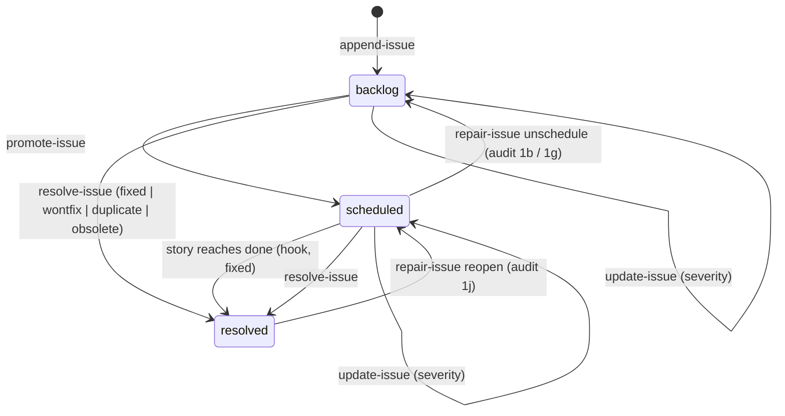

# Issue Lifecycle: Resolution, Triage, and Backlog Intake

**Date:** 2026-09-10
**Status:** Approved 2026-09-10 (revision 2 — revised after an architecture review
(`l3io-arch-review` Mode B) and an edge-case/adversarial review (`bmad-review`); dispositions in §9).
**Decision records:** [ADR-0001](../../adr/0001-pm-status-single-self-installed-file.md),
[ADR-0002](../../adr/0002-issue-storage-open-resolved-high-water.md),
[ADR-0003](../../adr/0003-done-hook-warns-not-fails.md)

---

## Problem

`state/issues.yaml` is write-only. Five producers append deferred findings to it; nothing ever
takes one out, changes one, or turns one into work. The documented contract —
"resolved items are **removed**, not marked" (`docs/l3io-pm-reference.md` Backlog section,
`CLAUDE.md` State files) — has no implementation: `pm-status.py` has exactly two issue verbs,
`append-issue` and `list-issues`. Every consequence below was reproduced against the real
script, not inferred.

1. **Removing an item reuses its key.** `_next_issue_number` allocates "highest surviving
   suffix + 1". Reproduced: append A, B, C (`BL-E001-001..003`), hand-delete C, append an
   unrelated D → D is allocated `BL-E001-003`. Every reference to C now silently names D.
2. **The only removal path races the lock.** `issues.yaml` is one of three shared-append
   files whose whole read-modify-write runs under `issues_lock`. A hand edit takes no lock, so
   a concurrent `append-issue` from a parallel subagent can have its item dropped, or can
   resurrect the removed one.
3. **Promotion is a silent no-op.** `epic-closure.md` §4 tells the agent to promote a Low item
   by re-writing it via `append-issue`. Reproduced: re-appending with `--severity High` prints
   `OK append-issue skipped … nothing written` and exits **0**; passing the existing `--key`
   exits 2. The agent reports "count promoted" while nothing changed — a false green.
4. **`status` is dead.** Every item is written `status: backlog`; nothing transitions it.
5. **Nothing consumes the backlog.** No `pm-plan` step reads `issues.yaml`; `pm-sync`
   enumerates `bmad_type: backlog` mappings but never acts on them; `archive-epic` ignores it;
   `pm-help` and `stats` count every item as open forever. Triage is referenced
   (`harvest-debt.md`) but defined nowhere.
6. **Resolution leaves no record.** `append-issue` writes no event, so a hand deletion erases
   the only evidence an item existed.

Producer gaps compound this: `epic-closure.md:58` and `:98` call `append-issue` in prose with no
`--source`, and most producers pass no `--description`, so most items carry no pointer back to
the finding they record.

## Goals

- Items can be resolved, re-severitied, and promoted to work through `pm-status.py` verbs that
  hold the lock, never by hand edit.
- A resolved item is preserved with its resolution, and its key is never reused.
- A story created from a backlog item resolves that item automatically when the story is done,
  on every supported path that marks a story done.
- An existing, never-pruned backlog can be audited for items that are already resolved:
  deterministic evidence where possible, agent judgment otherwise, human-confirmed always.
- Every rule is enforced by code or a check, and the spec says where it is not (§7).

## Non-goals

- **GitHub sync of BL items.** `pm-sync`'s `bmad_type: backlog` mapping stays report-only;
  `resolve-issue` is the primitive a follow-up sync spec will call. (The `pm-sync` *story* pull
  is corrected in §4.7, because this spec's `done` hook would otherwise turn its existing bug
  into false `fixed` records.)
- **A general reopen verb.** Only the narrow `repair-issue --action reopen`, gated on audit
  finding 1j (§3.4).
- **Editing title or description.** Only severity is mutable.
- **Automatic promotion.** No configuration enables it.
- **Recovering keys already reused** before this ships — undetectable (§5).
- **Legacy layouts.** `reconcile-status` and health-check Check 8 are untouched.
- **CI hygiene beyond the Node runtime** (`permissions:`, Dependabot, action majors, `uv` for the
  pm-status test step) — a follow-up (§8).

## Decisions

Settled during design review, 2026-09-10:

| Question | Decision |
|---|---|
| Scope | Lifecycle **and** intake (backlog → planned work). GitHub BL sync deferred. |
| Where a promoted story lands | The user names a target epic + sprint. Archived epics and any sprint not in `backlog` are refused. No special debt epic. |
| Which surface | `pm-plan` promotes; `l3io-util-doctor triage` closes without work and re-severities. |
| Open items of an archived epic | Stay open, keep their key, tagged `origin_archived` in every reader. `archive-epic` does not touch the backlog. |
| Storage model | Open items in `issues.yaml`; resolved items in `issues-resolved.yaml`; per-epic `next:` high-water. ADR-0002. |
| Audit depth | Mechanical checks, then a batched review agent for the rest; every verdict is a proposal the user confirms. |
| Where the audit lives | Integrity checks in `pm-status.py` (`audit-issues`); heuristic checks in `l3io-util-doctor/scripts/audit-backlog.py`. ADR-0001. |
| `repair-issue` | Kept: narrow structural repairs, each gated on its audit finding. |
| Review additions | Node LTS in CI; `pm-sync` `stateReason`; `reopen` repair; one owner for the story-document skeleton. |

---

## 1. Data model

### 1.1 `state/issues.yaml` — open items only

Shape unchanged except for one new top-level key.

```yaml
next: {'000': 13, '001': 5}        # per-epic high-water; written only by pm-status.py
backlog:
  - key: BL-E001-004
    epic: '001'
    sprint: '02'                   # '' for an epic-level item
    title: 'Issue title'
    source: 'code-review (E001-S02-003)'
    severity: Low
    status: backlog                # open, untriaged
    description: 'See …/closure/review-E001-S02-003.md'
  - key: BL-E001-002
    epic: '001'
    sprint: '01'
    title: '…'
    source: '…'
    severity: Medium
    status: scheduled              # promoted to work
    story: E003-S02-004            # the story whose `done` resolves this item
    scheduled_at: '2026-09-10T14:02:11Z'
```

### 1.2 `state/issues-resolved.yaml` — new

A resolved item moves here whole, with resolution fields added. Entries are never edited. The
only way an entry leaves is `repair-issue --action reopen` (§3.4), gated on audit finding 1j.

```yaml
resolved:
  - key: BL-E001-003
    epic: '001'
    sprint: '01'
    title: '…'
    source: '…'
    severity: Low
    status: resolved
    resolution: fixed              # fixed | wontfix | duplicate | obsolete
    resolved_at: '2026-09-10T15:40:00Z'
    ref: E003-S02-004              # story key, commit SHA, or (duplicate) the surviving BL key
    note: '…'                      # required for wontfix and obsolete
```

### 1.3 Story node — new `resolves:` field

```yaml
# state/planned/epic-003/sprint-02/E003-S02-004.yaml
key: 'E003-S02-004'
epic: 'E003'
sprint: 'S02'
title: 'Replace linear cache scan'
status: backlog
classification: standard
resolves: [BL-E001-002]            # written by promote-issue
estimate: { … }                    # written in the same save as the node (§2.4)
```

`resolves` is added to `DERIVED_NODE_FIELDS`, so `set-field` refuses it. That guards `set-field`
only; `bootstrap-state` and hand edits can still write it, which audit finding 1b/1h detects.

### 1.4 Invariants

Each is asserted by a test (§6) and each violation is an `audit-issues` integrity finding (§3.1).

1. A key exists in exactly one of `issues.yaml` and `issues-resolved.yaml`.
2. `next[epic]` is greater than every numeric suffix for that epic in either file, and never
   decreases.
3. Every `scheduled` item's `story` exists and lists the item's key in `resolves`.
4. Every item in `issues.yaml` has `status` `backlog` or `scheduled`.
5. No key appears twice within one file.
6. Every key written by `pm-status.py` is canonical: `BL-E` + 3 digits + `-` + 3 digits.

### 1.5 Lifecycle



### 1.6 Compatibility

- Every existing reader of the `backlog:` list keeps working and becomes **correct** without
  modification: resolved items are no longer in it.
- `next` is an additive top-level key; readers that ignore it are unaffected. No schema bump.
- Allocation is always `max(next[epic], highest suffix for the epic in either file + 1)`, so a
  project with no `next`, or with items written by hand that never raised it, is handled on the
  first mutating call.
- A missing `issues-resolved.yaml` is an empty one; the first resolution creates it.

---

## 2. `pm-status.py` verbs

**Common rules for every verb in this section:**

- Every mutating verb runs its whole load → decide → mutate → save cycle under `issues_lock`.
- Every verb takes `--state-root`; every mutating verb also takes an optional `--session-id`.
- Each verb is a thin `cmd_` wrapper over a **non-exiting core function** that returns a result
  or raises a typed error; only the wrapper maps results to exit codes and calls `sys.exit`.
  In-process callers (the `done` hook, `promote-issue`'s estimate) call the core function,
  never a `cmd_` function.
- Exit codes follow the existing table: `0` success, `2` usage error or refusal, `3` not found,
  `4` verification failure, `5` epic locked by another session.
- All validation happens before the first write. A non-zero exit from any verb means nothing
  was written.

### 2.1 `append-issue` — changed

- **Addressing.** Gains `--state-root` (preferred). `--file` remains for compatibility; if both
  are given and `--file` is not `<state-root>/issues.yaml`, exit 2. The resolved file is always
  `issues-resolved.yaml` beside `issues.yaml`.
- **Keys.** An explicit `--key` is canonicalized (`BL-E1-2` → `BL-E001-002`); a key that cannot
  be canonicalized is refused (exit 2), as is one whose epic differs from `--epic`. An explicit
  key present in either file is refused (exit 2). Automatic allocation uses §1.6's rule and
  writes `next[epic]` in the same save as the item.
- **Dedupe** (normalized title + epic + sprint + source) consults both files. When several items
  match, the **newest** decides (open items first, then resolved items by `resolved_at`):
  - an open item → skipped, exit 0 (unchanged);
  - a resolved `wontfix`, `duplicate`, or `obsolete` item **and** the new severity is no higher
    than that item's → skipped, exit 0, output names the resolved key and resolution;
  - a resolved `wontfix`, `duplicate`, or `obsolete` item at a **lower** severity than the new
    one → appended, output `(re-raised above BL-… <resolution> at <severity>)`;
  - a resolved `fixed` item → appended, output `(recurrence of BL-…)`.
- Writes an `issue_opened` event.

### 2.2 `resolve-issue` — new

```
resolve-issue --state-root S --key K --resolution {fixed,wontfix,duplicate,obsolete}
              [--ref R] [--note N] [--session-id ID]
```

**Validation (exit 2):** `fixed` requires `--ref` matching a story key or `[0-9a-f]{7,40}`.
`duplicate` requires `--ref` naming a BL key other than `K` that is open, or resolved with a
resolution other than `duplicate` (no duplicate chains). `wontfix` and `obsolete` require
`--note`.

**Resolution order, implemented once as a shared helper:**

1. `K` in the resolved file → remove any open copy of `K` (repairing a crash between the two
   writes), then exit 0 `already resolved (<resolution>)`. The removal happens *before* the
   idempotent exit, so a both-files state is always cleared.
2. `K` in neither file → exit 3.
3. Otherwise append the item to `issues-resolved.yaml` **first**, then remove it from
   `issues.yaml`.

A `scheduled` item may be resolved directly (e.g. `wontfix`); the output notes that story
`<story>` still lists it, and that story's later `done` is a no-op for it. Writes an
`issue_resolved` event.

### 2.3 `update-issue` — new

```
update-issue --state-root S --key K --severity {Low,Medium,High,Critical} [--note N] [--session-id ID]
```

Changes `severity` on an open item. A resolved `K` → exit 2 naming its resolution; an unknown
`K` → exit 3. Writes an `issue_updated` event with `from`, `to`, and `note`. Replaces the broken
promotion in `epic-closure.md` §4.

### 2.4 `promote-issue` — new

```
promote-issue --state-root S --artifacts-root A --key K [--key K2 …]
              --epic E --sprint S --classification {simple,standard,complex}
              [--title T] [--model M] [--token-rates JSON] [--session-id ID]
```

**Refusals, all checked before any write:**

| Condition | Exit |
|---|---|
| Any `K` not open, or `scheduled` (message names its story) | 2 |
| More than one `--key` without `--title` | 2 |
| `--model` unknown or `--token-rates` malformed | 2 |
| Epic under `archived/`, or sprint `status` not `backlog` | 2 |
| The story document for the allocated key already exists | 2 |
| Epic or sprint not found | 3 |
| Epic holds a live `_lock` and `--session-id` is absent or differs from its holder | 5 |

**Resuming a partial promote.** Before allocating, look for a story in the target epic whose
`resolves:` lists every `K` while each `K` is still `backlog` (a prior promote that stopped
before step 4). If exactly one exists, skip allocation and complete steps 3–4 against it,
printing `resumed <story>`. If more than one exists, exit 2 and point to `triage` (audit 1h).

**Writes, in this order:**

1. Acquire `epic_node_lock` on the target `epic.yaml` and hold it through step 3. Re-check the
   foreign `_lock` under it (the pre-write check above is advisory; this one decides).
2. Allocate the story number as the highest suffix in the sprint across **both** the state
   directory and `<A>/epic-<nnn>/sprint-<nn>/stories/`, plus one. Build the node (§1.3),
   compute its estimate in memory through the `estimate-story` core function, and write the
   node **with** its estimate in one atomic save. Create the story document through the
   `story-doc-init` core function (§2.8) with promotion context.
3. Roll up the sprint, then the epic, through the `estimate-rollup` core function — still under
   `epic_node_lock`, so a concurrent `set-lock` or promote cannot interleave with these saves.
4. Under `issues_lock` (nested inside `epic_node_lock`): set each item `status: scheduled`,
   `story`, `scheduled_at`. One `issue_scheduled` event per item.

**Lock rules.** `promote-issue` is the only verb holding two locks, always `epic_node_lock`
then `issues_lock`. No verb holds two `epic_node_lock`s at once — `_file_lock`'s re-entrancy
counter is per lock family, not per path, so a nested second epic lock would silently skip its
flock.

**Why story first.** A failure after step 2 leaves a story whose `resolves:` still resolves the
item on `done`, and a retry resumes it (above). The opposite order would leave a `scheduled`
item pointing at no story.

```mermaid
sequenceDiagram
    participant C as caller
    participant P as promote-issue
    participant E as epic_node_lock
    participant I as issues_lock
    C->>P: promote-issue --key K --epic E --sprint S
    P->>P: validate all refusals (no writes)
    P->>E: acquire
    P->>P: re-check foreign _lock
    P->>P: allocate over state + artifacts; write node+estimate (one save); story-doc-init
    P->>P: estimate-rollup sprint, then epic
    P->>I: acquire (nested)
    P->>P: mark K scheduled; event
    P->>I: release
    P->>E: release
    Note over C,P: later — set-status --story … --status done
    C->>P: set-status done (node saved)
    P->>I: acquire
    P->>P: resolve each K in resolves: (fixed, ref story); event
    P->>I: release
```

### 2.5 `list-issues` — changed

- `--status {backlog,scheduled}` filters open items.
- `--resolved` reads `issues-resolved.yaml` instead, with `--resolution` as a filter.
- `--all` returns `{"open": [...], "resolved": [...]}`, both read under one `issues_lock`, so a
  concurrent resolve cannot show a key in both lists or in neither. JSON only.
- Every item gains a computed `origin_archived` boolean (its epic directory lives under
  `archived/`), shown as a text column and a JSON field.

### 2.6 The `done` hook in `set-status`

When `set-status` moves a **story** to `done`, then after the node save succeeds, for each key
in the node's `resolves:` it calls the `resolve-issue` core function with `fixed` and the story
key as `ref`, passing the caller's `--session-id` and `cause: set-status`.

- It lives in the script, so it covers every path that marks a story done through `set-status`:
  the dev loop, sprint closure, and the `pm-sync` pull.
- **`set-field` refuses `status`** (exit 2, pointing to `set-status`). Nothing in the package
  writes status through `set-field` today; without the refusal, `set-field --field status
  --value done` would silently skip this hook.
- The hook runs regardless of `--no-events`.
- The hook catches every exception, including `SystemExit`. A failure — a malformed issues
  file, an I/O error — writes a warning to stderr and `set-status` still exits 0. ADR-0003.
- `_file_lock` blocks on `flock` with no timeout. A process stuck holding `issues_lock` blocks
  the hook, and therefore `set-status`, as it already blocks every `issues_lock` user today;
  this spec does not change that (§8).
- Each resolution prints on stdout: `resolved BL-… (fixed, ref E…)`.

### 2.7 Events

`issue_opened`, `issue_updated`, `issue_scheduled`, `issue_resolved`, `issue_reopened`. Each
carries `ts`, `session`, `cause` (`set-status`, `triage`, `plan-intake`, or `cli`), `key`,
`epic`, and its verb's fields (`severity`; `from`/`to`; `story`; `resolution`/`ref`). Written
through the existing best-effort `append_event`. The YAML files are the record; the events are
history. `report`'s event index reads only `status` events today, so these are recorded, not
yet rendered.

### 2.8 `story-doc-init` — new (single owner of the story-document skeleton)

```
story-doc-init --state-root S --artifacts-root A --story KEY
```

Creates the story document at `story_doc_path(A, KEY)` from the story's state node — frontmatter
`key`, `title`, `status`, `classification`, a `# <title>` heading, and an empty
`## Acceptance Criteria` section — when it is absent. An existing document is left untouched,
exit 0, `exists`. A missing state node is exit 3.

It is the only writer of the skeleton. Two callers:

- **Story prep** (`sprint/step-02-story-prep.md` §2): the orchestrator runs `story-doc-init` for
  each thin story before spawning the enrichment agent, and the agent prompt's
  "if a story file does not exist, create it with this skeleton" instruction and inline
  skeleton are deleted.
- **`promote-issue`**, through the core function with promotion context and
  `must_not_exist=True`: it adds a `## Context` section and one functional AC, so readiness
  grades the story Amber (functional ACs only) rather than Red (no AC section):

  ```markdown
  ## Context

  Promoted from deferred finding(s):
  - BL-E001-002 (Medium, code-review (E001-S01-002)) — See …/closure/review-E001-S01-002.md

  ## Acceptance Criteria

  - The deferred finding BL-E001-002 is resolved: <title>
  ```

---

## 3. Audit and doctor `triage`

The audit is split by who needs it (ADR-0001). Structural integrity is needed by `pm-status.py`
callers and health-check, and fits `verify`'s exit-4 contract, so it stays in the shared script.
Heuristic scanning of project source and closure reports has one consumer, doctor, so it ships
in doctor's own `scripts/`.

### 3.1 `pm-status.py audit-issues` — new, integrity only

```
audit-issues --state-root S [--format {text,json}]
```

Read-only. Reads both issue files under `issues_lock` and walks the story nodes. Exit 4 when any
finding exists, else 0.

| # | Finding | Repair (§3.4) |
|---|---|---|
| 1a | Key in both files | `resolve-issue` rerun |
| 1b | `scheduled` item whose story is missing or does not list it; or a `resolves:` entry naming a key in neither file | `unschedule` for the item; report only for the unknown key |
| 1c | `done` story whose `resolves:` names an item still open (missed hook) | `resolve-issue --resolution fixed --ref <story>` |
| 1d | Non-done story whose `resolves:` names an item still `backlog` (promote stopped before step 4) | `link` |
| 1e | `next[epic]` at or below the highest suffix for the epic | `reseed` |
| 1f | Open item whose `status` is not `backlog` or `scheduled` | report only |
| 1g | `scheduled` item whose story lives under `archived/` and is not `done` | `unschedule` |
| 1h | Key listed in more than one story's `resolves:` | report only — the user decides which story owns it |
| 1i | Key duplicated within one file, or non-canonical | report only — only a hand edit or pre-existing reuse creates it |
| 1j | Resolved `fixed` item whose `ref` story exists and is not `done` | `reopen` |

### 3.2 `l3io-util-doctor/scripts/audit-backlog.py` — new, heuristic

A PEP-723 `uv run --script` like doctor's other scripts. Read-only. Gets items only through
`pm-status.py list-issues --all --format json`, so issue-file layout knowledge stays in one
place.

```
audit-backlog.py --pm-status P --state-root S --artifacts-root A --project-root R [--format {text,json}]
```

Emits one verdict per open item:

```json
{"key": "BL-E000-012", "verdict": "fixed-candidate", "basis": "mechanical",
 "evidence": "no bmad-defer: line containing the marker text in src/cache.py",
 "pointer": "src/cache.py", "origin_archived": true}
```

Checks run in this order; the first that yields a verdict wins.

1. **Code-marker items** — `source` contains `code-marker (<file>:<line>)` anywhere (other
   producers embed it in a longer source string):
   - file absent → `obsolete-candidate`;
   - no line containing both `bmad-defer:` and the item's title text → `fixed-candidate`;
   - such a line exists → `open`, with its current line number.
   - **Guard:** if more than half of the code-marker items' files are absent, emit no
     `obsolete-candidate` verdicts and report `project-root suspect` instead — a wrong
     `--project-root` must not turn into mass closure.
2. **Duplicates** — same normalized title **and same epic**, where the candidate's severity is
   no higher than the target's:
   - an older open item → `duplicate-candidate`, `ref` that key;
   - a resolved `wontfix` or `obsolete` item → `duplicate-candidate`, `ref` that key.
3. **Evidence pointer** for everything else, verdict `needs-review`. The pointer is the first of
   these that resolves:
   - a `description` of the form `See <path>`, if the file exists;
   - `source` `code-review (<story>)` → that sprint's `closure/review-<story>.md`;
   - `source` `<phase> (<id>)` → the line containing `<id>` in **that phase's** report under the
     sprint's `closure/` directory — or `epic-closure/` when the item's `sprint` is empty — used
     only when exactly one line matches;
   - otherwise `pointer: null`, evidence `untraceable`.

An unrecognized `source` format never raises; it falls through to step 3.

### 3.3 Doctor `triage` mode

New `skills/l3io-util-doctor/steps/triage.md`, a keyword-table row in `SKILL.md`, and a help
line under "Ongoing maintenance". Mode files, never inline.

- **T1 — Load config.** As other modes, plus bind `{model_review}` from
  `modules.l3io-pm.model_review` (default `{model}`).
- **T2 — Integrity.** Run `audit-issues --format json`. On exit 4, list findings with their
  repair (§3.1 table), applied only on confirmation. Report-only findings are listed with the
  manual fix.
- **T3 — Mechanical proposals.** Run `audit-backlog.py --format json`. Table of `fixed-`,
  `obsolete-`, and `duplicate-candidate` items with evidence; the user confirms all, picks, or
  declines.
- **T4 — Agent review.** For `needs-review` items, state the cost first ("14 items → 2 spawns.
  Run?"); spawn nothing without a yes. Batches of at most 8, grouped by epic, on
  `{model_review}`, each bracketed with `dispatch --event open/close`
  (`--agent l3io-util-triage`). Per item the agent gets title, severity, source, and pointer;
  it reads the finding at the pointer, checks current code, and returns `fixed`,
  `still-present`, or `can't-tell` with `file:line` evidence. It never edits files.
- **T5 — Agent proposals.** A `fixed` verdict without `file:line` evidence is shown as
  `can't-tell`. `still-present` and `can't-tell` stay open. Confirmed as in T3.
- **T6 — Manual pass (optional).** Re-severity through `update-issue`, or close as
  `wontfix`/`obsolete` with a note.
- **T7 — Apply and summarize.** Every confirmed action goes through `resolve-issue`,
  `update-issue`, or `repair-issue` with `--session-id` and the evidence in `ref`/`note`.
  Summary: resolved by resolution, severity changes, and remaining open items — untriaged,
  scheduled, origin-archived.

### 3.4 `repair-issue` — new, narrow

```
repair-issue --state-root S --key K --action {unschedule,link,reseed,reopen}
             [--story KEY] [--session-id ID]
```

Only the structural repairs no lifecycle verb expresses. Runs under `issues_lock`. Each action
refuses (exit 2) unless its audit finding holds for `K`, so it cannot create a state the audit
would not flag:

| Action | Requires | Effect |
|---|---|---|
| `unschedule` | 1b or 1g | item → `backlog`; `story`, `scheduled_at` removed |
| `link --story KEY` | 1d, and `KEY`'s `resolves:` lists `K` | item → `scheduled` to `KEY` |
| `reseed` | 1e (`--key` names any key of the epic) | `next[epic]` = highest suffix + 1 |
| `reopen` | 1j | resolved entry removed from `issues-resolved.yaml`; item back in `issues.yaml` as `scheduled` to its `ref` story; `issue_reopened` event |

### 3.5 Health check

- **Check 13 — Backlog integrity and audit.** `audit-issues` exit 4 → flag `triage`, High.
  Any `fixed-`, `obsolete-`, or `duplicate-candidate` from `audit-backlog.py` → flag `triage`,
  Medium. `issues.yaml` absent → skip.
- HC2's heading changes from "12 checks" to "13 checks".
- HC6 runs `triage` immediately after `harvest-debt`.

---

## 4. Skill surfaces, producers, readers, docs

### 4.1 `pm-plan` intake step

New `skills/_shared/steps/plan/step-backlog-intake.md` (unnumbered, like `shared/step-estimate.md`;
step order is `SKILL.md`'s load list, so nothing is renumbered). Loaded in full-plan mode after
`step-01-classify-work.md` and before `step-02-readiness-check.md`; never in estimate mode.

1. `list-issues --status backlog --format json`. If empty, print one line and continue.
2. Show items grouped Critical → High → Medium → Low with `origin archived` marked; list
   `scheduled` items (`--status scheduled`) separately as in flight.
3. The user selects items, a target epic + sprint, and a classification — or types `skip`.
4. Call `promote-issue` with `--session-id`. Every refusal wrote nothing (§2 common rules), so on
   any refusal show it verbatim and let the user choose again. `resumed <story>` is success.
5. Output: promoted count and resulting story keys.

Running before readiness means the promoted story needs no new mechanism: readiness grades it
Amber, elaboration spawns `bmad-create-story` for technical ACs, and `step-estimate` re-prices it.

### 4.2 Producer fixes

Every producer passes `--source` and `--description "See <path>"`, in a fenced block:

| File | Change |
|---|---|
| `closure/epic-closure.md` §4 | Promotion via `update-issue`; "count promoted" from its output; the "remove the old entry manually" instruction is deleted |
| `closure/epic-closure.md:58` | Prose → fenced `append-issue` with `--source "epic-arch-review (<finding id>)"` and a pointer to the arch review output |
| `closure/epic-closure.md:98` | Prose → fenced `append-issue` with `--source "epic-redteam (<finding id>)"` and `--description "See …/epic-closure/redteam-report.md"` |
| `closure/sprint-closure.md` §7 | Add `--description "See <that phase's report path>"` |
| `sprint/step-03-dev-loop.md` Low path | Add `--description "See {sprint_root}/closure/review-{story_key}.md"` |
| `execute/step-04-arch-gate.md` | Add a pointer to the arch review output |
| `_shared/status-files.md:339` | Example gains `--description` |
| `l3io-util-doctor/assets/migrate-state.md:472` | Add `--description` pointing to the migrated legacy story |

### 4.3 Readers

- **`l3io-pm-help`** "Open issues": `list-issues --format json` instead of `cat`; counts by
  severity split into untriaged / scheduled, plus origin-archived.
- **Doctor `stats`**: the same split, plus resolved counts by resolution (`list-issues --all`).
- **Doctor `backlog`**: `list-issues --format json`; status and origin-archived columns; closes
  with a pointer to `triage`.
- **Doctor `harvest-debt`**: H3 reads `list-issues --all`. A marker matching an open item, or a
  resolved non-`fixed` item, counts as already harvested; a marker matching **only** resolved
  `fixed` items counts as **new**, so H6 passes it to `append-issue`, which records the
  recurrence (§2.1).

### 4.4 Documentation

Changed in the same commit as the code each describes:

- `CLAUDE.md` — State files (`issues.yaml` is open items with a `next` allocator;
  `issues-resolved.yaml` added; "items removed when resolved" deleted). The `check:docs`
  description: "runs nine checks" is already stale (the script has ten); it becomes eleven.
- `skills/_shared/status-files.md` — §1 tree, §3 allocation, §4 schemas, §7 subcommand table, §9
  lock order.
- `docs/l3io-pm-reference.md` — Backlog section and subcommand table (`check:docs` check 4).
- `pm-status.py` module docstring — a Subcommands entry per new verb (`check:docs` check 10).
- `docs/architecture.md` — state tree, the lifecycle diagram (§1.5), the promote/hook sequence
  (§2.4), and a link to the ADRs.
- `docs/getting-started.md` closure paragraph.
- `skills/_shared/steps/shared/step-00-digest.md` is **not** changed: subagents only append, and
  its byte budget (check 8) is preserved.

### 4.5 `check:docs` check 11 — `append-issue-pointer`

Every `append-issue` invocation inside a fenced code block in any `*.md` under `skills/` passes
both `--source` and `--description`. The file set is found by walking `skills/`, so a producer in
a new file or directory is covered on arrival. A prose instruction to append that has no fenced
invocation is **not** detected — §7 records the gap, and §4.2 removes the two known cases.

`check-docs.mjs` gains a root override (`CHECK_DOCS_ROOT`, default `process.cwd()`) so tests can
point it at a fixture tree.

### 4.6 Payload and scripts

- `pm-status.py` is synced to four skills and `skills/_shared/steps/**` to three by
  `npm run sync:scripts`; regenerate manifests with `node scripts/write-payload-manifest.mjs`.
- `audit-backlog.py` and its tests are doctor's own files: outside the sync scope and outside
  every payload manifest (manifests cover shared payload only). Tests live in
  `skills/l3io-util-doctor/scripts/tests/`, as `l3io-pm-sync` and `l3io-sec-redteam` already do.

### 4.7 `pm-sync` pull — mark done only on completion

**Rule, for every sync platform:** a pull marks a story `done` only when the remote item was
closed as *completed*. Any other close reason — not planned, duplicate, removed, cut — is
reported as "closed without completion — not marked done" and left for the user. Without this
rule, the `done` hook would record such a close as `resolution: fixed`. A platform added to
`pm-sync` later (Azure DevOps, for instance) must map its own close reasons onto this rule
before its pull may call `set-status`.

**GitHub, the only platform `pm-sync` supports today:** `sync/step-03-operations.md` Mode: pull
step 2 fetches `state` **and** `stateReason` (`gh issue view … --json
state,stateReason,title,labels`, or the equivalent field from the GitHub MCP tools). Step 3
marks a story `done` only when the issue is `CLOSED` with `stateReason` `COMPLETED`.

The lifecycle does not depend on sync: without `pm-sync`, stories reach `done` through the dev
loop and sprint closure, which fire the same hook.

### 4.8 Node runtime in CI

Node 20 reached end of life on 2026-04-30. `.github/workflows/checks.yml` moves to Node `24`;
`package.json` gains `"engines": {"node": ">=22"}`; a `.nvmrc` pins `24`. The new
`test:scripts` step (§6.3) runs on that runtime.

---

## 5. Failure handling

| Failure | Behaviour | Detected / repaired by |
|---|---|---|
| Invalid `--model` / rates, or existing story document, at promote | Refused before any write | — |
| Failure after promote step 2 | Story resolves the item on `done`; a retry resumes it | Audit 1d → `repair-issue link`, or re-run `promote-issue` |
| Two stories claim one item (hand edit, bootstrap) | — | Audit 1h, report only |
| Crash between resolve's two writes | — | Audit 1a → `resolve-issue` rerun (clears the open copy before exiting 0) |
| `done` hook fails | stderr warning; `set-status` exits 0 | Audit 1c → `resolve-issue` |
| Status set `done` through `set-field` | Refused, exit 2 | — |
| Story reverted after `done` | Item stays resolved `fixed` | Audit 1j → `repair-issue reopen` |
| Promoted story deleted, or its epic archived before `done` | — | Audit 1b / 1g → `repair-issue unschedule` |
| GitHub issue closed as not planned | Story not marked done; reported | — |
| Malformed `backlog:` or `resolved:` (not a list) | Every mutating verb refuses, exit 2 | — |
| Malformed `next` | stderr warning; allocation falls back to §1.6's max rule; never decreases | Audit 1e |
| Duplicate or non-canonical key in a file | — | Audit 1i, report only |
| Wrong `--project-root` given to the audit | No `obsolete-candidate` verdicts; `project-root suspect` | — |
| Concurrent promotes into one sprint | Serialized by `epic_node_lock` through the roll-ups | — |
| Concurrent resolve and append | Serialized by `issues_lock` | — |
| A process stuck holding `issues_lock` | Every `issues_lock` user blocks (existing behaviour) | Out of scope (§8) |
| Keys reused before this ships | **Undetectable** | Documented limitation |

---

## 6. Testing

### 6.1 `pm-status.py` — `skills/_shared/tests/test-pm-status.py`

Existing `unittest` suite. Fixtures are built by running the real verbs, never by hand-writing
issue or story shapes, except where a test deliberately constructs a corrupt state to prove the
audit detects it. Concurrency tests use real subprocesses.

- **Key reuse (regression):** append three, resolve the highest, append → `-004`. Fails on
  current code.
- **Allocation:** no `next`, open `001`–`005`, resolved `007` → `008`; a hand-written `-009`
  with a stale `next` → `010`; malformed `next` warns and never decreases; canonicalization of
  `BL-E1-2`; `--key` epic ≠ `--epic` → 2.
- **`resolve-issue`:** every validation refusal, including a duplicate chain; idempotent
  re-resolve; unknown → 3; both-files state cleared by a rerun. Invariants 1, 5, 6 asserted
  after every operation.
- **Crash injection:** make the second `_atomic_dump` raise in resolve and in promote; assert the
  matching audit finding and that its repair clears it.
- **`promote-issue`:** node written with estimate in one save (assert no intermediate
  estimate-less file via the crash-injection hook); roll-ups updated; document created with a
  non-empty Acceptance Criteria section; items `scheduled`; the full refusal matrix with no
  file changed on each refusal; resume of a partial promote; allocation skips a number taken by
  an artifact-only document.
- **`done` hook:** promote → `set-status done` → item resolved `fixed`, `ref` the story; also
  under `--no-events`; a core function that raises `SystemExit` leaves `set-status` at exit 0
  with a warning.
- **`set-field`:** refuses `status` and `resolves`.
- **Dedupe:** open match skipped; `wontfix` same-or-lower severity skipped; higher severity
  appended as re-raised; `fixed` appended as recurrence; newest match decides.
- **`update-issue`:** severity changes; resolved key → 2.
- **`audit-issues`:** each finding 1a–1j → exit 4; clean state → 0.
- **`repair-issue`:** each action refuses when its finding does not hold; each clears its finding.
- **`story-doc-init`:** creates from the node; leaves an existing document untouched.
- **`list-issues --all`:** consistent under a concurrent resolve (subprocess).
- **Concurrency:** mixed parallel resolve/append lose nothing and keep invariants 1–2, 5;
  parallel promotes into one sprint yield distinct story keys **and** a sprint roll-up that
  includes every promoted story.
- **Events:** each verb writes its event with `ts`, `session`, `cause`; a failing event write
  never fails the verb.

### 6.2 `audit-backlog.py` — `skills/l3io-util-doctor/scripts/tests/test-audit-backlog.py`

`unittest`, fixtures built through `pm-status.py` verbs against a temp project tree:

- marker removed / file deleted / marker present / title text present outside a
  `bmad-defer:` line → correct verdicts;
- `code-marker (f:l)` embedded in a longer source is recognized;
- mass-missing guard: with most files absent, no `obsolete-candidate`, `project-root suspect`;
- duplicates: cross-epic and higher-severity candidates are **not** proposed;
- pointers: each form; an ID matching two lines → `untraceable`; empty sprint → `epic-closure/`;
- an unrecognized source → `untraceable`, no exception.

CI gains a step running it with `uv run`.

### 6.3 `check:docs` check 11 — `scripts/tests/check-docs.test.mjs`

`node:test`, run through `CHECK_DOCS_ROOT` against a fixture copy of the repository (excluding
`.git` and `node_modules`):

- the unmodified copy passes;
- **scope attack:** an `append-issue` block without `--description` in a new step file in a new
  directory under `skills/` fails and names that file;
- the same violation inside a `SKILL.md` or an `assets/*.md` fails;
- a prose mention of `append-issue` outside a code block passes.

`package.json` gains `"test:scripts": "node --test scripts/tests/"`; `checks.yml` runs it.

### 6.4 Non-hollow proof

For each new guard — the allocator's max rule, the both-files clearing order, the `set-field`
refusals, audit 1c and 1j, the mass-missing guard, and check 11 — run its test once with the
guard reverted and confirm it fails. The implementation plan lists this per guard.

---

## 7. Enforcement coverage

| Rule | Enforced by |
|---|---|
| Keys are never reused | Allocator max rule + test |
| A key lives in one file | `resolve-issue` order + audit 1a + test |
| A promoted story never lacks an estimate | Node and estimate in one save + test |
| Promotion refusals write nothing | Validate-before-write + test |
| A done story resolves its items | `set-status` hook + `set-field` refusal + audit 1c + test |
| `resolves` is written only by promote | `set-field` refusal; `bootstrap-state` and hand edits are **not** blocked, only detected (audit 1b, 1h) |
| Producers pass a pointer | `check:docs` check 11 + test, for fenced invocations; a **prose-only** instruction to append is not detected |
| New verbs are documented | `check:docs` checks 4 and 10 (existing) |
| `pm-sync` marks done only on a completion close reason | **Prose only** — the pull is performed by an agent following `step-03-operations.md` |
| Triage agent cites `file:line` for `fixed` | **Prose only** — T5's downgrade is performed by the orchestrating agent |
| Intake never auto-promotes | **Prose only** — no configuration enables it; `promote-issue` needs explicit `--key`/`--epic`/`--sprint` |
| Triage and intake apply nothing unconfirmed | **Prose only** — confirmation prompts live in step files |

---

## 8. Deferred follow-ups

- **CI hygiene** (architecture review finding 15): a `permissions: contents: read` block,
  `dependabot.yml`, current action majors, and `uv run` for the pm-status test step.
- **Bounded lock waits.** `_file_lock` blocks indefinitely; a stuck holder hangs every caller of
  that lock family. Pre-existing and shared by all three lock families.
- **`ruamel.yaml` upper bound / `uv lock --script`** for `pm-status.py` (pre-existing).
- **GitHub sync of BL items** through `resolve-issue` (Non-goals).

---

## 9. Review record

Two reviews ran against revision 1 on 2026-09-10: `l3io-arch-review` Mode B (1 BLOCKER, 7 MAJOR,
8 MINOR) and `bmad-review` edge-case + adversarial (4 High, 7 Medium, 4 Low). Overlapping
findings were merged to 27. Confirmed findings were verified against the code or reproduced.

| # | Finding | Disposition |
|---|---|---|
| 1 | CI pins Node 20 (end of life) | §4.8 |
| 2 | Promote not atomic; `sys.exit` reuse; retry duplicates the story | §2 common rules, §2.4 |
| 3 | Story numbering ignores artifacts; unrelated document adopted | §2.4 step 2 |
| 4 | `set-field status` bypasses the hook | §2.6 |
| 5 | `pm-sync` pull records not-planned as `fixed` | §4.7 |
| 6 | Check 11 blind to prose producers; two fenced producers missing | §4.2, §4.5, §7 |
| 7 | `epic_node_lock` covers only step 1; roll-up unlocked | §2.4 steps 1–3 |
| 8 | Heuristic audit adds a responsibility to `pm-status.py` | §3 split, ADR-0001 |
| 9 | No `--session-id`; events lack `ts`/`session`; `report` ignores them | §2 common rules, §2.4, §2.7 |
| 10 | Resolve check order can strand a both-files state | §2.2 |
| 11 | Non-canonical and duplicate keys; hand items never raise `next` | §1.4, §1.6, §2.1, audit 1i |
| 12 | `harvest-debt` contradicts the recurrence rule | §4.3 |
| 13 | Dedupe precedence and severity unspecified | §2.1 |
| 14 | Title-only duplicates close real findings; duplicate chains | §2.2, §3.2 step 2 |
| 15 | Audit reads unlocked | §2.5 `--all`, §3.1 |
| 16 | Reverted story leaves item `fixed` | audit 1j, `reopen` |
| 17 | Scheduled to a never-done story in an archived epic | audit 1g |
| 18 | Marker heuristics too loose; wrong project root closes everything | §3.2 step 1 |
| 19 | Phase pointer takes the first match | §3.2 step 3 |
| 20 | "Lock timeout" does not exist | §2.6, §8 |
| 21 | §7 overclaims `resolves` protection | §1.3, §7 |
| 22 | `append-issue` addressed by `--file` | §2.1 |
| 23 | `--ref` unvalidated; misleading exit on resolved key | §2.2, §2.3 |
| 24 | `check-docs` hard-codes `cwd` | §4.5 |
| 25 | No diagrams | §1.5, §2.4, §4.4 |
| 26 | Skeleton defined in two places | §2.8 |
| 27 | CI hygiene | §8 |

---

## Post-review amendments (2026-09-11)

This body (§1–§9 above) is the approved design record as reviewed and merged; it is left
unedited. The follow-up passes that shipped after merge changed several behaviors the body
still describes the old way. **The live docs are authoritative for current behavior** —
`skills/_shared/status-files.md`, `docs/l3io-pm-reference.md`, `docs/architecture.md`, and
`CLAUDE.md`. Where the two disagree, the code and the live docs win.

- A repeat `set-status --status done` on a story prints `ok BL-... already resolved (...)`
  for each key already resolved, and prints `resolved BL-...` only for a key resolved by
  *this* call — never for one already closed. See `docs/l3io-pm-reference.md`'s done-hook
  row and `docs/architecture.md` § Backlog lifecycle.
- A story under `archived/` that is not `done` is a dead claim, not a live one: `resume`
  (promote's partial-promotion check) and audit findings 1d/1h both ignore it. See
  `docs/l3io-pm-reference.md`'s `promote-issue`/`audit-issues` rows.
- Audit finding 1j, and `repair-issue --action reopen`, fire only when the `ref` story's
  `resolves:` list actually names the key — not merely when the story exists and isn't
  `done`. Same rows as above.
- Audit and repair are resolved-first: a key with a resolved entry is not evaluated for
  1b/1c/1d/1f/1g (its stale open copy shows as 1a instead), and a key duplicated within one
  file (1i) is not evaluated for 1b/1c/1d/1f/1g either. See `docs/l3io-pm-reference.md`'s
  `audit-issues` row.
- `promote-issue` refuses a retry that would resume an interrupted promotion into a
  different epic or sprint than the one it partly completed (exit 2, naming the epic/sprint
  to retry with). See `docs/l3io-pm-reference.md`'s `promote-issue` row.
- `promote-issue` refuses (exit 5) a foreign epic lock it cannot evaluate — not a mapping,
  no `session_id` (a whitespace-only id also reads as absent), a `claimed_at` missing,
  unparseable, or without a timezone, or a non-integer `ttl_minutes` — naming `clear-lock`
  for an abandoned lock. Same row.
- Promote's nested `issues_lock` spans wider than the §2.4 diagram shows: it is held from
  the decisive item check through the node + estimate save, the story document, both
  roll-ups, and scheduling — not just the final "mark scheduled" step. See
  `skills/_shared/status-files.md` §9.
- `check:docs` check 11 (`append-issue-pointer`) matches every logical line under `skills/`
  — physical lines joined on a trailing `\`, fenced or not — rather than only invocations
  inside a fenced code block, as §4.5 said. See `CLAUDE.md`'s `check:docs` paragraph.
- `set-field` refuses not only a field in `DERIVED_NODE_FIELDS` and any sub-path of one, but
  also any **parent** path that contains one (e.g. `--field completion_evidence`, which would
  silently discard `completion_evidence.test_runs`). See `docs/l3io-pm-reference.md`'s
  `set-field` extras row.
- `append-issue` allocation is refused (exit 2, nothing written) once it would go past
  `BL-E{nnn}-999` — a three-digit suffix cannot name a higher number. See
  `skills/_shared/status-files.md` §3.
- `audit-issues --format json` carries an `error` key not only on a malformed issue file,
  but also on a story node that fails to parse, is not a mapping, or is not valid UTF-8 —
  the same error channel, no new finding id. See `docs/l3io-pm-reference.md`'s
  `audit-issues` row.
- `repair-issue --action unschedule` emits an `issue_unscheduled` event — the §3.4 action
  table does not list events for `unschedule`/`link`. See `docs/l3io-pm-reference.md`'s
  `repair-issue` row.
- `update-issue` on a key in neither file exits 3 with the message `{key} is in neither
  {open_path} nor {resolved_path}`, naming both files rather than just "unknown". Setting the
  severity an item already has is a no-op: it prints `unchanged`, writes nothing, and appends
  no event, rather than writing a same-value transition. See `docs/l3io-pm-reference.md`'s
  `update-issue` row.
- `repair-issue --action link`'s `issue_scheduled` event carries `via: repair-link`;
  promote's own `issue_scheduled` event carries no `via`. Same row.
- The `next:` alias rule: `allocate` reads only the canonical per-epic key (`'001'`, not
  `1`/`'1'`/`'E001'`); audit finding 1e reports any non-canonical alias key, whatever its
  value, and separately reports any alias or canonical value above the BL key space (1000);
  `repair-issue --action reseed` merges aliases into the canonical key **by max** (not
  "highest suffix + 1", as §3.4 said) and refuses outright (exit 2, nothing written) when a
  value it would merge exceeds 1000. See `docs/l3io-pm-reference.md`'s `audit-issues` and
  `repair-issue` rows.
- Every `epic.yaml` write holds `epic_node_lock`, not only the writes §2.4 covered
  (batch D1). See `skills/_shared/status-files.md` §9 and `docs/architecture.md` §
  Concurrency.
